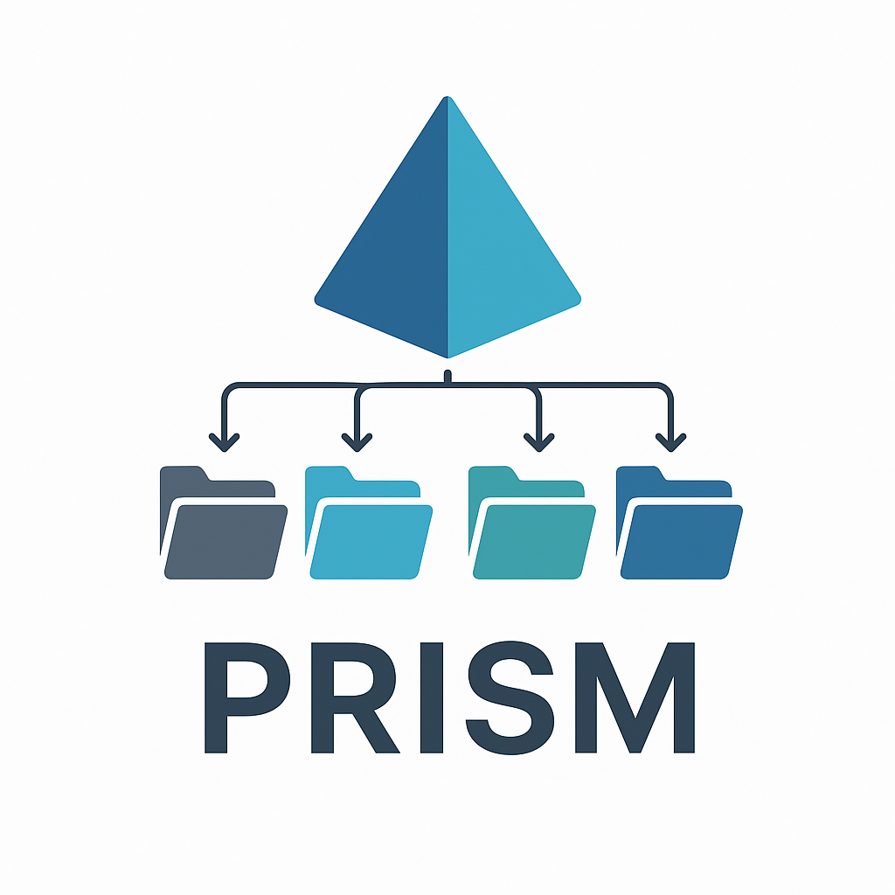

<p align="center">
  
</p>

<h1 align="center">PRISM Studio</h1>

<p align="center">
  <strong>Psychological Research Information Standard for Metadata</strong>
</p>

<p align="center">
  <a href="https://prism-studio.readthedocs.io/en/latest/?badge=latest"></a>
  <a href="https://github.com/MRI-Lab-Graz/prism-studio/blob/main/LICENSE"></a>
  
  
  <a href="https://github.com/MRI-Lab-Graz/prism-studio/issues"></a>
  
</p>

---

## Documentation

For a detailed guide on how to use PRISM, see the **[Comprehensive Walkthrough](docs/WALKTHROUGH.md)**.

## Quick Start


**Run the Web Interface (PRISM Studio)**:

```bash
bash setup.sh    # One-time setup (macOS/Linux)
# OR
.\setup.ps1      # One-time setup (Windows)

./prism-studio.py
```

The web interface will open automatically at `http://localhost:5001`.

**Configure Global Library** (recommended):

```bash
python scripts/setup/configure_global_library.py
```

This sets up the global library paths to point to the `official/` folder, making all 109+ validated surveys and recipes available to all your projects automatically. See [Global Library Configuration](docs/GLOBAL_LIBRARY_CONFIG.md) for details.

---

## Citation

- Citation metadata: see [CITATION.cff](CITATION.cff)
- JOSS manuscript scaffold: see [paper/paper.md](paper/paper.md)

---

## Overview

PRISM is an **independent, BIDS-compatible** framework and toolkit designed to enrich standard BIDS datasets with psychological and physiological metadata.

**Core Philosophy: Extension, not Replacement**
- **BIDS Core**: The main architecture remains standard BIDS. Files like `participants.tsv`, `dataset_description.json`, and standard modalities (`anat`, `func`, `eeg`) are preserved and validated according to BIDS standards.
- **PRISM Extensions**: We add structured support for modalities not yet fully standardized in BIDS, specifically **Survey** and **Biometrics**.

## Key Features

### BIDS-Compatible Add-ons
- **Survey Modality (`survey/`)**: Full support for complex questionnaires (LimeSurvey integration), treating surveys as rich data with sidecar metadata.
- **Biometrics Modality (`biometrics/`)**: Structured storage for physiological assessments (VO2max, planks, balance tests) that don't fit into standard `beh` or `physio` categories.
- **Non-Destructive**: Your standard BIDS files (`participants.tsv`, `dataset_description.json`) remain untouched. We only validate the extensions.

### Web Interface
- **Drag & drop dataset upload** - Just drop a folder or ZIP file
- **Interactive validation** - Real-time results with visual charts
- **NeuroBagel Integration** - Annotate participants with standardized ontologies
  - Professional annotation widget for participant metadata
  - Integration with official NeuroBagel dictionary
  - SNOMED-CT shorthand URI support
  - Auto-detect and parse participants.tsv files
  - Categorical value extraction and labeling
- **JSON Editor** - Edit and create metadata files interactively
- **Template Editor** - Create/edit Survey/Biometrics templates with schema-guided, value-only forms (validate + download)
- **Local processing** - All data stays on your machine (no cloud uploads)
- **Cross-platform** - Works on Windows, macOS, and Linux
- **Responsive design** - Works on desktop and mobile browsers

## Survey Data Import Workflow
A complete toolset for converting external survey data (CSV/Excel) into PRISM-compliant datasets:
0.  **Start with Templates**: Use the provided [Survey Template](docs/examples/survey_import_template.xlsx) or [Biometrics Template](docs/examples/biometrics_import_template.xlsx) (includes a **Help** sheet with column explanations).
1.  **Excel to Library**: Convert data dictionaries into a "Golden Master" JSON library (via `prism_tools.py survey import-excel`).
2.  **Library Validation**: Ensure variable uniqueness and generate catalogs (via `prism_tools.py survey validate`).
3.  **Session/Run-aware items**: In the Excel/CSV, you can add columns `session` and `run` per item; defaults are `ses-1` and no run suffix (run-1 is implicit). Use multiple rows for repeat occurrences: set `alias_of` to the canonical item_id, and set per-row `session`/`run` hints. Example header: `item_id,question,scale,group,alias_of,session,run`.
4.  **Convert survey responses (Excel)**: Convert a wide survey export (`.xlsx`) into a PRISM/BIDS-like dataset (via `prism_tools.py survey convert`). The converter matches your column headers against the item IDs in `library/survey/survey-*.json` (e.g., `ADS01`, `ADS02`, …).
5.  **Compute Recipes**: Automatically calculate scores, subscales, and intermediate variables (e.g., best of 3 trials) using JSON recipes. Supports complex formulas and reverse-coding (via `./prism_tools.py recipes surveys` or `recipes biometrics`). See [RECIPES.md](docs/RECIPES.md) for details.

## Biometrics Template Workflow (Codebook to JSON)

For biometrics assessments (e.g., Y-Balance, CMJ, Sit-and-Reach), PRISM supports generating **biometrics JSON templates** from a single-sheet Excel *codebook* (no data required).

1. **Create a codebook** (one row per variable/TSV column) with headers like:
   `item_id,description,units,datatype,minvalue,maxvalue,allowedvalues,group,originalname,authors,doi,protocol,instructions,reference,reliability,validity,estimatedduration,equipment,supervisor`
  Optional: add per-variable `session` and `run` columns (e.g., `ses-1`, `run-2`). The importer stores these as `SessionHint`/`RunHint` in the generated template.
2. **Generate templates**:

```bash
./prism_tools.py biometrics import-excel \
  --excel test_dataset/Biometrics_variables.xlsx \
  --sheet biometrics_codebook \
  --output biometrics_library
```

The `group` column controls whether you get one combined `biometrics-biometrics.json` or multiple files like `biometrics-ybalance.json`, `biometrics-cmj.json`, etc. Labeled scales like `0=...;1=...` are preserved as `Levels` (value→label mapping) for reproducibility.

If you want a single library root, write templates into subfolders:

```bash
./prism_tools.py biometrics import-excel \
  --excel test_dataset/Biometrics_variables.xlsx \
  --sheet biometrics_codebook \
  --library-root library
```

This creates `library/biometrics/biometrics-*.json` (and `library/survey/` for surveys when using `--library-root` there too).

## Biometrics Smoke Test Dataset

To generate a small PRISM-valid dataset from the biometrics codebook and dummy data (for quick end-to-end testing).

The dummy CSV can be either:

- **Long format (recommended):** columns `participant_id`, `session`, `item_id`, `value` (optional `group`, optional `instance` for trials/repeats)
- **Wide format (supported):** one row per participant (optional `session` column) and one column per `item_id`

```bash
./prism_tools.py dataset build-biometrics-smoketest \
  --codebook test_dataset/Biometrics_variables.xlsx \
  --sheet biometrics_codebook \
  --data test_dataset/Biometrics_dummy_data.csv \
  --library-root library \
  --output test_dataset/_tmp_prism_biometrics_dataset

python prism.py test_dataset/_tmp_prism_biometrics_dataset
```

Note: the repo ships a wide dummy CSV at `test_dataset/Biometrics_dummy_data.csv`. Long-format dummy files (e.g., `test_dataset/Biometrics_dummy_data_long.csv`) are intended to be generated locally.

The generated dataset uses the BIDS inheritance principle for biometrics sidecars: one dataset-level sidecar per task (`task-<task>_biometrics.json` at the dataset root) is used for all subjects/sessions unless you intentionally override it with a subject/session-specific sidecar.

## Prism Tools (CLI)

For advanced data conversion tasks, use the `prism_tools.py` utility.

### Physiological Data Conversion

```bash
./prism_tools.py convert physio \
  --input ./sourcedata \
  --output ./rawdata \
  --task rest \
  --suffix ecg \
  --sampling-rate 256
```

### Survey & Demo Tools

```bash
# Create a demo dataset
./prism_tools.py demo create --output my_demo

# Fill missing metadata keys in library files from schema
python scripts/fill_missing_metadata.py --modality survey --path library/survey
python scripts/fill_missing_metadata.py --modality biometrics --path library/biometrics

# Import survey library from Excel
./prism_tools.py survey import-excel --excel metadata.xlsx

# Validate survey library
./prism_tools.py survey validate

# Convert a wide survey export (.xlsx) to a PRISM dataset (survey only)
./prism_tools.py survey convert \
  --input responses.xlsx \
  --library library/survey \
  --output my_survey_dataset \
  --survey ads

# Import LimeSurvey structure
./prism_tools.py survey import-limesurvey --input survey.lsa
```

See [`docs/PRISM_TOOLS.rst`](docs/PRISM_TOOLS.rst) for full documentation.

### 1. Prepare your `sourcedata`
Before conversion, organize your raw files into a BIDS-compliant `sourcedata` structure. This ensures the tool can automatically detect subjects and sessions.

```text
sourcedata/
  sub-1292001/
    ses-1/
      physio/
        sub-1292001_ses-1_physio.raw   <-- Renamed from VPDATA.RAW
  sub-1292002/
    ses-1/
      physio/
        sub-1292002_ses-1_physio.raw
```

### 2. Run the Conversion
Use the `convert physio` command to process the data.

```bash
./prism_tools.py convert physio \
  --input ./sourcedata \
  --output ./rawdata \
  --task rest \
  --suffix ecg \
  --sampling-rate 256
```

**Arguments:**
*   `--input`: Path to your organized `sourcedata` folder.
*   `--output`: Where the BIDS-compliant `rawdata` should be generated.
*   `--task`: The task name to assign (e.g., `rest`, `task`).
*   `--suffix`: The filename suffix (e.g., `ecg`, `physio`).
*   `--sampling-rate`: (Optional) Force a specific sampling rate if the header is incorrect.
3.  **Data Import**: Automatically extract data from raw CSVs and generate BIDS file structures (`scripts/csv_to_prism.py`).

[Read the full guide here](docs/SURVEY_DATA_IMPORT.md).

### Validation Features
- **Multi-modal validation**: Supports survey, biometrics, physiological, eyetracking data
- **BIDS-App Compatibility**: Automatically updates `.bidsignore` to ensure custom modalities are ignored by standard BIDS tools (e.g., fMRIPrep), preventing crashes.
- **BIDS-inspired naming**: Validates filenames follow the pattern `sub-<label>_[ses-<label>_]task-<label>_[run-<index>_]<suffix>`
- **JSON schema validation**: Validates sidecar metadata against modality-specific schemas
- **Schema versioning**: Multiple schema versions (stable, v0.1, etc.) selectable in UI
- **Flexible structure**: Supports both session-based and direct subject organization
- **Cross-subject consistency**: Warns when subjects have inconsistent modalities or tasks
- **Structured error codes**: All issues have unique codes (PRISM001-PRISM9xx) with fix hints
- **Auto-fix mode**: Automatically repair common issues with `--fix`
- **Multiple output formats**: JSON, SARIF, JUnit XML, Markdown, CSV for CI/CD integration
- **Plugin system**: Extend validation with custom checks via `validators/` directory
- **Project configuration**: Per-dataset settings via `.prismrc.json`
- **Comprehensive reporting**: 
  - Dataset summary with subject/session counts
  - Modality breakdown with file counts
  - Task detection and listing
  - **Survey & Biometrics listing**: Lists found instruments with their full names (e.g., `ads - Allgemeine Depressions Skala`)
  - File statistics (data files vs sidecars)
  - Cross-subject consistency warnings
  - Clear error and warning categorization

## Directory Structure

```
dataset/
├── dataset_description.json     # Standard BIDS metadata
├── participants.tsv            # Standard BIDS participant info
├── sub-<label>/               # Subject directories
│   ├── ses-<label>/          # Optional session directories
│   │   ├── survey/           # Extension: Questionnaires
│   │   ├── biometrics/       # Extension: Physio assessments
│   │   └── <modality>/       # Standard BIDS (anat, func, etc.)
│   └── <modality>/           # Or direct modality folders
```

## Supported Modalities

| Modality | File Extensions | Required Fields |
|----------|----------------|-----------------|
| `survey` | .tsv | StimulusType, FileFormat, TaskName, OriginalName |
| `biometrics` | .tsv | StimulusType, FileFormat, Equipment, BiometricName, OriginalName |
| `events` | .tsv | StimulusPresentation (OperatingSystem, SoftwareName) |
| `physio` | .tsv, .edf, .bdf | SamplingFrequency, StartTime, Columns |
| `eyetracking` | .tsv, .edf, .asc | SamplingFrequency, Manufacturer, EyeTracker |

## Super-BIDS: Enhanced Validation

PRISM Studio implements a "Super-BIDS" layer—a stricter set of validation rules that sits on top of standard BIDS to ensure higher data quality and reproducibility.

### Why "Super-BIDS"?
Standard BIDS is excellent for file organization but often permissive with metadata. "Super-BIDS" enforces mandatory fields that are critical for scientific reproducibility but optional in the base standard.

### Enhanced Modalities

#### 1. Biometrics (`biometrics/`)
We enforce a rich set of metadata for physiological assessments to ensure the protocol is fully documented.
- **Mandatory Fields**: `Description` (detailed protocol).
- **Recommended Fields**: `Instructions`, `Author`, `DOI`, `Reference`, `EstimatedDuration`, `TargetPopulation`, `ExclusionCriteria`.

#### 2. Events (`*_events.tsv`)
Standard BIDS allows minimal event files. We enforce the `StimulusPresentation` object to ensure we know exactly how stimuli were delivered.
- **Mandatory Object**: `StimulusPresentation`
- **Required Fields**: 
  - `OperatingSystem`
  - `SoftwareName`
  - `SoftwareRRID` (Recommended)
  - `SoftwareVersion` (Recommended)

This ensures that years later, you know exactly what software version and OS were used to run the experiment.

## Schema Structure

Each stimulus file must be associated with metadata in a `.json` sidecar. Sidecars can be adjacent (same basename) **or** inherited via the BIDS inheritance principle (e.g., dataset-level sidecars shared across subjects/sessions). These JSON files are validated against JSON schemas in the `schemas/` directory.

### Example Survey Metadata (`.json` sidecar):
```json
{
  "StimulusType": "Survey",
  "FileFormat": "tsv",
  "TaskName": "bdi",
  "OriginalName": "Beck Depression Inventory",
  "SchemaVersion": "1.1.1"
}
```

### Example Biometrics Metadata (`.json` sidecar):
```json
{
  "Technical": {
    "StimulusType": "Biometrics",
    "FileFormat": "tsv",
    "Equipment": "Stopwatch"
  },
  "Study": {
    "BiometricName": "UKK",
    "OriginalName": "UKK Walk Test",
    "Protocol": "2k walk"
  },
  "Metadata": {
    "SchemaVersion": "1.1.1",
    "CreationDate": "2023-01-01"
  }
}
```

## Usage

### Basic validation:
```bash
python prism.py /path/to/dataset
```

### JSON output for CI/CD:
```bash
python prism.py /path/to/dataset --json
python prism.py /path/to/dataset --json-pretty
```

### Auto-fix common issues:
```bash
python prism.py /path/to/dataset --fix          # Apply fixes
python prism.py /path/to/dataset --dry-run      # Preview fixes
python prism.py --list-fixes                    # List fixable issues
```

### Output formats (SARIF, JUnit, etc.):
```bash
python prism.py /path/to/dataset --format sarif -o report.sarif
python prism.py /path/to/dataset --format junit -o report.xml
python prism.py /path/to/dataset --format markdown -o report.md
python prism.py /path/to/dataset --format csv -o report.csv
```

### Plugin system:
```bash
python prism.py /path/to/dataset --init-plugin my_checks  # Create plugin template
python prism.py /path/to/dataset --list-plugins           # List loaded plugins
python prism.py /path/to/dataset --no-plugins             # Disable plugins
```

### Verbose output (shows scanning details):
```bash
python prism.py /path/to/dataset -v
```

### Example Output:

For a valid dataset:
```
🔍 Validating dataset: valid_test_dataset/

============================================================
🗂️  DATASET SUMMARY
============================================================
📁 Dataset: valid_test_dataset
👥 Subjects: 2
📋 Sessions: No session structure detected

🎯 MODALITIES (2 found):
  ✅ survey: 2 files
  ✅ biometrics: 2 files

📝 TASKS (0 found):
  No tasks detected

📋 SURVEYS (1 found):
  • bdi - Beck Depression Inventory

🧬 BIOMETRICS (1 found):
  • ukk - UKK Walk Test

📄 FILES:
  • Data files: 4
  • Sidecar files: 4
  • Total files: 8

============================================================
✅ VALIDATION RESULTS
============================================================
🎉 No issues found! Dataset is valid.
```

For a dataset with issues:
```
============================================================
🔍 VALIDATION RESULTS
============================================================

🔴 ERRORS (1):
   1. Missing sidecar for test_dataset/sub-003/image/invalid-file.jpg

� WARNINGS (3):
   1. Subject sub-003 session ses-001 missing audio data
   2. Subject sub-003 session ses-001 missing task soundrecognition
   3. Mixed session structure: 2 subjects have sessions, 1 don't

�📊 SUMMARY: 1 errors, 3 warnings
❌ Dataset validation failed due to errors.
```

## Consistency Checking

The validator performs cross-subject consistency checks to ensure scientific rigor:

- **Modality consistency**: All subjects should have the same modalities (e.g., if one subject has both image and audio data, all should)
- **Task consistency**: All subjects should perform the same tasks within each session
- **Session structure**: Warns if mixing subjects with and without session directories
- **Per-session consistency**: For multi-session studies, ensures each subject has consistent data across sessions

These checks generate **warnings** (not errors) since missing data might be due to technical issues, dropouts, or valid experimental design decisions.

### Exit codes:
- `0`: Dataset is valid
- `1`: Validation errors found

## Test Dataset

The included `test_dataset/` demonstrates:
- Valid files with proper naming and metadata
- Invalid naming conventions (for testing)
- Missing sidecar files (for testing)
- Mixed session/no-session structures

## Repository Structure

- **`prism-studio.py`** - **Main entry point** - Web interface with NeuroBagel integration
- `schemas/` - JSON schemas for each modality
- `docs/` - Documentation (web interface guide, examples, NeuroBagel integration)
- `tests/` - Test dataset and test scripts
- `src/` - Core validation and utility modules
- `static/` - Web interface assets (CSS, JavaScript, NeuroBagel widget)
- `templates/` - Web interface templates (HTML)
- `archive/` - Legacy scripts (not tracked in git)

### Additional Files
- `prism.py` - Command-line tool (see footnote below)
- `scripts/setup/setup.sh` / `scripts/setup/setup-windows.bat` - Installation scripts
- `requirements.txt` - Python dependencies

## NeuroBagel Integration (v1.1.0+)

The JSON Editor now includes professional **NeuroBagel annotation tools** for standardizing participant metadata:

### Features:
- **Automatic TSV Parsing**: Loads unique values from `participants.tsv`
- **Smart Categorization**: Separates available columns from suggestions
- **Data Type Detection**: Auto-detects continuous vs. categorical variables
- **Ontology Integration**: Add SNOMED-CT URIs to categorical levels
- **Standardized Export**: Downloads annotated `participants.json` with full BIDS compliance

### Workflow:
1. Upload dataset with `participants.json` and `participants.tsv`
2. Go to JSON Editor → Select "Annotate Participants"
3. Edit column descriptions, units, and categorical levels
4. Add ontology URIs (SNOMED-CT shorthand: `snomed:248153007`)
5. Download annotated file to replace original

See [`docs/NEUROBAGEL_INTEGRATION_STRATEGY.md`](docs/NEUROBAGEL_INTEGRATION_STRATEGY.md) for details.

---

## LimeSurvey Integration

PRISM Studio now includes a complete workflow for integrating LimeSurvey questionnaires into the BIDS/PRISM structure.

### Features:
- **Automated Conversion**:
  - `LimeSurvey (.lss) -> PRISM JSON`: Create sidecars from survey structures
  - `PRISM JSON -> LimeSurvey (.lss)`: Generate importable surveys from sidecars
- **Data Merging**: Combine multiple questionnaire templates into a single BIDS sidecar
- **Dataset-level sidecars**: Validator now resolves shared `survey-<name>_beh.json` files at the dataset root, so you only keep one canonical JSON per instrument.
- **Redaction tooling**: `helpers/utils/redact_sidecar.py` can strip or hash copyrighted prompts before publishing.

### Workflow:
1. **Create/Export**: Design survey in LimeSurvey (using standard naming `BDI_01`, `ADS_01`) and export structure (`.lss`).
2. **Convert**: Run `helpers/surveys/limesurvey_to_prism.py` to generate the JSON sidecar.
3. **Collect**: Run study, export data to TSV.
4. **Combine**: Use `helpers/surveys/combine_survey_json.py` to merge multiple sidecars for the final dataset.

## Survey Library (New)

A robust management system for questionnaire templates ("Golden Masters") with a **Draft & Publish** workflow.

### Key Features:
- **Read-Only Masters**: Prevents accidental overwrites of production files.
- **Draft Mode**: Checkout files to `drafts/` for safe editing.
- **Automated Validation**: Submissions are checked for variable name conflicts across the entire library.
- **Merge Requests**: Validated drafts are submitted to `merge_requests/` for final review.
- **GUI Editor**: User-friendly web interface for editing questions, ranges, and metadata.

See [`docs/SURVEY_LIBRARY.md`](docs/SURVEY_LIBRARY.md) for the full guide.

---

## LimeSurvey Integration (continued)
5. **Redact (optional)**: Run `helpers/utils/redact_sidecar.py` to produce a public-safe copy of the sidecar if the instrument text is licensed.

See [`docs/LIMESURVEY_INTEGRATION.md`](docs/LIMESURVEY_INTEGRATION.md) for the full guide.

---

## Additional Resources

- **[Web Interface Documentation](docs/WEB_INTERFACE.md)** - Detailed UI guide
- **[NeuroBagel Integration](docs/NEUROBAGEL_INTEGRATION_STRATEGY.md)** - Annotation tool usage
- **[Schema Versioning Guide](docs/SCHEMA_VERSIONING_GUIDE.md)** - Multiple schema versions
- **[Examples](docs/examples/)** - Test datasets and example files
- **[FAIR Implementation](docs/FAIR_IMPLEMENTATION.md)** - FAIR data principles

---

## Future Enhancements

1. **Cross-file validation**: Validate stimulus-response timing relationships
2. **BIDS compatibility**: Ensure full compatibility with official BIDS standard
3. **Batch processing**: Support for validating multiple datasets via web UI
4. **Export formats**: BIDS package export, DataLad integration

## Project Configuration (.prismrc.json)

Create a `.prismrc.json` file in your dataset root for per-project settings:

```json
{
  "schema_version": "stable",
  "strict_mode": false,
  "run_bids": false,
  "ignore_paths": ["sourcedata/", "derivatives/"],
  "plugins": ["./validators/custom_checks.py"]
}
```

Settings can be overridden via CLI arguments.

## Installation

### Quick Setup (Recommended)

**macOS/Linux:**
```bash
git clone https://github.com/MRI-Lab-Graz/prism-studio.git
cd prism-studio
bash scripts/setup/setup.sh
python prism-studio.py
```

**Windows:**
```cmd
git clone https://github.com/MRI-Lab-Graz/prism-studio.git
cd prism-studio
scripts\setup\setup-windows.bat
python prism-studio.py
```

The web interface opens automatically.

### Manual Setup

```bash
# Create virtual environment
python -m venv .venv
source .venv/bin/activate  # macOS/Linux or .venv\Scripts\activate on Windows

# Install dependencies
pip install -r requirements.txt

# Run web interface
python prism-studio.py
```

---

## Usage Guide

### Web Interface (Primary - Recommended for All Users)

Simply run:
```bash
python prism-studio.py
```

The interface opens at `http://localhost:5001` with three main sections:

#### 1. **Dataset Validation** (Home Tab)
- Drag & drop your dataset folder or ZIP file
- Select schema version (stable/v0.1)
- Get instant validation results with visual charts

#### 2. **JSON Editor** (JSON Editor Tab)
- Edit dataset_description.json and other metadata
- Create new metadata files
- **NeuroBagel Annotation Tool** (if participants.json exists):
  - Load your dataset with participants.json
  - Select "Annotate Participants" 
  - Annotation widget loads your participants.tsv data
  - Edit descriptions, units, and categorical levels
  - Add SNOMED-CT URIs for ontology standardization
  - Download annotated participants.json

#### 3. **Home Page**
- Introduction and quick links
- Feature overview
- Getting started guide

**Features:**
- All processing happens locally (no data leaves your machine)
- Real-time validation feedback
- Support for folder and ZIP uploads
- Interactive metadata editing
- Professional annotation with NeuroBagel

See [`docs/WEB_INTERFACE.md`](docs/WEB_INTERFACE.md) for detailed instructions.

---

### Command-Line Interface (Advanced/Automation)

For automation and scripting, use the CLI:

```bash
# Activate virtual environment first
source .venv/bin/activate  # macOS/Linux
# or
.venv\Scripts\activate     # Windows

# Basic validation (uses stable schema)
python prism.py /path/to/dataset

# Validate with specific schema version
python prism.py /path/to/dataset --schema-version v0.1

# JSON output for CI/CD pipelines
python prism.py /path/to/dataset --json
python prism.py /path/to/dataset --json-pretty

# Auto-fix common issues
python prism.py /path/to/dataset --fix
python prism.py /path/to/dataset --dry-run  # Preview only

# Output to different formats
python prism.py /path/to/dataset --format sarif -o report.sarif
python prism.py /path/to/dataset --format junit -o results.xml

# Plugin management
python prism.py /path/to/dataset --init-plugin custom_rules
python prism.py /path/to/dataset --list-plugins

# List available schema versions
python prism.py --list-versions

# List auto-fixable issues
python prism.py --list-fixes

# Verbose output
python prism.py /path/to/dataset -v

# Show help
python prism.py --help
```

**Note:** This is primarily for automation and batch processing. The web interface is recommended for interactive use.

#### Schema Versions

Available schema versions:
- **`stable`** (default) - Current recommended version
- **`v0.1`** - Version 0.1

See [`docs/SCHEMA_VERSIONING_GUIDE.md`](docs/SCHEMA_VERSIONING_GUIDE.md) for details.

## Dependencies

- Python 3.6+
- `jsonschema` - For JSON schema validation
- `flask` - Web interface framework
- `requests` - HTTP client for NeuroBagel API

Optional (for dummy file generation):
- `Pillow` - For creating test images
- `numpy` - For generating test data

---

## Footnote: Command-Line Tool

While the **web interface is the primary and recommended method** for using PRISM Studio, a command-line interface is also available for automation and batch processing.

**Command-line tool usage:**
```bash
python prism.py /path/to/dataset [--schema-version VERSION] [-v]
```

This is useful for:
- CI/CD pipelines and automated testing
- Batch processing multiple datasets
- Scripting and automation workflows
- Integration with other tools

For most users and interactive validation, please use the web interface instead.

---

## License & Attribution

See LICENSE file for details.

For questions or contributions, visit the [GitHub repository](https://github.com/MRI-Lab-Graz/prism-studio).

---

## All Thanks to Our Contributors

<a href="https://github.com/MRI-Lab-Graz/prism-studio/graphs/contributors">
  
</a>
