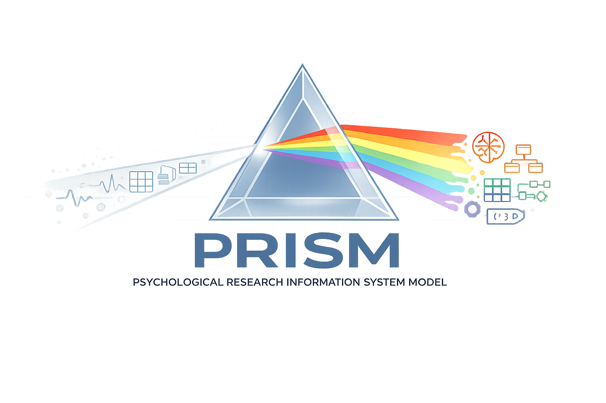

<p align="center">
	
</p>

<h1 align="center">PRISM Studio</h1>

<p align="center"><strong>Psychological Research Information System Model</strong></p>

<p align="center">
	
	
	
</p>

PRISM Studio is a comprehensive tool for managing psychological research datasets built on the PRISM framework.

PRISM (Psychological Research Information System Model) extends BIDS for modalities such as surveys and biometrics while staying compatible with standard BIDS apps. PRISM Studio applies that model in practical web and CLI workflows for validation, conversion, and dataset management.

## Core Features

- Dataset validation and conversion
- PRISM Studio web interface for interactive workflows
- CLI workflows for terminal users
- Survey and biometrics metadata support
- Local-first operation (data stays on your machine)

## Pre-built Binaries

Download the latest release from the [Releases page](https://github.com/MRI-Lab-Graz/prism-studio/releases).

| Platform | Binary | Notes |
|----------|--------|-------|
| macOS | `prism-studio-macOS-arm64.zip` | Apple Silicon (M1/M2/M3/M4) |
| macOS | `prism-studio-macOS-x86_64.zip` | Intel Macs |
| Windows | `prism-studio-Windows.zip` | x64 |
| Linux | `prism-studio-Linux.zip` | x64 |

macOS first launch: if Gatekeeper blocks the app, run `Open Prism Studio.command` from the extracted release folder.

## Installation

### Using Pre-built Binaries (Recommended)

Download the latest release for your platform from the [Releases page](https://github.com/MRI-Lab-Graz/prism-studio/releases).

### From Source

One-time setup from repository root.

macOS/Linux:

```bash
bash setup.sh
```

Windows (PowerShell):

```powershell
.\setup.ps1
```

For detailed installation instructions, see the [documentation](https://prism-studio.readthedocs.io).

## Quick Usage

### Run PRISM Studio (Web)

```bash
python prism-studio.py
```

Open `http://localhost:5001` if it does not open automatically.

### Run PRISM Validator (CLI)

```bash
python prism-validator /path/to/dataset
```

### Run PRISM Tools (CLI)

```bash
python prism_tools.py --help
```

## Documentation

Comprehensive documentation is available on [ReadTheDocs](https://prism-studio.readthedocs.io).

## Report an Issue

Use the `Issues` tab to report bugs or request features:
`https://github.com/MRI-Lab-Graz/prism-studio/issues`

Include these details so we can reproduce quickly:
- Your OS and Python version
- The exact command you ran
- The full error message or screenshot
- A small dataset example (if possible)

## Citation

See `CITATION.cff` for citation metadata.

## License

See `LICENSE`.
