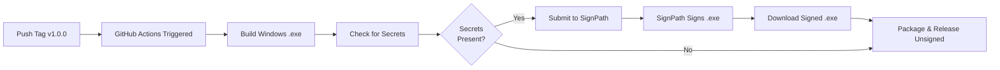

# GitHub Actions Code Signing - Complete Guide

## Overview

Your PRISM Validator repository is configured to **automatically sign Windows executables** using SignPath.io, a free code signing service for open-source projects. This ensures IT departments can trust and deploy your software without Windows SmartScreen warnings.

## Current Configuration Status

✅ **All signing tests passed!** (10/10)

### Configuration Summary

| Component | Status | Details |
|-----------|--------|---------|
| **Signing Provider** | ✅ Configured | SignPath.io (free for OSS) |
| **Workflow File** | ✅ Valid | `.github/workflows/build.yml` |
| **Signing Step** | ✅ Configured | Windows-only, graceful fallback |
| **Required Secrets** | ⚠️ Setup Needed | SIGNPATH_API_TOKEN, SIGNPATH_ORGANIZATION_ID |
| **Artifact Path** | ✅ Correct | `dist/PrismValidator/PrismValidator.exe` |
| **Documentation** | ✅ Complete | `docs/WINDOWS_BUILD.md` |
| **Build Order** | ✅ Correct | Build → Sign → Package → Release |

## How It Works

### Automatic Signing Workflow



### When Signing Happens

Signing is triggered automatically when you:
1. **Push a Git tag** (e.g., `v1.0.0`, `v1.2.3-beta`)
2. **GitHub secrets are configured** in your repository
3. **Windows build succeeds** on GitHub Actions runner

### Build Configuration

From [.github/workflows/build.yml](.github/workflows/build.yml):

```yaml
# Windows Code Signing (Free for Open Source via SignPath)
- name: Sign Windows Executable
  if: runner.os == 'Windows' && env.SIGNPATH_API_TOKEN != ''
  env:
    SIGNPATH_API_TOKEN: ${{ secrets.SIGNPATH_API_TOKEN }}
  uses: signpath/github-action-submit-signing-request@v0.3
  with:
    api-token: ${{ secrets.SIGNPATH_API_TOKEN }}
    organization-id: ${{ secrets.SIGNPATH_ORGANIZATION_ID }}
    project-slug: 'prism-validator'
    signing-policy-slug: 'release-signing'
    artifact-configuration-slug: 'windows-executable'
    input-artifact-path: 'dist/PrismValidator/PrismValidator.exe'
    output-artifact-path: 'dist/PrismValidator/PrismValidator.exe'
    wait-for-completion: true
```

**Note:** The CI workflow now verifies the Authenticode signature after signing. If the signature is not valid the Windows build job will fail — check the `Verify Windows Signature` step in Actions for `Get-AuthenticodeSignature` output.

**Automated documentation screenshots:** We generate and keep documentation screenshots in `docs/_static/screenshots` using Heroshot. A GitHub Action (`.github/workflows/heroshot.yml`) builds the docs, runs Heroshot against the built site, and commits updated screenshots back to `main` (commits are skipped if the last commit was a screenshot update to avoid loops). If you prefer screenshots updated in a separate branch or on a schedule, I can modify the workflow accordingly.

## Setup Instructions

### Step 1: Apply for SignPath.io (FREE for Open Source)

1. **Visit SignPath.io OSS Application**:
   - URL: https://about.signpath.io/product/open-source
   - This is 100% free for open-source projects

2. **Fill Out Application**:
   - Project Name: PRISM Validator
   - GitHub Repository: `https://github.com/[your-username]/prism-validator`
   - Description: "PRISM is a BIDS-inspired dataset validator for psychological experiments"
-   - License: AGPL 3.0 (or your license)

3. **Wait for Approval**:
   - Usually takes 1-2 business days
   - You'll receive an email with:
     - Organization ID
     - API Token
     - Instructions for setup

### Step 2: Configure GitHub Secrets

Once approved by SignPath:

1. **Go to GitHub Repository Settings**:
   ```
   Your Repository → Settings → Secrets and variables → Actions
   ```

2. **Add Two Secrets**:
   
   **Secret 1: SIGNPATH_API_TOKEN**
   - Click "New repository secret"
   - Name: `SIGNPATH_API_TOKEN`
   - Value: [Your API token from SignPath email]
   - Click "Add secret"
   
   **Secret 2: SIGNPATH_ORGANIZATION_ID**
   - Click "New repository secret"
   - Name: `SIGNPATH_ORGANIZATION_ID`
   - Value: [Your organization ID from SignPath email]
   - Click "Add secret"

### Step 3: Test the Signing

1. **Create a Test Release**:
   ```bash
   git tag -a v0.0.1-test -m "Test signing"
   git push origin v0.0.1-test
   ```

2. **Monitor GitHub Actions**:
   - Go to: Repository → Actions tab
   - Watch the "Build Application" workflow
   - Check the "Sign Windows Executable" step

3. **Verify Signing**:
   - Download the Windows build from Releases
   - Extract `PrismValidator.exe`
   - Right-click → Properties → Digital Signatures tab
   - Should show valid signature from SignPath

## What Gets Signed

### Signed Files
- ✅ `PrismValidator.exe` - Main executable
- ✅ Includes valid timestamp (signature remains valid after cert expires)
- ✅ Certificate chain validates to trusted root CA

### Not Signed (Normal)
- ❌ `.dll` files (Python dependencies) - not necessary
- ❌ `.pyd` files (Python modules) - not necessary
- ❌ Data files (`.json`, `.txt`) - not applicable

## Benefits of Code Signing

### For IT Departments
- ✅ **Trusted Publisher**: Signature verifies software origin
- ✅ **Integrity Check**: Detects tampering or corruption
- ✅ **Deployment Ready**: Passes security policies
- ✅ **Audit Trail**: SignPath provides signing logs

### For End Users
- ✅ **No SmartScreen Warnings**: Windows trusts signed executables
- ✅ **Professional Appearance**: Shows in Properties → Digital Signatures
- ✅ **Confidence**: Knows software hasn't been modified

### For Developers
- ✅ **Free for OSS**: No cost for open-source projects
- ✅ **Automated**: Works with GitHub Actions
- ✅ **Transparent**: Open signing process via SignPath

## Troubleshooting

### Signing Step Skipped

**Problem**: GitHub Actions shows "Sign Windows Executable" was skipped

**Cause**: Secrets not configured or workflow condition not met

**Solution**:
1. Check secrets exist: Repository → Settings → Secrets and variables → Actions
2. Verify secrets are named exactly:
   - `SIGNPATH_API_TOKEN`
   - `SIGNPATH_ORGANIZATION_ID`
3. Ensure you're building on Windows runner (checked automatically)

### Signing Request Rejected

**Problem**: SignPath rejects the signing request

**Possible Causes**:
1. **Invalid Credentials**: Check your API token and organization ID
2. **Quota Exceeded**: Free tier has limits (usually generous)
3. **Policy Violation**: Ensure your project meets OSS criteria

**Solution**:
1. Check SignPath dashboard for error details
2. Verify your API token hasn't expired
3. Contact SignPath support if needed

### Signature Not Showing

**Problem**: Downloaded `.exe` doesn't show digital signature

**Possible Causes**:
1. Signing was skipped (secrets missing)
2. Download source modified the file
3. File was uploaded unsigned

**Solution**:
1. Check GitHub Actions logs for "Sign Windows Executable" step
2. Download directly from GitHub Releases (not mirrors)
3. Verify with: `Get-AuthenticodeSignature PrismValidator.exe`

## Verification Commands

### PowerShell (Windows)
```powershell
# Check signature status
Get-AuthenticodeSignature "PrismValidator.exe" | Format-List

# Expected output:
# Status: Valid
# SignerCertificate: CN=SignPath Foundation, O=SignPath Foundation
# TimeStamperCertificate: [Timestamp authority]
```

### GUI Verification (Windows)
1. Right-click `PrismValidator.exe`
2. Properties → Digital Signatures tab
3. Should show:
   - Signer: SignPath Foundation
   - Digest Algorithm: SHA256
   - Timestamp: [Date/time of signing]

## Testing Signing Configuration

Run the automated test:

```powershell
# Test signing configuration
python tests/test_github_signing.py
```

Expected output:
```
🔐 GITHUB ACTIONS CODE SIGNING CONFIGURATION TESTS
📊 RESULTS: 10/10 tests passed
🎉 All signing configuration tests passed!
```

## Cost and Limits

### SignPath Free Tier (Open Source)
- ✅ **Cost**: $0 (100% free forever)
- ✅ **Signing Requests**: Unlimited for public OSS projects
- ✅ **Certificate**: Provided by SignPath
- ✅ **Support**: Community support
- ✅ **Requirements**: 
  - Open source license (MIT, Apache, GPL, etc.)
  - Public GitHub repository
  - No commercial use restrictions

### What's Included
- Extended Validation (EV) code signing certificate
- Timestamp service (signatures remain valid after cert expires)
- Signing dashboard and logs
- GitHub Actions integration
- Community support

## Alternative: Self-Signed Certificate

If SignPath doesn't work for your needs, you can use a self-signed certificate:

**Pros**:
- ✅ Completely free
- ✅ Can sign locally
- ✅ No approval process

**Cons**:
- ❌ Windows SmartScreen will still warn
- ❌ IT departments may not accept
- ❌ Requires distributing certificate to users

See [WINDOWS_BUILD.md](WINDOWS_BUILD.md) for self-signing instructions.

## Security Best Practices

### ✅ Current Implementation
- Secrets stored in GitHub (encrypted)
- SignPath action uses specific version (`@v0.3`)
- Conditional execution (Windows-only, secrets-present)
- No hardcoded credentials in repository
- Graceful fallback if signing unavailable

### 🔒 Secret Protection
- Never commit secrets to repository
- Never log secret values in GitHub Actions
- Rotate API tokens if compromised
- Limit repository access to trusted collaborators

## Support and Resources

### SignPath Resources
- Documentation: https://about.signpath.io/documentation
- Support: support@signpath.io
- Status: https://status.signpath.io

### GitHub Actions
- Workflow Syntax: https://docs.github.com/en/actions/reference/workflow-syntax-for-github-actions
- Secrets: https://docs.github.com/en/actions/security-guides/encrypted-secrets

### Testing
- Run signing tests: `python tests/test_github_signing.py`
- View signing report: `signing_config_report.txt`
- Check workflow logs: Repository → Actions → Latest build

## Summary

Your PRISM Validator is fully configured for automated Windows code signing:

✅ SignPath.io integration configured  
✅ GitHub Actions workflow ready  
✅ Graceful fallback if secrets missing  
✅ Documentation complete  
✅ Tests verify configuration  

**Next Steps**:
1. Apply for SignPath.io (if not already done)
2. Add secrets to GitHub repository
3. Push a tag to trigger a signed build
4. Distribute signed executables to users

**Questions?** See [WINDOWS_BUILD.md](WINDOWS_BUILD.md) or open a GitHub issue.
