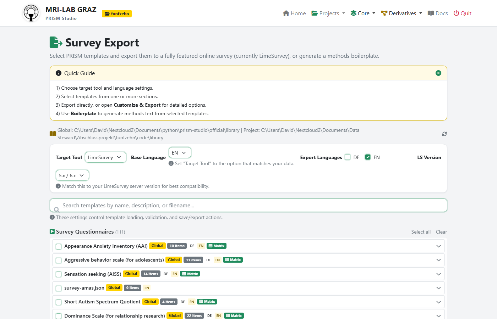
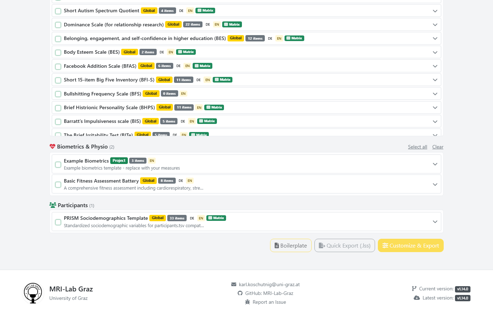
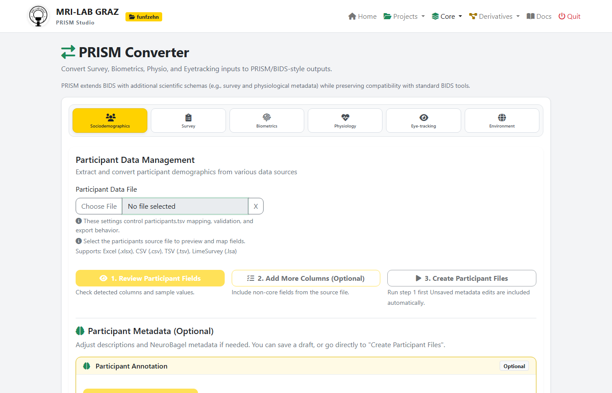

# LimeSurvey Integration

PRISM Studio provides a complete, bidirectional integration with [LimeSurvey](https://www.limesurvey.org/) — from designing questionnaires and exporting them as ready-to-use LimeSurvey surveys, to importing response data and preserving all system metadata in a BIDS-compatible structure.

## Overview

The integration supports **three main workflows**:

1. **Design & Export** — Build questionnaires from PRISM templates and export them as `.lss` files that can be imported directly into LimeSurvey
2. **Import & Convert** — Import LimeSurvey response data (`.lsa` archives or `.csv` exports) and convert them to PRISM/BIDS format
3. **Metadata Preservation** — Automatically separate LimeSurvey system variables (timestamps, tokens, timing data) from questionnaire responses

All workflows are available through both the **web interface** (PRISM Studio) and the **command line** (CLI).

## Supported LimeSurvey Versions

PRISM Studio supports LimeSurvey versions **3.x**, **5.x**, and **6.x**. The integration handles version-specific differences automatically:

| Feature | LS 3.x | LS 5.x | LS 6.x |
|---------|--------|--------|--------|
| Basic import/export | Yes | Yes | Yes |
| Multi-language support | Yes | Yes | Yes (localization tables) |
| Question attributes | Yes | Yes | Yes |
| Timing data extraction | Yes | Yes | Yes |
| Per-question timing | No | Yes | Yes |
| Metadata preservation | Yes | Yes | Yes |

## 1. Designing Questionnaires (PRISM to LimeSurvey)

### Using the Survey Export Page

The **Survey Export** page (Derivatives > Survey Export) lets you select one or more templates from the PRISM library and export them as a single LimeSurvey `.lss` file.



**Steps:**

1. Navigate to **Derivatives > Survey Export**
2. Configure export settings:
   - **Target Tool**: LimeSurvey (default)
   - **Base Language**: Select the primary survey language (EN or DE)
   - **Export Languages**: Check additional languages to include
   - **LS Version**: Select 5.x/6.x (recommended) or 3.x
3. Select one or more questionnaire templates from the list
4. Click **Quick Export (.lss)** for a direct download, or **Customize & Export** for additional options



### Using the Survey Customizer

The **Customize & Export** workflow opens the Survey Customizer where you can:

- **Reorder** question groups and individual questions via drag-and-drop
- **Enable/disable** individual questions
- **Configure LimeSurvey-specific settings** per question:
  - Question type (Radio, Dropdown, Numerical, Text, Array/Matrix, etc.)
  - Validation rules (min/max values, integer-only)
  - Display options (input width, CSS class, page breaks)
  - Relevance equations (conditional display logic)
- **Set survey-level options**:
  - Welcome and end messages (with templates)
  - Data policy / ethics consent text
  - Navigation settings (progress bar, back button)
  - Presentation options (question numbering, group info display)
- **Preview** the assembled questionnaire in a modal
- **Export as Word** (.docx) for paper-pencil use

### Question Type Mapping

When exporting to LimeSurvey, PRISM automatically maps question types:

| PRISM Template | LimeSurvey Type | Notes |
|----------------|-----------------|-------|
| Items with Levels (2-10 options) | L - List (Radio) | Default for Likert scales |
| Items with Levels (>10 options) | ! - List (Dropdown) | Auto-converts |
| Items with identical Levels | F - Array (Matrix) | When matrix mode is enabled |
| InputType: numerical | N - Numerical Input | With min/max validation |
| InputType: text (single-line) | S - Short Free Text | |
| InputType: text (multiline) | T - Long Free Text | With configurable rows |
| InputType: slider | K - Multiple Numerical | With slider appearance |
| InputType: dropdown | ! - List (Dropdown) | Explicit dropdown |
| InputType: calculated | * - Equation | Hidden calculated field |

### Code Sanitization

LimeSurvey has strict limits on code lengths. PRISM Studio automatically sanitizes codes during export:

- **Question codes**: Max 15 characters (safe limit; LS allows 20)
- **Answer codes**: Max 5 characters
- **Subquestion codes**: Max 5 characters

Codes are made alphanumeric (no special characters), with collision resolution via incremental suffixes.

### Metadata Embedding

Exported `.lss` files include PRISM template metadata (authors, citation, license, DOI) embedded as a hidden equation question. This metadata is preserved when the survey is re-imported into PRISM Studio.

## 2. Importing LimeSurvey Data

### Importing Survey Structure (.lss)

To generate PRISM JSON templates from an existing LimeSurvey survey:

1. Navigate to **Core > Template Editor**
2. Click **+ Create** and select **Import from file**
3. Upload the `.lss` file
4. Choose import mode:
   - **Combined**: All questions in one template
   - **Per Group**: One template per question group (recommended for multi-questionnaire surveys)
   - **Per Question**: Individual template per question

The import automatically:
- Maps LimeSurvey question types to PRISM equivalents
- Extracts answer options as `Levels`
- Preserves question text in all available languages
- Detects matrix/array structures

### Supported Question Types (Import)

| LimeSurvey Code | Type | PRISM Mapping |
|-----------------|------|---------------|
| L | List (Radio) | Radio with Levels |
| ! | List (Dropdown) | Dropdown with Levels |
| F | Array (Flexible) | Items with shared Levels |
| A, B, C, E | Array variants | Items with implicit Levels |
| 1 | Array Dual Scale | Dual-scale items |
| M | Multiple Choice | Checkbox |
| S | Short Free Text | Short text |
| T | Long Free Text | Long text |
| N | Numerical Input | Numerical |
| D | Date/Time | Date |
| R | Ranking | Ranking |
| G | Gender | Dropdown (M/F) |
| Y | Yes/No | Radio (Y/N) |
| X | Text Display | Boilerplate (display only) |
| * | Equation | Calculated field |

### Importing Response Data (.lsa or .csv)

To convert LimeSurvey response data to PRISM/BIDS format:



1. Navigate to **Core > Converter > Survey** tab
2. Upload the data file:
   - `.lsa` archive (recommended — contains both structure and responses)
   - `.csv` or `.xlsx` export from LimeSurvey
3. Configure conversion settings:
   - **Participant ID Column**: Auto-detected for PRISM surveys, or select manually
   - **Session ID**: Select or enter session identifier
4. Click **Preview (Dry-Run)** to review the conversion
5. Click **Convert** to write the output files

### Run Number Handling

When the same questionnaire is administered multiple times (e.g., pre/post design), PRISM Studio automatically detects and handles run numbers:

- Question codes with run suffixes (e.g., `PANAS01run02`) are parsed and grouped
- Output files include `_run-02` in the filename
- Run detection works during both import and export

## 3. System Variables (Metadata Preservation)

When converting LimeSurvey data, PRISM Studio automatically separates platform metadata from questionnaire responses.

### What Gets Separated

LimeSurvey stores system information alongside response data. During conversion, these columns are extracted into dedicated **tool-limesurvey** files:

**Core system columns** (always present):

| Column | Description |
|--------|-------------|
| `id` | Response ID |
| `submitdate` | Submission timestamp |
| `lastpage` | Last page viewed |
| `startlanguage` | Language at survey start |
| `completed` | Completion flag |
| `seed` | Randomization seed |
| `token` | Participant access token |

**Optional columns** (when enabled in LimeSurvey settings):

| Column | Description | Enabled via |
|--------|-------------|-------------|
| `startdate` | Survey start timestamp | Date stamp setting |
| `datestamp` | Last action timestamp | Date stamp setting |
| `ipaddr` | IP address | Save IP Address setting |
| `refurl` | Referrer URL | Save Referrer URL setting |

**Timing columns**:

| Pattern | Description |
|---------|-------------|
| `interviewtime` | Total survey time (seconds) |
| `grouptime{N}` | Time per question group (seconds) |
| `questiontime{N}` | Time per question (seconds, LS 5+) |

### Output Files

For each participant and session, two files are created:

**TSV file** (`sub-XX_ses-YY_tool-limesurvey_survey.tsv`):
Contains the raw system variable values plus derived fields:
- `SurveyDuration_minutes`: Calculated from submitdate - startdate
- `CompletionStatus`: "complete" or "incomplete" based on submitdate

**JSON sidecar** (`sub-XX_ses-YY_tool-limesurvey_survey.json`):
Documents each column with descriptions, data types, and sensitivity markers:

```json
{
  "Metadata": {
    "SchemaVersion": "1.0.0",
    "Tool": "LimeSurvey",
    "ToolVersion": "6.0.0",
    "SurveyId": "123456",
    "SurveyTitle": "My Survey"
  },
  "SystemFields": {
    "submitdate": {
      "Description": "Timestamp when participant submitted the survey",
      "DataType": "string",
      "Format": "ISO8601"
    },
    "token": {
      "Description": "Participant access token",
      "DataType": "string",
      "Sensitive": true
    }
  },
  "Timings": {
    "grouptime10": {
      "Description": "Time spent on question group",
      "Unit": "seconds"
    }
  },
  "DerivedFields": {
    "SurveyDuration_minutes": {
      "Description": "Total survey duration",
      "Unit": "minutes"
    },
    "CompletionStatus": {
      "Description": "Whether survey was completed",
      "Levels": {
        "complete": "Survey was submitted",
        "incomplete": "Survey was not submitted"
      }
    }
  }
}
```

## 4. Preparing Surveys in LimeSurvey

### Best Practices for Variable Naming

To ensure smooth conversion back to PRISM/BIDS format:

- **Question codes**: Use short, alphanumeric codes matching the template item keys (e.g., `GAD701`, `PSS01`)
- **Subquestion codes**: Use simple suffixes (e.g., `SQ001`, `01`)
- **Answer codes**: Use numeric codes (e.g., `0`, `1`, `2`) rather than text codes
- **Avoid special characters** in all codes

### Recommended Export Settings

When exporting data from LimeSurvey for PRISM conversion:

1. **Format**: CSV or LimeSurvey Archive (.lsa)
2. **Heading format**: Question code (not full question text)
3. **Response format**: Answer codes (recommended) or answer text
4. **Include**: Check "Timing data" if available

### Combining Multiple Questionnaires

To create a multi-questionnaire survey:

1. Use the **Survey Export** page to assemble multiple templates
2. Or in LimeSurvey: export each questionnaire as a Question Group (`.lsg`) and import into a single survey
3. Each questionnaire should be its own question group for clean separation during re-import

## CLI Reference

### Import .lss to PRISM template

```bash
python app/prism.py convert survey --input survey.lss --library official/library \
    --output /path/to/dataset --session 1
```

### Export PRISM template to .lss

The `.lss` export is currently only available through the web interface (Survey Export page).

## Troubleshooting

### Common Issues

**Import shows "0 questions"**: The `.lss` file may use an unsupported question type or encoding. Try opening it in a text editor to verify it's valid XML.

**Special characters in exported questions**: PRISM Studio sanitizes question codes for LimeSurvey compatibility. Codes longer than 15 characters are truncated, and special characters are removed.

**Timing data not appearing**: Ensure "Save timings" was enabled in LimeSurvey before data collection. Timing data is only available if the survey was configured to record it.

**System variables missing in output**: System variable separation only applies to LimeSurvey-sourced data (detected automatically). If your data was exported as plain CSV without system columns, no tool-limesurvey files will be generated.
