# LimeSurvey Integration

PRISM Studio provides a complete, bidirectional integration with [LimeSurvey](https://www.limesurvey.org/) — from designing questionnaires and exporting them as ready-to-use LimeSurvey surveys, to importing response data and preserving all system metadata in a BIDS-compatible structure.

## Supported LimeSurvey Versions

PRISM Studio supports LimeSurvey versions **3.x**, **5.x**, and **6.x**. The integration handles version-specific differences automatically:

| Feature | LS 3.x | LS 5.x | LS 6.x |
|---------|--------|--------|--------|
| Basic import/export | Yes | Yes | Yes |
| Multi-language support | Yes | Yes | Yes (localization tables) |
| Question attributes | Yes | Yes | Yes |
| Timing data extraction | Yes | Yes | Yes |
| Per-question timing | No | Yes | Yes |
| Metadata preservation | Yes | Yes | Yes |

## End-to-End Workflow

The typical workflow for using LimeSurvey with PRISM looks like this:

```
1. Select templates in PRISM Studio
       ↓
2. Customize & configure survey settings
       ↓
3. Export as .lss file
       ↓
4. Import .lss into LimeSurvey
       ↓
5. Adjust settings in LimeSurvey (if needed)
       ↓
6. Activate survey & collect data
       ↓
7. Export responses from LimeSurvey (.lsa or .csv)
       ↓
8. Import responses into PRISM Studio
       ↓
9. PRISM creates BIDS-compatible dataset
```

Each step is described in detail below.

## Step 1: Selecting Templates

Navigate to **Derivatives > Survey Export** to select questionnaires from the PRISM template library.

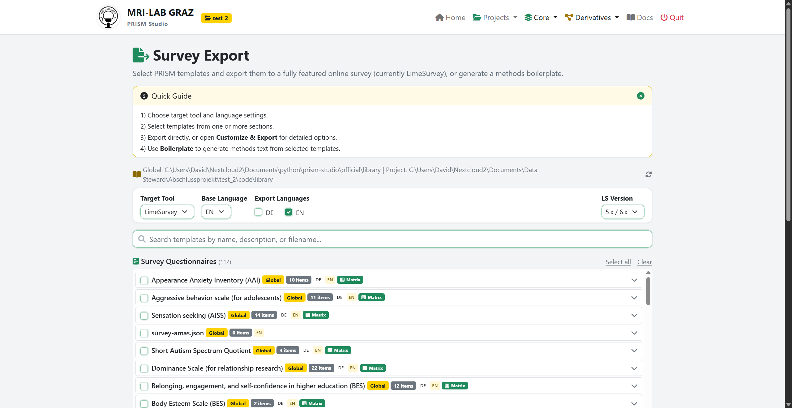

**Configure the export settings:**

- **Target Tool**: LimeSurvey (default)
- **Base Language**: The primary survey language (EN or DE)
- **Export Languages**: Check additional languages for multilingual surveys
- **LS Version**: Match this to your LimeSurvey server version (5.x/6.x recommended)

**Select templates** by checking one or more questionnaires from the list. For each selected template, you can set the **Run** number (for repeated administrations, e.g., pre/post design):

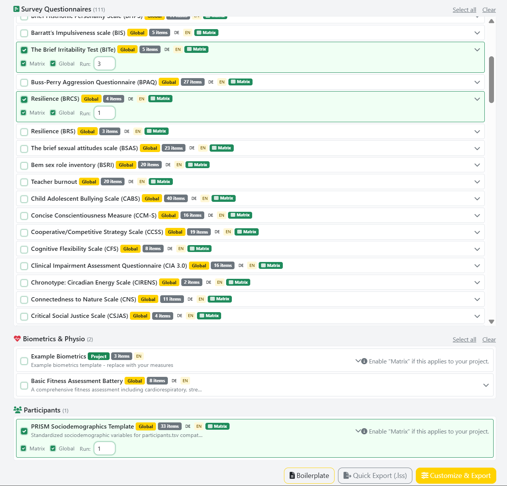

Each template shows:
- Item count and available languages (DE/EN badges)
- Question type (Matrix, List, etc.)
- Source (Global library or Project library)

```{tip}
Use the search bar to filter templates by name, abbreviation, or description.
```

## Step 2: Customize & Export

You have two export options:

- **Quick Export (.lss)**: Downloads the `.lss` file immediately with default settings
- **Customize & Export**: Opens the Survey Customizer for detailed configuration

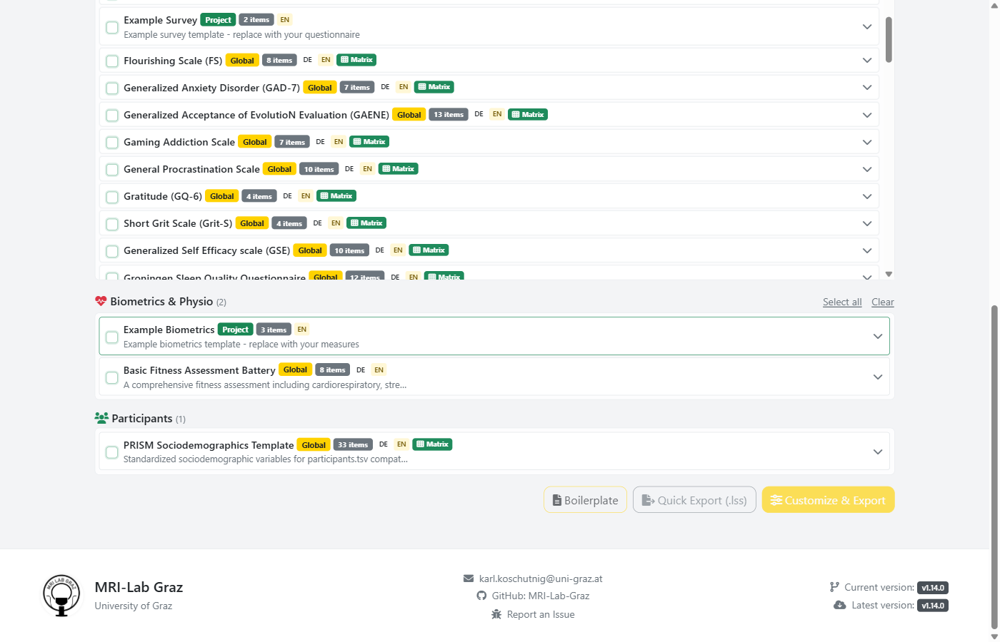

### The Survey Customizer

The Customizer is the recommended path for production surveys. It provides full control over the survey structure and LimeSurvey-specific settings:

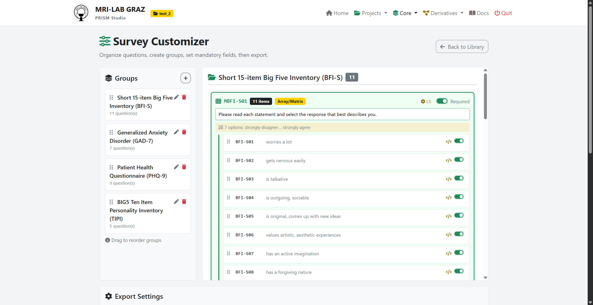

#### Question Group Management
- **Reorder groups** via drag-and-drop on the left panel
- **Add/rename/remove** question groups (pencil and trash icons)
- **Reorder questions** within each group
- **Run numbers** are shown per group (e.g., "Run 1", "Run 2", "Run 3" for repeated measures)

#### Per-Question Settings
Click the **gear icon** (LS) on any question to expand the LimeSurvey tool settings panel:

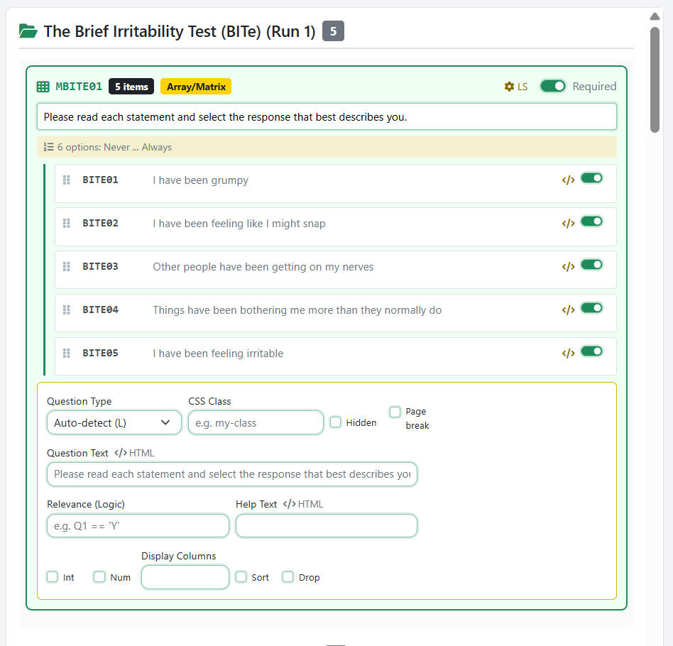

For each question, you can configure LimeSurvey-specific properties:

| Setting | Description | When to use |
|---------|-------------|-------------|
| **Question Type** | Override auto-detected type (Radio, Dropdown, Matrix, Numerical, Text, etc.) | When you want a dropdown instead of radio buttons |
| **Mandatory** | Mark question as required | For questions that must be answered |
| **Relevance** | Conditional display logic (e.g., `Q02 == 'Y'`) | Show/hide questions based on previous answers |
| **Hidden** | Hide question from respondent | For calculated fields or metadata |
| **Input Width** | Control display width (1-12 grid units) | For numerical or text inputs |
| **Validation Min/Max** | Enforce numeric range | For age, rating scales, etc. |
| **CSS Class** | Custom styling | For visual emphasis or grouping |
| **Page Break** | Force a page break before this question | To control pagination |

#### Matrix Grouping
When **Matrix Mode** is enabled (default), questions with identical answer scales are automatically grouped into a matrix/array table in LimeSurvey. This creates a compact layout where respondents see all items with the same scale in one table.

- **Matrix Mode**: Toggle on/off for matrix grouping
- **Global Matrix**: Group all matching questions (not just consecutive ones)

#### Export Settings

At the bottom of the Customizer, configure the survey name, target tool, and language options:

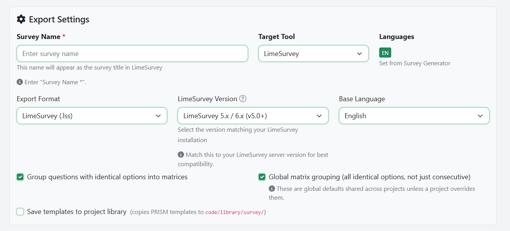

#### Survey-Level Settings

The Customizer also provides survey-wide LimeSurvey settings in expandable accordion sections:

**Welcome & End Messages:**

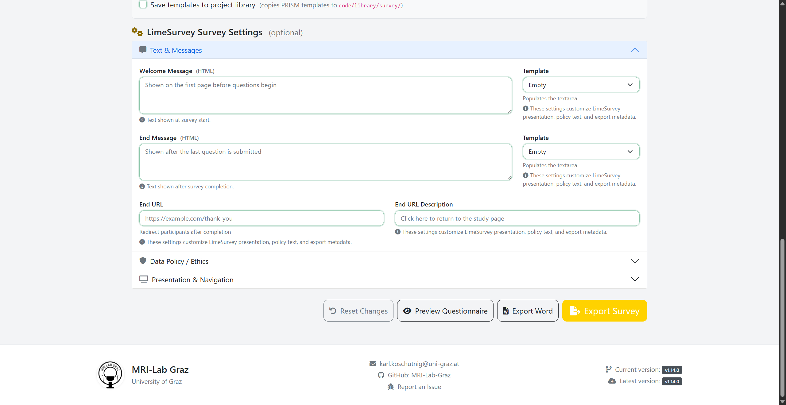

- Welcome text with template dropdown (Standard, Academic, Brief)
- End/thank-you text with template dropdown
- End URL for redirect after completion

**Data Policy & Consent:**

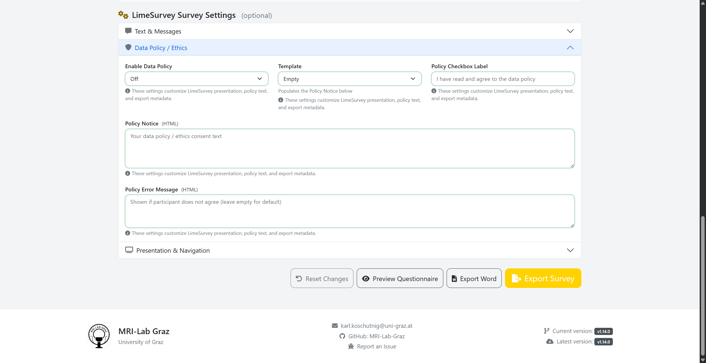

- Data policy display mode (off, inline, popup)
- Consent text with templates (Standard, GDPR, Anonymous, Longitudinal, Minimal)
- Error message for declined consent
- Checkbox label text

**Navigation & Presentation:**

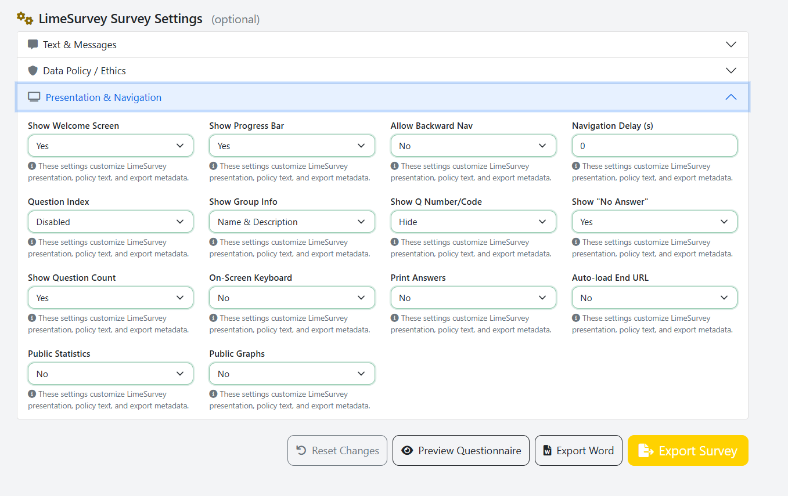

- Navigation delay between pages
- Question index display (disabled, incremental, full)
- Group information display
- Question numbering style
- "No answer" option visibility
- Progress bar display
- Back button availability
- Keyboard navigation toggle

**Privacy & Statistics:**
- Print answers option
- Public statistics / graphs
- Auto-redirect after completion

```{important}
**Save timings** should be enabled if you want timing data in your PRISM dataset. This is configured in LimeSurvey itself (Notifications & Data settings), not in the Customizer.
```

### Preview Before Export

Click **Preview Questionnaire** in the Customizer to see a full preview of the assembled survey in a modal. This shows the questionnaire with matrix grouping and all enabled questions, helping you verify the layout before exporting:

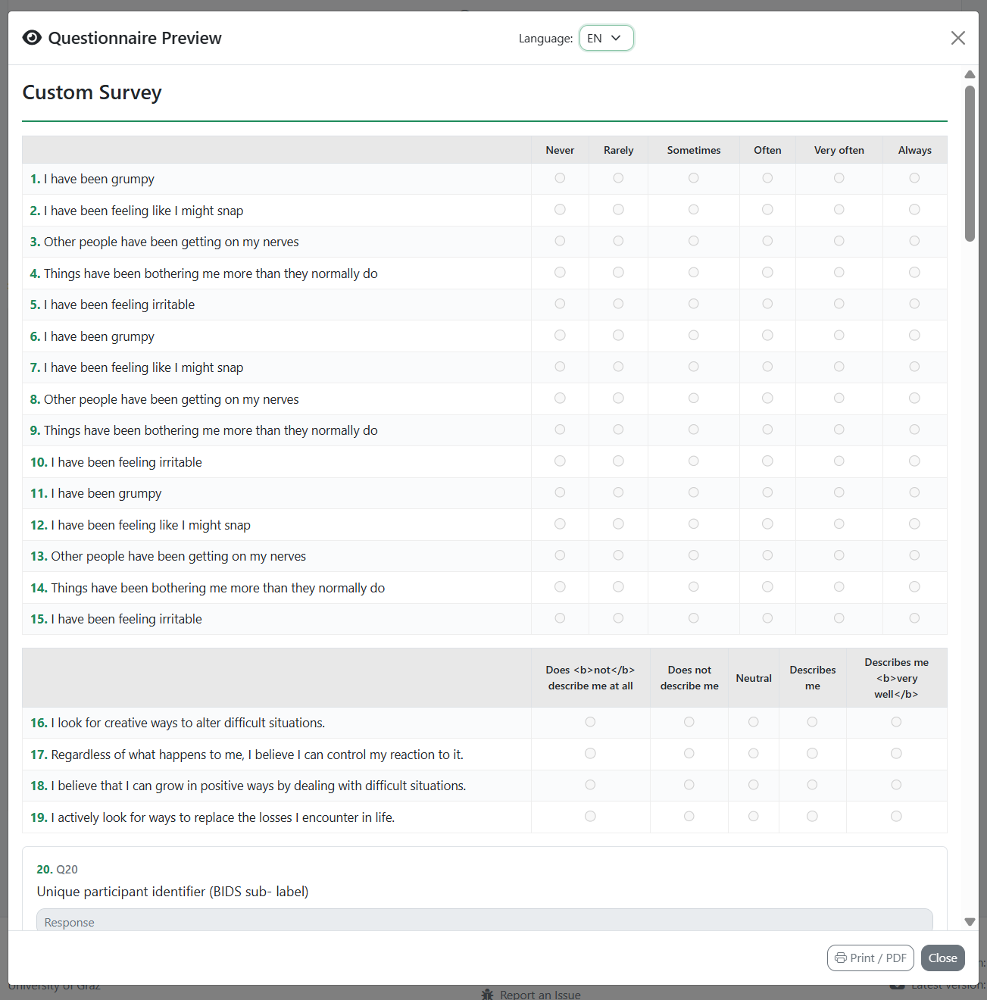

### Exporting the .lss File

Use the action buttons at the bottom of the Customizer:


Click **Export Survey** to generate and download the `.lss` file. If "Save to project library" is checked, the selected templates will also be saved to your project's local library.

## Step 3: Import into LimeSurvey

1. Log in to your LimeSurvey instance
2. Click **Create Survey** (or **+ Create new survey**)
3. Select **Import** and upload the `.lss` file
4. LimeSurvey will show a summary of imported questions and groups
5. Click **Import** to confirm

```{tip}
The imported survey will be in **inactive** state. Review all settings before activating.
```

## Step 4: Adjustments in LimeSurvey

After importing, you may want to configure settings that are not part of the `.lss` export:

### Recommended Settings to Check

| Setting | Location in LimeSurvey | Why |
|---------|----------------------|-----|
| **Date stamps** | Notifications & Data > Date stamp | Required for timing analysis |
| **Save timings** | Notifications & Data > Save timings | Required for response time analysis |
| **IP addresses** | Notifications & Data > Save IP address | Optional, privacy consideration |
| **Token-based access** | Survey Participants | For controlled access or longitudinal designs |
| **Email templates** | Email templates tab | For invitation/reminder emails |
| **Survey theme** | General settings > Theme | Visual appearance |
| **Response persistence** | Notification & Data | Allow participants to save and resume |

### Testing the Survey

Before activating:
1. Click **Preview** to test the survey as a respondent
2. Verify question order, matrix grouping, and conditional logic
3. Check all language versions if multilingual
4. Test on different devices (desktop, tablet, mobile)

## Step 5: Data Collection

1. **Activate** the survey in LimeSurvey
2. Distribute the survey URL to participants
3. Monitor responses via LimeSurvey's response panel

```{note}
Once a survey is activated, you cannot add or remove questions. Make all structural changes before activation.
```

## Step 6: Export from LimeSurvey

After data collection is complete:

### Recommended: Export as .lsa Archive

1. Go to **Display/Export** > **Survey archive (.lsa)**
2. Click **Export**
3. The `.lsa` file contains the survey structure, all responses, and timing data in a single archive

### Alternative: Export as CSV

1. Go to **Responses** > **Export** > **Export results**
2. **Format**: CSV
3. **Heading format**: **Question code** (important — do not use full question text)
4. **Response format**: **Answer codes** (recommended for analysis)
5. Include timing data if available

```{warning}
Always use **Question code** as the heading format. Using full question text will break the column-to-template mapping during PRISM import.
```

## Step 7: Import Responses into PRISM

Importing LimeSurvey data into PRISM is a multi-step process. The key steps are:

1. **Place the data file** in your project's sourcedata folder
2. **Ensure templates exist** in the library for all questionnaires in the survey
3. **Upload and preview** the conversion in the Survey Converter
4. **Convert** to generate the BIDS-compatible output

### 7a. Place Data in Sourcedata

Copy your exported `.lsa` archive (or `.csv`/`.xlsx`) into your project's `sourcedata/` folder:

```
my-project/
  sourcedata/
    survey_archive_484667.lsa    <-- place here
  sub-001/
  sub-002/
  ...
```

If your project has a `sourcedata/` folder, PRISM can auto-detect files from there via a dropdown in the Converter.

### 7b. Ensure Templates are in the Library

When PRISM converts LimeSurvey data, it matches each **question group** in the survey against templates in the library. If a group has no matching template, the conversion will fail with an "unmatched groups" error.

**For surveys exported from PRISM Studio:** Templates are already in the global or project library — no action needed.

**For surveys created directly in LimeSurvey:** You need to import the templates first:

1. Navigate to **Core > Template Editor**
2. Click **+ Create** and select **Import from file**
3. Upload the `.lss` file (you can extract it from the `.lsa` archive, or export it separately from LimeSurvey)
4. Choose **Per Group** import mode — this creates one template per question group
5. Review each generated template and **Save to Project** library

```{tip}
The `.lsa` archive contains the `.lss` structure file inside it. PRISM can import directly from `.lsa` files in the Template Editor.
```

### 7c. Upload and Configure

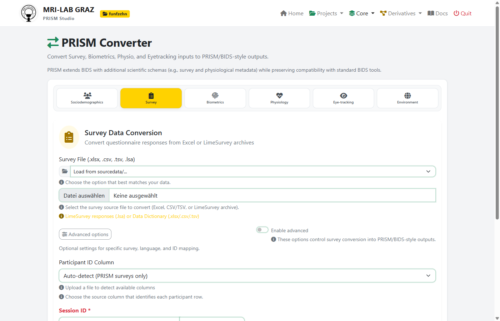

1. Navigate to **Core > Converter > Survey** tab
2. Upload the data file:
   - **`.lsa` archive** (recommended) — contains structure + responses + timing
   - **`.csv`** or **`.xlsx`** — exported response data from LimeSurvey
   - Or select a file from the **sourcedata dropdown** if you placed it in the project folder
3. Configure the conversion:
   - **Participant ID Column**: PRISM auto-detects common ID columns. For LimeSurvey data with token-based access, the `token` column is often used. Select manually if auto-detection fails.
   - **Session ID**: Enter the session identifier (e.g., `1`, `baseline`, `post`). This becomes the `ses-` prefix in BIDS filenames.
   - **Advanced options** (toggle to show):
     - Separator override for CSV files
     - Duplicate handling (keep first, keep last, or treat as sessions)
     - Language for metadata labels

### 7d. Preview (Dry-Run)

Click **Preview (Dry-Run)** to see what PRISM will create without writing any files:

- **Matched templates**: Which library templates match which question groups
- **Participant list**: All detected participants with their IDs and completeness
- **Files to create**: Full list of output files with paths
- **Warnings**: Any issues (unmatched columns, missing values, duplicate IDs)

```{important}
If the preview shows **"unmatched groups"**, go back to Step 7b and import the missing templates first.
```

### 7e. Convert

Click **Convert** to write the BIDS-compatible output files. PRISM generates:

**Survey response files** (one per participant, session, and questionnaire):
```
sub-001/ses-1/survey/
  sub-001_ses-1_task-gad7_survey.tsv        # Response data (items as columns)
  sub-001_ses-1_task-gad7_survey.json       # Metadata sidecar (from library template)
  sub-001_ses-1_task-pss_survey.tsv         # Second questionnaire
  sub-001_ses-1_task-pss_survey.json
```

**LimeSurvey system variable files** (automatically created when system columns are detected):
```
sub-001/ses-1/survey/
  sub-001_ses-1_tool-limesurvey_survey.tsv  # Timestamps, tokens, timing data
  sub-001_ses-1_tool-limesurvey_survey.json # Field descriptions with sensitivity markers
```

**Run-numbered files** (when the same questionnaire is administered multiple times):
```
sub-001_ses-1_task-panas_run-01_survey.tsv  # First administration
sub-001_ses-1_task-panas_run-02_survey.tsv  # Second administration (e.g., post-test)
```

### From CSV/Excel Export (Alternative)

If you exported responses as CSV instead of .lsa:

1. Upload the `.csv` or `.xlsx` file in the Survey Converter
2. PRISM will try to match columns against library templates
3. You may need to manually select which template(s) to use
4. The participant ID column must be explicitly selected (no auto-detection from survey structure)

```{warning}
CSV exports do **not** contain the survey structure. PRISM cannot auto-detect question groups or match templates as reliably as with `.lsa` archives. Always prefer `.lsa` when possible.
```

## System Variables (Metadata Preservation)

When converting LimeSurvey data, PRISM automatically identifies and separates platform metadata from questionnaire responses. These system columns are **not** included in the survey response TSV files — instead, they are written to dedicated **tool-limesurvey** sidecar files.

### Why Separate System Variables?

LimeSurvey stores administrative data (timestamps, tokens, IP addresses, timing) alongside response data. In PRISM/BIDS format, this metadata belongs in a separate file because:

- **Clean survey data**: Response files contain only questionnaire items
- **Privacy**: Sensitive fields (IP address, token) are isolated and clearly marked
- **Timing analysis**: Survey duration and per-group timing are preserved for analysis
- **Reproducibility**: Randomization seeds enable reconstruction of item order

### What Gets Separated

**Core system columns** (always present in LimeSurvey response table):

| Column | Description |
|--------|-------------|
| `id` | Response ID |
| `submitdate` | Submission timestamp (NULL if incomplete) |
| `lastpage` | Last page viewed |
| `startlanguage` | Language at survey start |
| `completed` | Completion flag |
| `seed` | Randomization seed |
| `token` | Participant access token |

**Optional columns** (only present when enabled in LimeSurvey settings):

| Column | Description | Enabled via |
|--------|-------------|-------------|
| `startdate` | Survey start timestamp | Notifications & Data > Date stamp |
| `datestamp` | Last action timestamp | Notifications & Data > Date stamp |
| `ipaddr` | IP address | Notifications & Data > Save IP Address |
| `refurl` | Referrer URL | Notifications & Data > Save Referrer URL |

**Timing columns** (only present when "Save timings" is enabled):

| Pattern | Description |
|---------|-------------|
| `interviewtime` | Total survey time (seconds) |
| `grouptime{N}` | Time per question group (seconds) |
| `questiontime{N}` | Time per individual question (seconds, LS 5+) |

### Derived Fields

PRISM computes additional fields from the raw system data:

- **SurveyDuration_minutes**: Total duration calculated from `submitdate - startdate`, in minutes
- **CompletionStatus**: `"complete"` if `submitdate` is present, `"incomplete"` if the respondent did not submit

### JSON Sidecar

Each `tool-limesurvey_survey.tsv` file is accompanied by a JSON sidecar (`tool-limesurvey_survey.json`) that documents:

- **Metadata**: Schema version, LimeSurvey version, survey ID and title
- **SystemFields**: Description, data type, format, and sensitivity flags for each column
- **Timings**: Per-group and per-question timing columns with units
- **DerivedFields**: Calculated fields with formulas and units

Sensitive fields (`token`, `ipaddr`) are explicitly marked with `"Sensitive": true` in the sidecar.

## Importing Existing LimeSurvey Surveys (.lss)

If you already have a survey running in LimeSurvey and want to bring it into PRISM:

### Export the Structure from LimeSurvey

1. In LimeSurvey, go to **Display/Export** > **Survey structure (.lss)**
2. Click **Export** and save the `.lss` file

### Import into PRISM Template Editor

1. Navigate to **Core > Template Editor**

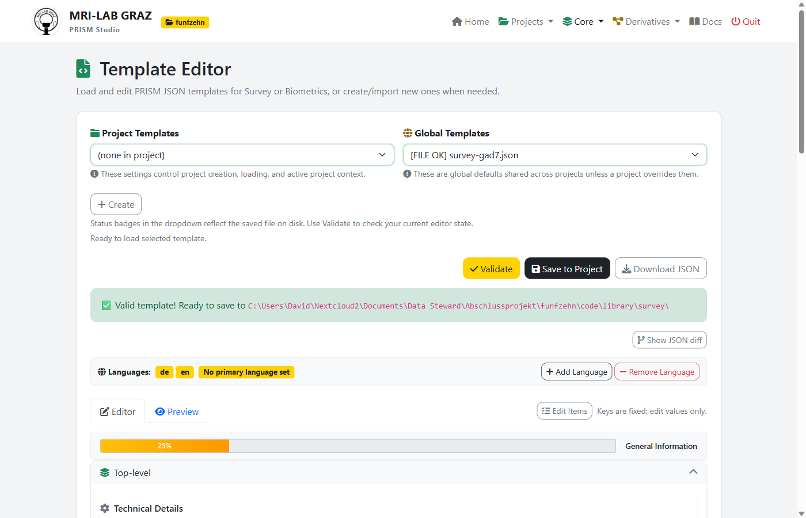

2. Click **+ Create** and select **Import from file**
3. Upload the `.lss` file (or `.lsa` archive)
4. Choose import mode:
   - **Combined**: All questions merged into one template — useful for single-questionnaire surveys
   - **Per Group**: One template per question group — **recommended** for multi-questionnaire surveys
   - **Per Question**: Individual template per question — for maximum granularity
5. Review the generated template(s) in the Editor
6. Click **Save to Project** to add them to your project library

### Supported Question Types (Import)

| LimeSurvey Code | Type | PRISM Mapping |
|-----------------|------|---------------|
| L | List (Radio) | Radio with Levels |
| ! | List (Dropdown) | Dropdown with Levels |
| F | Array (Flexible) | Items with shared Levels |
| A, B, C, E | Array variants | Items with implicit Levels |
| 1 | Array Dual Scale | Dual-scale items |
| M | Multiple Choice | Checkbox |
| S | Short Free Text | Short text |
| T | Long Free Text | Long text |
| N | Numerical Input | Numerical |
| D | Date/Time | Date |
| R | Ranking | Ranking |
| G | Gender | Dropdown (M/F) |
| Y | Yes/No | Radio (Y/N) |
| X | Text Display | Boilerplate (display only) |
| * | Equation | Calculated field |

## Question Type Mapping (Export)

When exporting to LimeSurvey, PRISM automatically maps question types:

| PRISM Template | LimeSurvey Type | Notes |
|----------------|-----------------|-------|
| Items with Levels (2-10 options) | L - List (Radio) | Default for Likert scales |
| Items with Levels (>10 options) | ! - List (Dropdown) | Auto-converts |
| Items with identical Levels | F - Array (Matrix) | When matrix mode is enabled |
| InputType: numerical | N - Numerical Input | With min/max validation |
| InputType: text (single-line) | S - Short Free Text | |
| InputType: text (multiline) | T - Long Free Text | With configurable rows |
| InputType: slider | K - Multiple Numerical | With slider appearance |
| InputType: dropdown | ! - List (Dropdown) | Explicit dropdown |
| InputType: calculated | * - Equation | Hidden calculated field |

### Code Sanitization

LimeSurvey has strict limits on code lengths. PRISM Studio automatically sanitizes codes during export:

- **Question codes**: Max 15 characters (safe limit; LS allows 20)
- **Answer codes**: Max 5 characters
- **Subquestion codes**: Max 5 characters

Codes are made alphanumeric (no special characters), with collision resolution via incremental suffixes.

## Best Practices

### Variable Naming

To ensure smooth conversion between PRISM and LimeSurvey:

- **Question codes**: Use short, alphanumeric codes matching the template item keys (e.g., `GAD701`, `PSS01`)
- **Subquestion codes**: Use simple suffixes (e.g., `SQ001`, `01`)
- **Answer codes**: Use numeric codes (e.g., `0`, `1`, `2`) rather than text codes
- **Avoid special characters** in all codes

### LimeSurvey Settings for PRISM Compatibility

Enable these settings in LimeSurvey **before activating** your survey:

| Setting | Recommended | Why |
|---------|-------------|-----|
| Date stamp | On | Enables start/submit timestamps |
| Save timings | On | Enables per-group and per-question timing |
| Anonymized responses | Off (or as required) | Token-based tracking for longitudinal studies |
| Question codes heading | Always use for export | Required for PRISM column mapping |

### Combining Multiple Questionnaires

To create a multi-questionnaire survey:

1. Use the **Survey Export** page to assemble multiple templates into one `.lss`
2. Or in LimeSurvey: export each questionnaire as a Question Group (`.lsg`) and import into a single survey
3. Each questionnaire should be its own question group for clean separation during re-import

## CLI Reference

### Import .lss to PRISM template

```bash
python app/prism.py convert survey --input survey.lss --library official/library \
    --output /path/to/dataset --session 1
```

### Export PRISM template to .lss

The `.lss` export is currently only available through the web interface (Survey Export page).

## Troubleshooting

### Common Issues

**Import shows "0 questions"**: The `.lss` file may use an unsupported question type or encoding. Try opening it in a text editor to verify it's valid XML.

**Special characters in exported questions**: PRISM Studio sanitizes question codes for LimeSurvey compatibility. Codes longer than 15 characters are truncated, and special characters are removed.

**Timing data not appearing**: Ensure "Save timings" was enabled in LimeSurvey **before** data collection started. Timing data is only available if the survey was configured to record it.

**System variables missing in output**: System variable separation only applies to LimeSurvey-sourced data (detected automatically). If your data was exported as plain CSV without system columns, no tool-limesurvey files will be generated.

**Matrix grouping not working as expected**: Matrix grouping requires questions with *identical* answer scales (same codes and labels). Even small differences in scale labels will prevent grouping.

**Column mapping errors during import**: Ensure LimeSurvey data was exported with **Question code** as the heading format, not full question text or question ID.
