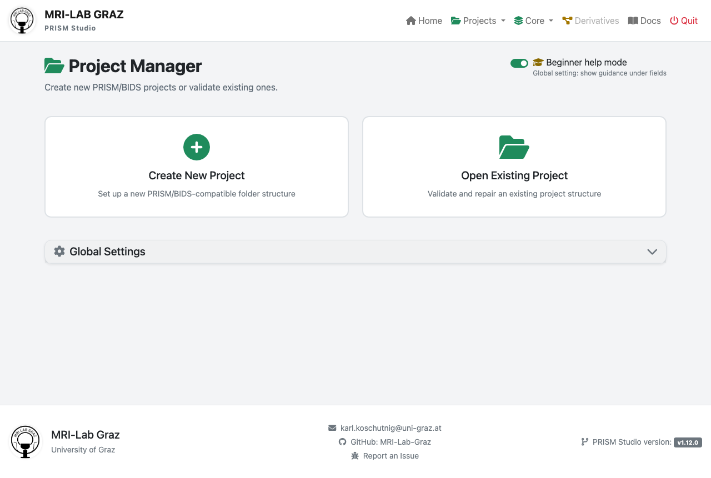
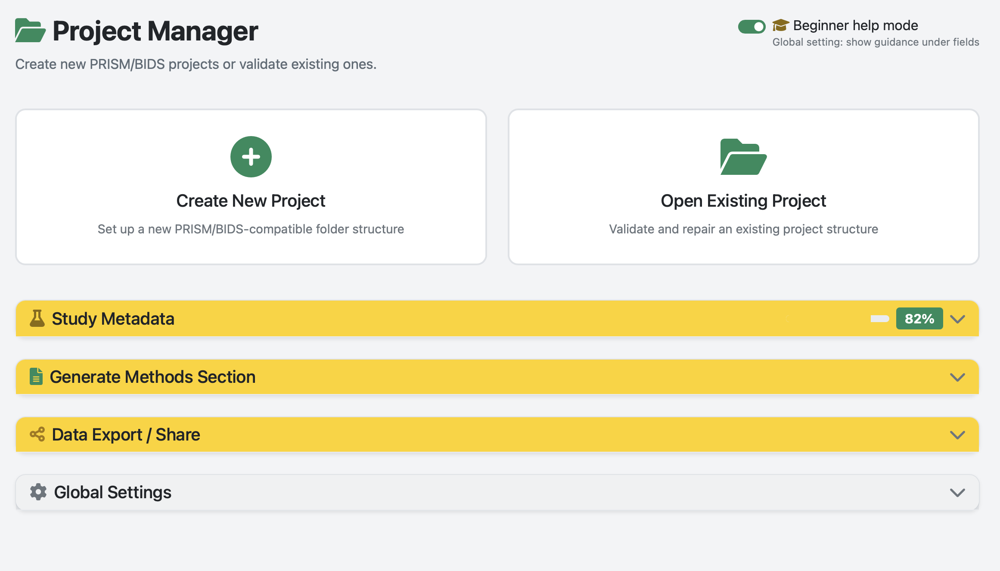
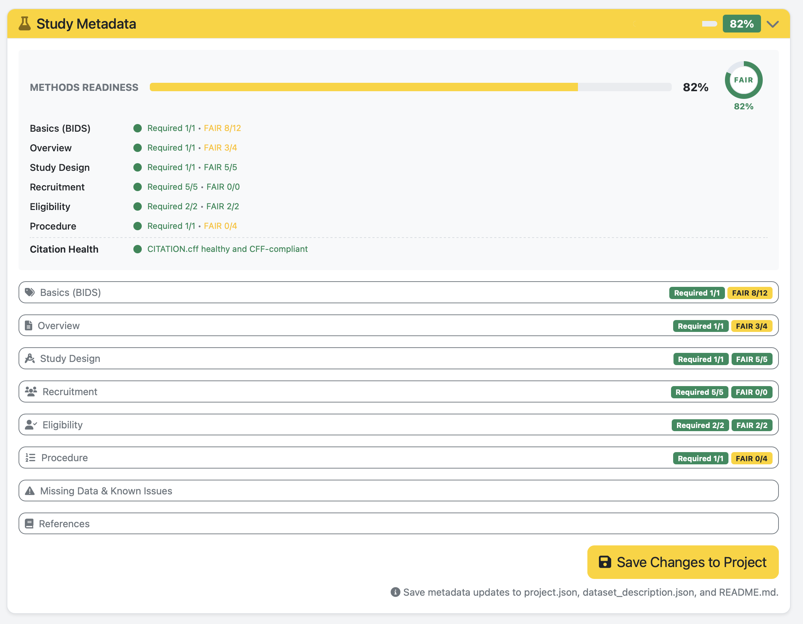
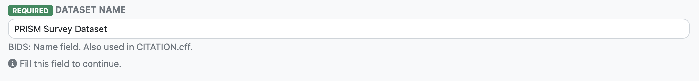

# Projects

Use this page to create and manage projects in the **PRISM Studio frontend**.

This guide is intentionally UI-first. Standard users should use the project forms in PRISM Studio instead of editing JSON files manually.

## Open the Projects Page

1. Start PRISM Studio.
2. Open `Projects` in the top navigation.



### Global Overview (Project Loaded)

When a project is loaded, the `Projects` page provides a single overview of all project-management entry points.



The overview includes:

- `Create New Project` and `Open Existing Project` cards at the top.
- Top-level accordions for `Study Metadata`, `Generate Methods Section`, and `Data Export / Share`.
- `Global Settings` as a separate collapsible section.
- `Beginner help mode` toggle in the page header.

Use this view as the starting point before opening specific subsections.

## Create a New Project (Recommended)

1. Click `Create New Project`.
2. Fill the form fields:
   - `Project Name`: short, lowercase with underscores. Example: `wellbeing_study`.
   - `Project Location`: choose the parent folder where the project folder will be created.
3. Confirm creation.

### What to Fill In

- Use clear project names that map to your study title.
- Avoid spaces and special characters in folder names.
- Keep one study per project folder.

### What PRISM Studio Creates

PRISM Studio creates a project scaffold aligned with YODA principles and PRISM-compatible dataset organization.

```text
my_study/
|-- dataset_description.json
|-- participants.tsv
|-- sub-001/
|-- code/
|-- analysis/
|-- project.json
`-- CITATION.cff
```

## Open an Existing Project

1. Click `Open Existing Project`.
2. Select either:
   - the project folder, or
   - `project.json` inside that folder.
3. Verify the project is active in the UI header.

## Edit Project Metadata in the Frontend

Use frontend forms for common metadata updates:

- Dataset title and description
- Authors and contributors
- Participants metadata
- Project-level settings

Avoid manual JSON editing unless you are doing advanced maintenance.

### Metadata Snippet 1: Global Status



Use this screenshot to interpret project readiness at a glance:

- Treat `Required` completion as the release blocker for methods completeness.
- Use the `FAIR` indicator to prioritize improvements after required fields are complete.
- Re-check this panel after each subsection save to verify real progress.

### Metadata Snippet 2: Basics (BIDS)



Use this screenshot as the canonical reference for first-pass metadata completion.

Field intent beyond inline help:

- `Dataset Name`: canonical study label used across BIDS metadata and citation output.
- `Authors`: maintain consistent name style to avoid citation drift.
- `Ethics Approvals`: capture committee and approval ID in publication-ready wording.
- `Keywords`: use normalized terms to improve search and reuse.
- `Funding`: set explicit `Yes` or `No`; do not leave ambiguous blanks.

Quick example:

```text
Dataset Name: mood_regulation_study
Keywords: emotion regulation, stress, longitudinal, survey
Funding: Austrian Science Fund (FWF), P34789
```

### Additional Metadata Subsections

#### Overview

- `Dataset Overview` (required): short paragraph with goals, context, and unique value.
- `Independent Variables`: manipulated conditions.
- `Dependent Variables`: measured outcomes.
- `Control Variables`: pre-defined controls/covariates.
- `Quality Assessment`: brief QC summary or pointer to QC report.

#### Study Design

- `Study Design Type` (required): select the top-level design (`cross-sectional`, `longitudinal`, `RCT`, etc.).
- `Condition Type`: between-subjects, within-subjects, or mixed.
- `Type Description`: extra detail (for example `2x2 factorial`).
- `Blinding`, `Randomization`, `Control Condition`: fill for experimental designs.

#### Recruitment

- `Method` (required): recruitment channels (multi-select).
- `Location` (required): country/city entries or `Online-only recruitment`.
- `Period Start` and `Period End` (required): recruitment window.
- `Financial Compensation` (required): whether participants were compensated.

#### Eligibility

- `Inclusion Criteria` (required): one criterion per line.
- `Exclusion Criteria` (required): one criterion per line.
- `Target Sample Size`: planned sample size.
- `Power Analysis`: concise method and assumptions.

#### Procedure

- `Overview` (required): narrative of the study flow.
- `Informed Consent`: when/how consent was captured.
- `Quality Control`: one QC measure per line.
- `Missing Data Handling`: planned handling strategy.
- `Debriefing`: how and when participants were debriefed.
- `Additional Data Acquired`: extra data not central to the current release.
- `Notes`: practical or procedural notes.

#### Missing Data & Known Issues

- `Missing Data Description`: high-level summary.
- `Missing Files (Table)`: one line per subject, format `SubjectID | missing content`.
- `Known Issues (Table)`: one line per file, format `Filename | issue`.

#### References

- `References`: one citation or DOI/URL per line.
- Prefer stable identifiers (DOI, PMID, OSF URL).

### Suggested Fill Order

Use this order to move quickly from 0% to publication-ready metadata:

1. Complete all `REQUIRED` fields in `Basics (BIDS)`.
2. Fill required fields in `Overview`, `Study Design`, `Recruitment`, `Eligibility`, and `Procedure`.
3. Add recommended FAIR fields (`License`, `Dataset Type`, richer references).
4. Add `Missing Data & Known Issues` once data collection/QA is underway.
5. Re-check `Methods Readiness` and `Citation Health`.

## Recommended User Workflow

1. Create/open project in `Projects`.
2. Convert/import data in `Converter`.
3. Validate in `Validator`.
4. Run scoring in `Tools -> Recipes & Scoring`.

## Optional CLI (Advanced)

CLI is optional and intended for automation or CI.

```bash
# Validate project dataset
python prism-validator /path/to/project

# Run survey recipes
python prism_tools.py recipes survey --prism /path/to/project
```

For full command coverage, see [CLI Reference](CLI_REFERENCE.md).

## Roadmap (User Feedback, 2026-03-16)

This roadmap translates recent user feedback into concrete implementation slices.

### Solved in This Iteration

- [x] `Open Existing Project` now accepts both project folder and `project.json` path.
- [x] Windows picker flow improved with folder fallback and stricter `project.json` validation.
- [x] Dead paths are removed from recent projects instead of only being hidden.
- [x] Participant table loading is more robust against BOM and CSV/TSV delimiter mismatch.
- [x] Project state synchronization improved across navbar and page-level project state.

### P1 - Editing Concept / State Consistency (Next)

- [ ] Introduce a single frontend project-state store used by all pages/tools.
- [ ] Emit and consume one canonical project-change event (`prism-project-changed`) everywhere.
- [ ] Remove duplicated project-path derivation logic (hidden inputs, `window.*`, per-page fallbacks).
- [ ] Add integration tests for tool switching with an already-loaded project.

Acceptance criteria:

- Switching between `Projects`, `Converter`, `Recipes`, `Validator`, and `Tools` never loses loaded project context.
- Menu enable/disable states are consistent after load, reload, and project switch.
- Required field indicators stay stable after section reload/save cycles.

### P1 - Save As / Rename / Move Project

- [ ] Add backend operation to duplicate project metadata and structure to a new target path.
- [ ] Add optional in-place rename operation with path safety checks.
- [ ] Add optional move operation across drives/folders with conflict handling.
- [ ] Preserve BIDS compatibility files and project pointers during copy/move.

Acceptance criteria:

- Users can create a new similar project from an existing one without manual filesystem edits.
- Cross-drive move/copy works on Windows and keeps project loadable in PRISM Studio.
- Recent projects update automatically and drop stale source entries when moved.

### P1 - Resume Marker for Long-Running Actions

- [ ] Persist conversion/analysis run metadata (status, started_at, last_step, output_path).
- [ ] Add resumable job UI with `Resume`, `Restart`, and `Discard` actions.
- [ ] Add explicit crash-safe write points for multi-step conversions.

Acceptance criteria:

- Interrupting a run (sleep/close/restart) does not force full rerun when intermediate state exists.
- Users see clear resume location and next action after returning.

### P2 - Parsing Reliability / Error Transparency

- [ ] Standardize tabular file ingestion helpers across all converter blueprints.
- [ ] Normalize parser error messages to actionable UI hints (delimiter, encoding, missing required columns).
- [ ] Add regression fixtures for malformed header, BOM, wrong delimiter, and mixed TSV/CSV naming.

Acceptance criteria:

- Common `line 1 char 1` parsing failures produce targeted guidance instead of generic errors.
- Same input file behavior across participants/survey/biometrics flows.

## Lessons Learned (2026-03-16)

- Shared utility code is not enough if callers still implement divergent behavior; state and flow ownership must be centralized.
- Returning different path semantics (`project.json` vs project root) creates hidden cross-tool bugs.
- Recent-project cleanup should be data maintenance, not only presentation filtering.
- Parser robustness must be implemented once and reused, not re-implemented per blueprint.

## Next Sprint Handover (Token-Light)

Use this checklist to continue in a fresh chat without reloading full history.

### Goal

- Finish P1 state consistency across all remaining frontend modules.
- Keep Project Manager neutral on entry (no implicit autoload).
- Keep Windows picker responsiveness high (`tkinter` first).

### Immediate Tasks

- [x] Replace remaining direct `window.currentProjectPath` reads with store-first helpers in untouched modules.
- [x] Add one integration-style frontend test flow: load project -> switch pages -> create mode -> recent project reload.
- [x] Validate that navbar badge + menu enabled states are always event-driven (`prism-project-changed`).

### Verification Gate

- [x] Run targeted unit tests for lifecycle, participants, picker service.
- [x] Run `tests/verify_repo.py` with `path-hygiene` and `system-file-filtering` checks.
- [ ] Manual GUI pass on Windows: project switch, create reset, recent project click, picker latency feel.

### Lessons Learned (Delta)

- Clearing only form inputs is insufficient; active project context must be cleared too.
- Project display name must be derived from the selected project's metadata, not stale session state.
- Theme utility overrides should honor Bootstrap opacity variables to avoid visual regressions.
- Small iterative test gates between UI changes reduce backtracking significantly.
