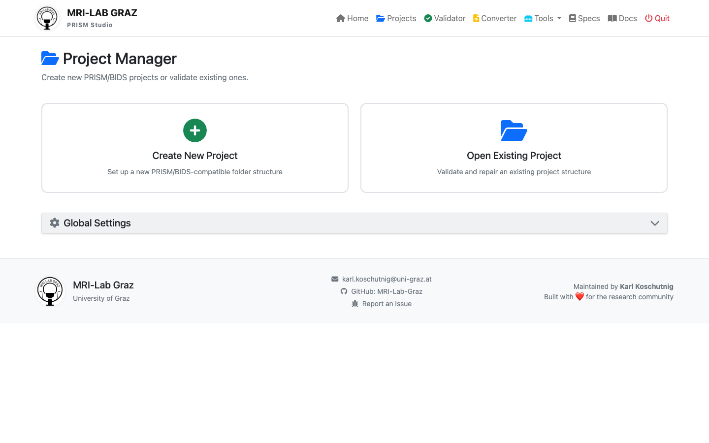

# Projects

Use this page to create and manage projects in the **PRISM Studio frontend**.

This guide is intentionally UI-first. Standard users should use the project forms in PRISM Studio instead of editing JSON files manually.

## Open the Projects Page

1. Start PRISM Studio.
2. Open `Projects` in the top navigation.


## Create a New Project (Recommended)

1. Click `Create New Project`.
2. Fill the form fields:
   - `Project Name`: short, lowercase with underscores. Example: `wellbeing_study`.
   - `Project Location`: choose the parent folder where the project folder will be created.
3. Confirm creation.



### What to Fill In

- Use clear project names that map to your study title.
- Avoid spaces and special characters in folder names.
- Keep one study per project folder.

### What PRISM Studio Creates

PRISM Studio creates a project scaffold aligned with YODA principles and PRISM-compatible dataset organization.

```text
my_study/
|-- dataset_description.json
|-- participants.tsv
|-- sub-001/
|-- code/
|-- analysis/
|-- project.json
`-- CITATION.cff
```

## Open an Existing Project

1. Click `Open Existing Project`.
2. Select either:
   - the project folder, or
   - `project.json` inside that folder.
3. Verify the project is active in the UI header.

## Edit Project Metadata in the Frontend

Use frontend forms for common metadata updates:

- Dataset title and description
- Authors and contributors
- Participants metadata
- Project-level settings

Avoid manual JSON editing unless you are doing advanced maintenance.

### Metadata Snippet 1: Readiness

The `Methods Readiness` panel summarizes how complete your project metadata is for reporting and FAIR reuse.

How to read it:

- `Required`: fields needed for a complete baseline methods description.
- `FAIR`: additional fields that improve findability, interoperability, and reuse.
- Progress bar and percentage: overall completion across sections.
- `Citation Health`: quick check for `CITATION.cff` completeness/compliance.

How to use it in practice:

1. Prioritize rows that still show missing `Required` items.
2. Then improve rows with missing `FAIR` items.
3. Re-open readiness after edits to confirm progress moved up.

Recommended screenshot filename for this snippet:
`docs/_static/screenshots/prism-studio-project-metadata-readiness-light.png`

### Metadata Snippet 2: Subsection Status Overview

This view lists all metadata subsections and shows completion per section.

Typical subsections include:

- `Basics (BIDS)`
- `Overview`
- `Study Design`
- `Recruitment`
- `Eligibility`
- `Procedure`
- `Missing Data & Known Issues`
- `References`

How to read the badges on the right:

- `Required X/Y`: mandatory fields completed in that section.
- `FAIR X/Y`: optional FAIR-supporting fields completed in that section.

Suggested workflow:

1. Fix sections where `Required` is not complete.
2. Then improve sections with low `FAIR` coverage.
3. Re-check readiness score after each section update.

Recommended screenshot filename for this snippet:
`docs/_static/screenshots/prism-studio-project-metadata-subsections-overview-light.png`

## Recommended User Workflow

1. Create/open project in `Projects`.
2. Convert/import data in `Converter`.
3. Validate in `Validator`.
4. Run scoring in `Tools -> Recipes & Scoring`.

## Optional CLI (Advanced)

CLI is optional and intended for automation or CI.

```bash
# Validate project dataset
python prism-validator /path/to/project

# Run survey recipes
python prism_tools.py recipes survey --prism /path/to/project
```

For full command coverage, see [CLI Reference](CLI_REFERENCE.md).
