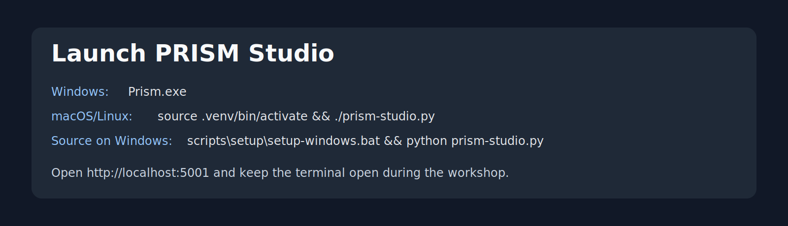
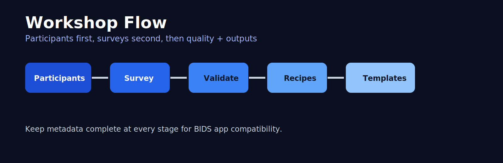
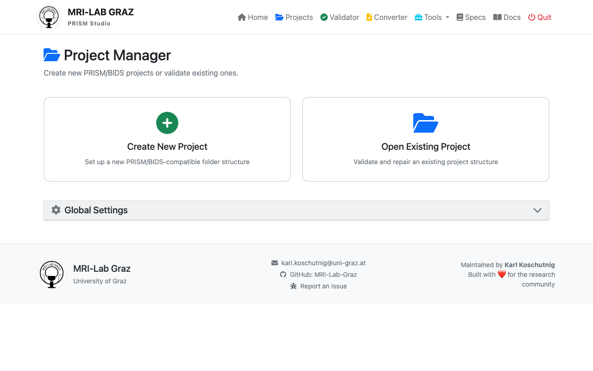
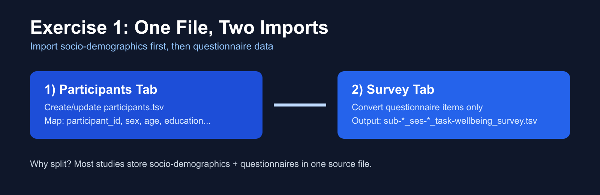

# PRISM Studio Overview

PRISM Studio is the frontend-first workflow for PRISM.

Use Studio when you want guided project setup, conversion, validation, and scoring in one place. Use CLI when you need automation or CI.

## Start Studio

From repository root:

```bash
python prism-studio.py
```

Open `http://localhost:5001` if your browser does not open automatically.



## Workflow Map



The recommended order is:

1. Create or open a project.
2. Import or convert data.
3. Run validation.
4. Fix issues and re-validate.
5. Run recipes and export outputs.

(projects-page)=
## 1) Create or Open a Project

UI path: `Projects`

Goal:
- Create a clean research project structure.
- Keep validation target and analysis outputs separated.



Expected structure:

```text
project_name/
|-- dataset_description.json
|-- participants.tsv
|-- sub-001/
|-- code/
|-- analysis/
|-- project.json
`-- CITATION.cff
```

## 2) Convert and Import Data

UI path: `Converter`

Goal:
- Convert source files (Excel/CSV/TSV/SPSS/LimeSurvey) into PRISM-compatible files.

Inputs:
- Source data file(s)
- Participant ID column
- Item/data column mapping

Output:
- Subject-level files in PRISM/BIDS-like folder structure.

Visual reference:



## 3) Validate the Dataset

UI path: `Validator`

Goal:
- Detect filename, sidecar, and schema issues.
- Optionally include BIDS validation.

Result levels:
- Error: must fix
- Warning: should fix
- Suggestion: recommended improvement

What to do next:

1. Open issue details.
2. Apply fixes manually or with auto-fix when available.
3. Re-run validation until blocking errors are gone.

## 4) Tools for Metadata and Scoring

UI path: `Tools`

Main tools:
- `Template Editor`: create/edit survey and biometrics templates.
- `JSON Editor`: edit sidecars and participant metadata.
- `Recipes & Scoring`: compute derivative variables and scores.
- `File Management`: organize and rename files safely.

## 5) Export and Report

After validation and scoring:
- Export derivatives as needed.
- Keep generated outputs in project analysis/derivatives paths.
- Keep raw/primary data unchanged.

## Frontend-First, Backend as Source of Truth

PRISM Studio UI is workflow UX.
Validation and processing logic remains in backend modules.

If behavior is inconsistent, trust backend CLI validation as the canonical result:

```bash
python prism-validator /path/to/project_or_dataset --bids
```

## Common Problems

Problem: Studio starts but page is blank.
- Check terminal output for Flask errors.
- Ensure virtual environment is activated.

Problem: Validation reports missing sidecar JSON.
- Add matching `.json` sidecar or place a valid inherited sidecar at higher dataset level.

Problem: Data imported but task/modality looks wrong.
- Re-check converter mapping and filename patterns.
- Re-run validation to confirm corrected structure.

## Related Pages

- Detailed command reference: [CLI_REFERENCE.md](CLI_REFERENCE.md)
- Command-based workflows: [CLI_WORKFLOWS.md](CLI_WORKFLOWS.md)
- Hands-on walkthrough: [WORKSHOP.md](WORKSHOP.md)
