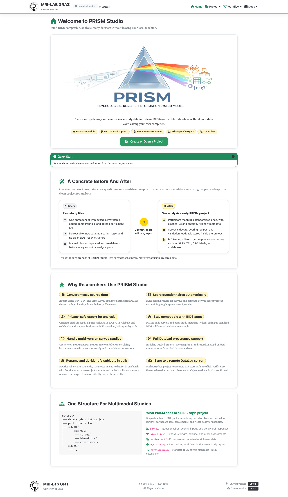
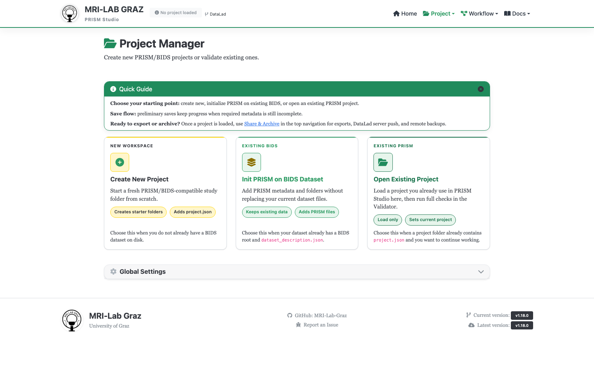
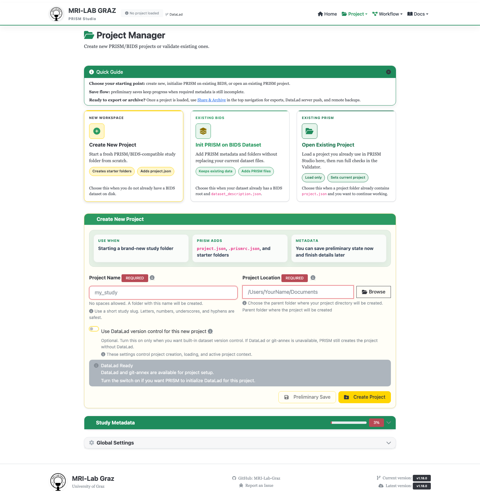
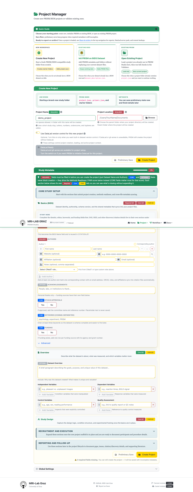

# Chapter 1: Create a Project

Chapter 1 of [Getting Started — Your First PRISM Project](TUTORIAL_BEGINNER.md).
This is about creating the project structure everything else in this series
gets loaded into, *and* filling in the small set of Study Metadata fields
that actually gate project creation — it doesn't import any data yet, and it
deliberately doesn't attempt the full Study Metadata form, most of which
belongs later in a study's lifecycle.

**Time:** ~15 minutes. **Outcome:** a `wellbeing_study` project with a
correct folder structure and complete required metadata, ready for chapter 2.

```{mermaid}
flowchart TD
    A["Launch Studio"] --> B["Projects page:<br/>Create New Project"]
    B --> C["Name & Location"]
    C --> D["Study Metadata:<br/>Dataset Name, Authors, ..."]
    D --> E["Create Project"]
    E --> F["wellbeing_study/<br/>scaffold created"]
```

<div class="prism-persona-note" data-persona-note>
<p class="prism-persona-note-empty" data-persona-empty>Picked a persona on the <a href="TUTORIAL_BEGINNER.html#pick-a-reason-to-be-here">intro page</a>? This note speaks to it.</p>

<div class="prism-persona-note-content" data-persona="student" hidden>
<span class="prism-persona-note-badge">👩🏽‍🎓 The enthusiastic student <a class="prism-persona-note-change" href="TUTORIAL_BEGINNER.html#pick-a-reason-to-be-here">change</a></span>

*Your last rotation project ended as a folder called `data_final2`, and you
promised yourself the next one wouldn't.* `wellbeing_study` is that next
one. This is where you stop improvising folder structure from scratch every
time — everything later in this series (participants, surveys, scoring,
sharing) assumes exactly this layout, so you never have to reinvent it.

</div>

<div class="prism-persona-note-content" data-persona="pi" hidden>
<span class="prism-persona-note-badge">👨🏿‍🔬 The skeptical PI <a class="prism-persona-note-change" href="TUTORIAL_BEGINNER.html#pick-a-reason-to-be-here">change</a></span>

*Three years after the Excel-files-with-no-codebook incident, "every
project goes through PRISM, no exceptions" is lab policy now — and
`wellbeing_study` is the one you're setting up as this semester's example
for the new students.* This is the structure you'll point them to instead
of explaining it from memory again.

</div>

<div class="prism-persona-note-content" data-persona="future" hidden>
<span class="prism-persona-note-badge">🧑🏻 Future-you <a class="prism-persona-note-change" href="TUTORIAL_BEGINNER.html#pick-a-reason-to-be-here">change</a></span>

*Eighteen months from now, someone — probably you — is going to open this
folder with zero memory of today.* Fill in Dataset Name and Authors
properly now; today is the only day this is cheap.

</div>
</div>

## Part A — Project basics

### 1. Launch Studio

From a prebuilt release, open the app. From a source checkout:

```bash
source .venv/bin/activate && python prism-studio.py
```

Studio opens at `http://localhost:5001` on its landing page.



Select **Create or Open a Project** to open the **Projects** page.

### 2. Choose "Create New Project"



The Projects page offers three cards — use **Create New Project**. The other
two are for later: **Init PRISM on BIDS Dataset** adds PRISM's project files
onto a BIDS dataset that already exists (without overwriting anything);
**Open Existing Project** loads a project you already created. Neither
applies here since we're starting from nothing.

### 3. Name and location



| Field | What to enter | Notes |
|---|---|---|
| Project Name | `wellbeing_study` | Letters, numbers, `_`, `-` only — no spaces. The field validates live and tells you exactly what's wrong (e.g. names a space or an umlaut) rather than just turning red. |
| Project Location | a parent folder, e.g. `~/prism_projects` | The new project directory is created *inside* this folder, named after Project Name — so the actual target is `<Location>/wellbeing_study/`. The parent folder itself can already contain other things (other projects, unrelated files); what has to be empty or not-yet-existing is that specific `<Location>/wellbeing_study/` subfolder. |
| Use DataLad version control | leave unchecked for now | Optional. You can enable DataLad later; the Intermediate tutorial explains when it is useful. |

```{warning}
PRISM creates `<Location>/wellbeing_study/`. That exact folder must be new or
empty; do not point it at a folder that already contains source files. Leave
DataLad unchecked for this first project.
```

There is no modality or session picker at this step; modalities and
sessions are populated automatically as you import data in later chapters.

## Part B — Study Metadata essentials

The **Study Metadata** card appears once you start filling in the form
above. It's a large form covering a study's entire lifecycle (design,
recruitment, procedure, missing-data notes, and more), but only two things
in it actually block project creation: **Dataset Name** and **Authors**.
Fill those in properly now rather than dismissing them — it's little extra
effort at this point, and it means `dataset_description.json` and
`CITATION.cff` start out correct instead of needing a cleanup pass later.

Expand the card and make sure you're in its **Basics (BIDS)** section (open
by default under "Core study setup").




### 1. Dataset Name

Enter a human-readable dataset title, e.g. `Wellbeing Study` — minimum 3
characters. This becomes the BIDS `Name` field in `dataset_description.json`
and is reused in `CITATION.cff`. It doesn't have to match the Project Name
from Part A exactly (that one's a filesystem-safe slug; this one is a real
title).

### 2. Authors

Click **Add Author**, then fill in:

- **First name** / **Last name** — both required for the row to count.
- **Corresponding** checkbox — mark yourself (or whoever should be the
  contact) as the corresponding author. Only one author can be marked
  corresponding at a time.
- **Email** — optional in general, but *required* once an author is marked
  corresponding.
- **ORCID** / **Affiliation** — both optional; ORCID has a lookup button if
  you want to search by name instead of typing the ID.

At least one author with a first and last name, with exactly one of them
marked corresponding and carrying an email address, is what's actually
required. Add more author rows the same way if the study has more than one
author.

### 3. Worth doing now, not required: Ethics, Keywords, Funding

Three more fields sit right below Authors in the same Basics section, under
a **Core study setup** header and carrying a blue **CORE** badge — not the
red **REQUIRED** badge Dataset Name and Authors carry. **CORE does not mean
blocking**: these three fields cannot trigger the Required Fields Missing
dialog in Part C no matter how you leave them. What CORE *does* mean is that
they feed the **Methods Readiness / FAIR score** shown at the top of the
card (the small ring badge labeled **FAIR**) — a completeness/quality
indicator, not a gate. They're quick to answer honestly right now, so do
that, but don't go looking for a missing-fields error that these three
fields can't actually cause:

- **Ethics Approvals** — click Yes/No. If Yes, fill in the committee name
  and reference number.
- **Keywords** — a comma-separated list, e.g. `psychology, wellbeing,
  questionnaire`. Aim for at least three.
- **Funding** — click Yes/No. If Yes, add one row per funding source with
  agency and grant number.

### What's intentionally left for later

Everything else in the Study Metadata card — **Overview**, **Study
Design**, **Recruitment**, **Eligibility**, **Procedure**, **Discovery &
Citation**, **Missing Data & Known Issues**, **References** — is grouped
under "Recruitment and execution" and "Reporting and follow-up," collapsed
by default in the UI itself. That's a deliberate signal, not an oversight
on this tutorial's part: those sections describe things you typically don't
know yet at project-creation time (recruitment period, final sample size,
missing-data notes), or that can wait until the project scaffold is stable
(DOI, HED tags). Skip them for this tutorial; nothing later in this series
depends on them.

## Part C — Create the project

Click **Create Project** (not **Preliminary Save**, which only saves the
form without creating anything yet).

With Dataset Name and a corresponding Author filled in from Part B, project
creation should proceed straight through without any warning dialog. If a
**Required Fields Missing** dialog appears anyway, it means one of those two
fields didn't save correctly (e.g. the corresponding author's email is
still empty) — read the listed items, click **Go back and fill fields**,
and fix exactly what's named rather than guessing.

## What gets created

```text
wellbeing_study/
├── dataset_description.json
├── .bidsignore
├── .prismrc.json
├── README.md
├── project.json
├── CITATION.cff
├── CHANGES
├── sourcedata/
├── derivatives/
└── code/
    ├── library/
    └── recipes/
```

Notice `participants.tsv` is **not** in this list — that's created in
chapter 2. The generated `README.md` inside the project describes this same
layout, so you can always re-check it later without leaving the project.

<div class="prism-persona-note" data-persona-note>
<p class="prism-persona-note-empty" data-persona-empty>Picked a persona on the <a href="TUTORIAL_BEGINNER.html#pick-a-reason-to-be-here">intro page</a>? This note speaks to it.</p>

<div class="prism-persona-note-content" data-persona="student" hidden>
<span class="prism-persona-note-badge">👩🏽‍🎓 The enthusiastic student <a class="prism-persona-note-change" href="TUTORIAL_BEGINNER.html#pick-a-reason-to-be-here">change</a></span>

An empty, correctly-shaped project, `dataset_description.json` and
`CITATION.cff` already accurate. It doesn't feel like much yet — that
changes in Chapter 2, when real data goes in for the first time.

</div>

<div class="prism-persona-note-content" data-persona="pi" hidden>
<span class="prism-persona-note-badge">👨🏿‍🔬 The skeptical PI <a class="prism-persona-note-change" href="TUTORIAL_BEGINNER.html#pick-a-reason-to-be-here">change</a></span>

Five minutes of metadata, and the scaffold is already more complete than
half the datasets that have crossed your desk. Chapter 2 is where you find
out whether the data behind it holds up to the same standard.

</div>

<div class="prism-persona-note-content" data-persona="future" hidden>
<span class="prism-persona-note-badge">🧑🏻 Future-you <a class="prism-persona-note-change" href="TUTORIAL_BEGINNER.html#pick-a-reason-to-be-here">change</a></span>

Whatever you typed into Dataset Name and Authors just now is what
`dataset_description.json` will say forever, or until someone deliberately
edits it. That's one less thing eighteen-months-from-now-you has to
reconstruct from memory.

</div>
</div>

## Common mistakes

- **Pointing Project Name + Location at a folder that already has content
  in it** — e.g. reusing a folder where source files were already dropped,
  or retrying after a failed attempt left partial output behind. PRISM
  rejects this outright rather than merging into it; use **Init PRISM on
  BIDS Dataset** instead if you're deliberately adding PRISM to data that
  already exists.
- **Typing a project name with spaces or accented characters** — the field
  will tell you exactly what's invalid; fix it there rather than guessing.
- **Clicking Preliminary Save and expecting a project to exist** — that
  button only saves form values for later; only **Create Project** actually
  creates the folder structure.
- **Marking an author corresponding without an email** — this is the most
  common reason the Required Fields Missing dialog still appears after
  filling in Part B; the email is only required *because* that author is
  corresponding, so add it or unmark the checkbox.
- **Confusing CORE with REQUIRED** — see Part B, step 3: the blue CORE badge
  (Ethics Approvals, Keywords, Funding) never blocks creation, only the red
  REQUIRED badge (Dataset Name, Authors) does.
- **Expecting a DataLad checkbox mistake to be permanent** — it isn't; this
  choice can be revisited later and isn't covered in depth until the
  Intermediate tutorial.

## What's next

- [Chapter 2 — Import sociodemographic data](TUTORIAL_BEGINNER_2_PARTICIPANTS.md)
- [Projects](studio/projects.md) — full reference for this screen, including
  deleting and re-opening projects
