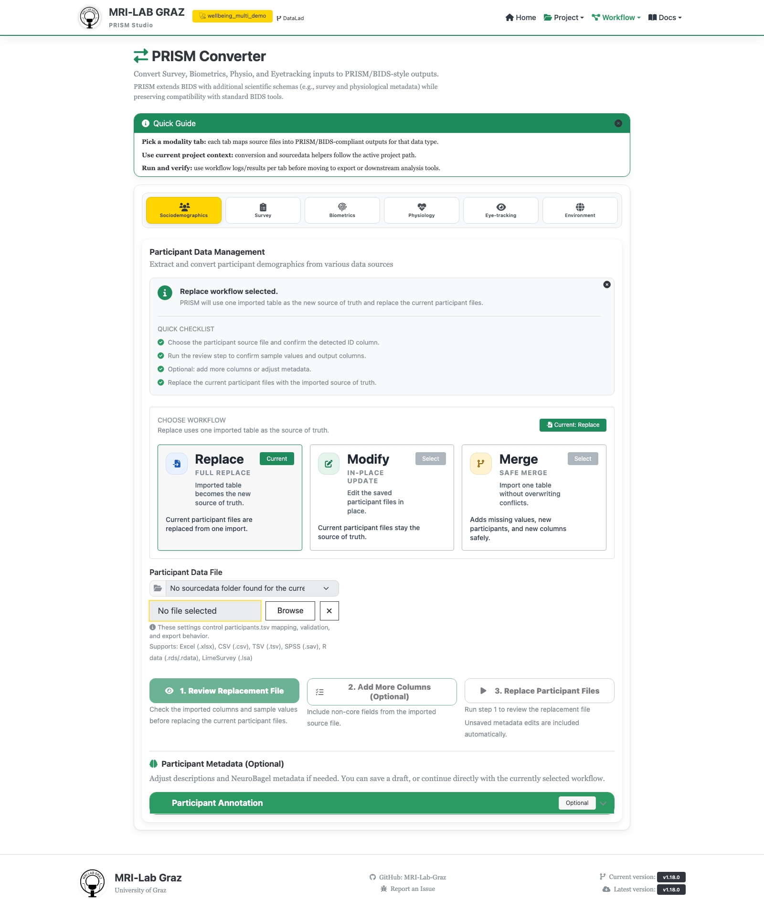

# Chapter 2: Import Sociodemographic Data

Chapter 2 of [Getting Started — Your First PRISM Project](TUTORIAL_BEGINNER.md).
This chapter imports information about the people who take part in a study,
such as age, sex, education, and handedness. It does not import their survey
responses from the same source spreadsheet; those come in chapter 3.

```{important}
**Data and its description belong together.** This is a crucial PRISM and BIDS
convention: a TSV data table stores the recorded values, and a matching JSON
file explains what its columns and values mean. The two files are a pair, not
alternatives to each other. You will use this same TSV/JSON pattern throughout
PRISM for surveys, biometrics, study environment data, and other documented
tables.
```

In this chapter, `participants.tsv` is a table with one row for each person.
`participants.json` explains columns such as `participant_id`, `age`, and
`sex`, including any codes used in the table.

**Time:** ~20 minutes. **Outcome:** a matching `participants.tsv` and
`participants.json` pair written into `wellbeing_study`, plus hands-on
experience with PRISM's Merge workflow for updating them later.

```{mermaid}
flowchart LR
    A["📄 wellbeing.xlsx<br/>raw spreadsheet<br/>age, sex, education..."] --> B["🔧 Sociodemographics<br/>Converter"]
    B --> C["📋 participants.tsv<br/>+ participants.json<br/>documented, ready to validate"]
```

<div class="prism-persona-note" data-persona-note>
<p class="prism-persona-note-empty" data-persona-empty>Picked a persona on the <a href="TUTORIAL_BEGINNER.html#pick-a-reason-to-be-here">intro page</a>? This note speaks to it.</p>

<div class="prism-persona-note-content" data-persona="student" hidden>
<span class="prism-persona-note-badge">👩🏽‍🎓 The enthusiastic student <a class="prism-persona-note-change" href="TUTORIAL_BEGINNER.html#pick-a-reason-to-be-here">change</a></span>

*The empty scaffold from Chapter 1 is still just a promise. This is where
it becomes a real dataset.* `age`, `sex`, `education`, `handedness` — plain
columns today, but properly typed and documented, they're fields a reviewer
or reuser will actually be able to trust without emailing you to ask what
they mean.

</div>

<div class="prism-persona-note-content" data-persona="pi" hidden>
<span class="prism-persona-note-badge">👨🏿‍🔬 The skeptical PI <a class="prism-persona-note-change" href="TUTORIAL_BEGINNER.html#pick-a-reason-to-be-here">change</a></span>

*This is the exact step your last collaborator skipped.* Their `sex` column
was an undocumented `1`/`2` code nobody could interpret two years later —
watch how little extra effort it takes to not repeat that.

</div>

<div class="prism-persona-note-content" data-persona="future" hidden>
<span class="prism-persona-note-badge">🧑🏻 Future-you <a class="prism-persona-note-change" href="TUTORIAL_BEGINNER.html#pick-a-reason-to-be-here">change</a></span>

*The empty project from Chapter 1 gets its first real content here — and
its first permanent naming decision.* You won't remember what `DEMO001`
meant either, but `sub-DEMO001`, sanitized and consistent, is at least
something you can grep for.

</div>
</div>

## 1. Look at the source file

Open `examples/workshop/exercise_1_raw_data/raw_data/wellbeing.xlsx`. It has
one row per participant with columns like `participant_id`, `session`,
`age`, `sex`, `education`, `handedness`, `WB01`-`WB05`, `completion_date`.
Only the demographic columns matter for this chapter — `WB01`-`WB05` are the
survey items, imported separately in chapter 3.

```{tip}
This tutorial uses an Excel (`.xlsx`) workbook as an example; it is not an
Excel-only workflow. The Participants converter also accepts CSV (`.csv`), TSV
(`.tsv`), SPSS (`.sav`), R (`.rds`, `.rdata`, `.rda`), and LimeSurvey (`.lsa`)
source files.
```

## 2. Reopen `wellbeing_study`

If Studio is still the same session you created the project in, it's
already loaded — skip to step 3. Otherwise, go to **Project Manager** and
either paste the project's path (e.g. `~/prism_projects/wellbeing_study`)
into **Select project folder or project.json** and click **Load Project**,
or click it under **Recent Projects**, which lists every project you've
created or opened before, de-duplicated by its resolved absolute path.

Each project is assigned a small emoji icon (e.g. 🧬) the first time it's
created or loaded, saved permanently into that project's `project.json`, and
shown next to its name both in Recent Projects and in the header once
loaded — it's just a visual identifier to tell projects apart at a glance,
not a status indicator.

## 3. Open Converter → Sociodemographics

With `wellbeing_study` loaded, go to **Converter**. The **Sociodemographics**
tab is the default/first tab.



## 4. Select the file and ID column

- Upload `wellbeing.xlsx`. Excel files expose a sheet selector if there's
  more than one sheet.
- **Participant ID Column** defaults to "Auto-detect", which recognizes
  `participant_id` directly here — no need to override it for this file.

```{tip}
**What if my ID column isn't called `participant_id`?** Auto-detect also
recognizes `participantid`, `prism_participant_id`, and `prismparticipantid`
directly, and falls back to `subject_id`, `sub_id`, `subject`, `sub`, `id`,
or any column whose name contains both "participant" and "id". If your file
uses something else entirely (e.g. `PID`), just pick it manually from the
**Participant ID Column** dropdown — auto-detect is a convenience, not a
requirement.
```

## 5. Review Participant Fields

Click **Review Participant Fields** to preview detected columns and sample
values before anything is written. You should see `age`, `sex`, `education`,
`handedness` among the detected fields.

If `WB01`-`WB05` show up as available-but-not-selected columns, leave them
out here — pulling survey items into `participants.tsv` would mix
one-time-per-participant demographics with repeated-measure survey data,
which don't belong in the same file. Use **Add More Columns (Optional)**
only if you want to bring in additional demographic-style columns beyond
what's auto-detected — not for the survey items.

```{note}
**Where did the `session` column go?** You won't see it in the preview,
and it won't be in the output either. `participants.tsv` is a BIDS
requirement of one row per participant, not one row per visit, so
session-like columns (`session`, `ses`, `visit`, `run`, ...) are dropped
before PRISM collapses the source rows down to one per participant. Session
information itself isn't lost — it belongs on the survey/biometrics files
you'll create in later chapters, each of which carries its own `ses-`
label.
```

## 6. Create Participant Files

Click **Create Participant Files**. This writes `participants.tsv` and
`participants.json` together — every import path writes both, never just
one. Since neither file exists yet in a fresh project, you won't see the
overwrite warning this time.

Behind the scenes, each `participant_id` value is trimmed, Unicode-normalized,
had any leading `sub-` stripped, then non-alphanumeric characters removed,
and re-prefixed with `sub-` — so a source ID like `DEMO001` becomes
`sub-DEMO001` in the output. IDs are sanitized, never renumbered.

<div class="prism-persona-note" data-persona-note>
<p class="prism-persona-note-empty" data-persona-empty>Picked a persona on the <a href="TUTORIAL_BEGINNER.html#pick-a-reason-to-be-here">intro page</a>? This note speaks to it.</p>

<div class="prism-persona-note-content" data-persona="student" hidden>
<span class="prism-persona-note-badge">👩🏽‍🎓 The enthusiastic student <a class="prism-persona-note-change" href="TUTORIAL_BEGINNER.html#pick-a-reason-to-be-here">change</a></span>

`participants.tsv` and `.json` now exist, and every ID is consistent. The
raw survey codes (`WB01`-`WB05`) are still sitting in `wellbeing.xlsx`
untouched — Chapter 3 is where those actually become data.

</div>

<div class="prism-persona-note-content" data-persona="pi" hidden>
<span class="prism-persona-note-badge">👨🏿‍🔬 The skeptical PI <a class="prism-persona-note-change" href="TUTORIAL_BEGINNER.html#pick-a-reason-to-be-here">change</a></span>

Demographics done properly, five minutes in. Next chapter is where most
labs' ad-hoc import scripts actually live — watch how PRISM replaces that
with something reusable instead.

</div>

<div class="prism-persona-note-content" data-persona="future" hidden>
<span class="prism-persona-note-badge">🧑🏻 Future-you <a class="prism-persona-note-change" href="TUTORIAL_BEGINNER.html#pick-a-reason-to-be-here">change</a></span>

Every participant ID is now sanitized the same way, permanently. That's one
naming scheme you will never have to reverse-engineer later.

</div>
</div>

## 7. Optional: update participants with Merge

Real studies rarely stop at one import. A more common situation: you already
have `participants.tsv`, and a source file arrives with **one new
participant** and a **corrected value** for someone already in the project.
This step shows what PRISM does with that — and, just as importantly, what
it deliberately refuses to do.

1. Make your own working copy of the source file rather than editing the
   shared example directly: copy
   `examples/workshop/exercise_1_raw_data/raw_data/wellbeing.tsv` somewhere
   convenient (Desktop, or your project folder) and rename it, e.g.
   `wellbeing_update.tsv`. (This file has all 20 of the same participants
   you already imported in step 6 via `wellbeing.xlsx` — same data, just a
   different format.)
2. Open the copy in a spreadsheet or text editor and make two changes:
   - Add one new row for a participant not yet in your project — everyone
     up to `DEMO020` is already there, so use `DEMO021`, with plausible
     values for every column.
   - Change `DEMO003`'s `age` value to something else (e.g. `22` → `23`) —
     pretend you just noticed a typo in the original data.
3. Back in **Converter → Sociodemographics**, since `participants.tsv`
   already exists in this project, you'll now be asked to choose a
   workflow first: **Replace** (the imported file becomes the new source of
   truth), **Modify** (edit the current files in place), or **Merge** (safe
   merge from an imported table). Choose **Merge**.
4. Upload `wellbeing_update.tsv` and click **Preview Merge**. The Merge
   Summary shows counts for matched participants, new participants, filled
   values, and conflicts. You should see `1 new participant` (DEMO021) and
   `1 conflict` (DEMO003's `age`).

```{warning}
**Merge won't overwrite an existing value, even to fix it.** It only fills
in *missing* values, adds new participants, and adds new columns — any
non-empty value that differs from what's already in `participants.tsv`
is reported as a conflict, and **Apply Merge stays blocked** until it's
resolved. This is deliberate: Merge assumes your project's existing data is
correct unless you tell PRISM otherwise. Use **Download Conflict Report**
to see exactly what disagreed. To actually correct a value (as opposed to
adding new information), use **Modify** or a full **Replace** instead —
Merge is the safe option for enrichment, not the tool for corrections.
```

5. For this exercise, you don't need to resolve the conflict — you've seen
   what Merge does and doesn't do. If you want to see a clean **Apply
   Merge** succeed, remove the `DEMO003` edit from your copy (keep only the
   new `DEMO021` row) and preview again; with zero conflicts, **Apply
   Merge** becomes available and adds the new participant without touching
   anyone else's data.

## Common mistakes

```{warning}
**Including `WB01`-`WB05` as participant fields.** They're repeated survey
responses, not one-time demographics; keep them out of `participants.tsv`
and import them via the Survey converter in chapter 3 instead.
```

```{warning}
**Re-running this step later without noticing the workflow choice.** Once
`participants.tsv` exists, PRISM makes you pick Replace, Modify, or Merge
before anything else — read that choice rather than clicking through it.
Replace and a resolved Merge both write over the current files.
```

```{tip}
**Raw demographic codes aren't relabeled automatically, and that's normal.**
There is no value-recoding step here. Raw values (e.g. a numeric sex code)
are preserved as-is in `participants.tsv`; labeling what a code means
happens separately via the "Participant Annotation" panel into
`participants.json`, and turning coded values into readable labels
project-wide is covered by the optional participant-mapping workflow (see
`examples/workshop/exercise_5_participant_mapping/` for a worked example) —
not required for this tutorial.
```

## What's next

- [Chapter 3 — Import survey response data](TUTORIAL_BEGINNER_3_SURVEY_IMPORT.md)
- [Converter — Participants](studio/converter_participants.md) — full
  reference for this screen
