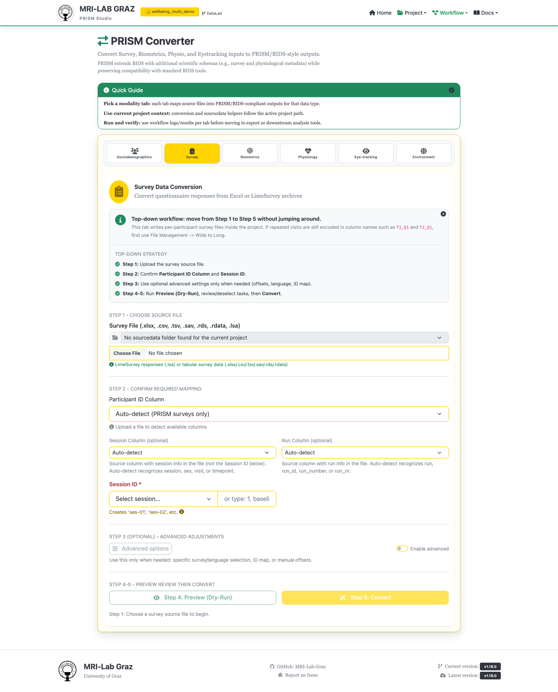

# Chapter 3: Import a Survey via Excel

Chapter 3 of [Getting Started — Your First PRISM Project](TUTORIAL_BEGINNER.md).
This is about turning the five wellbeing-survey columns (`WB01`-`WB05`) in
`wellbeing.xlsx` into real survey response files inside your project. It has
two parts: getting a survey **template** in place (the JSON that describes
what the instrument and its items are), then actually **importing the
response data** against that template.

**Time:** ~25 minutes. **Outcome:** survey response files for every
participant, written into subject-level folders under `wellbeing_study`.

## Part A — Get a template

A survey import needs a template to map columns against. There are two ways
to get one; do whichever suits you, then move on to Part B either way.

### Fast path: use the ready-made template

Copy `examples/workshop/exercise_4_templates/survey-wellbeing.json` into
your project at `code/library/survey/survey-wellbeing.json` (create the
`survey/` subfolder if it doesn't exist yet). That's it — this file already
defines everything the import needs:

- `Study.TaskName`: `wellbeing`
- Five items, `WB01`-`WB05`, each with a 6-point response scale (0-5) and
  bilingual (en/de) labels
- Citation and license info for the underlying instrument (a WHO-5 adaptation)

Open **Template Editor** → Modality `survey` → Project Templates and confirm
`wellbeing` now shows up there, to check the copy landed correctly.

### Alternative: build your own template from a spreadsheet

If you'd rather practice authoring a template yourself instead of using the
ready-made one — useful once you have your own instrument, not just this
tutorial's example — follow [Excel Survey Template —
Basics](EXCEL_TEMPLATE_BASICS.md) end to end, using its own example workbook.
That tutorial covers the `Items`/`General` workbook format and the Template
Editor import flow in full detail; there's no need to repeat it here. Come
back to this page for Part B once you have a saved template either way.

## Part B — Import the response data

### 1. Open Converter → Survey



### 2. Choose the source file

Select `examples/workshop/exercise_1_raw_data/raw_data/wellbeing.xlsx` as
the **Survey File**.

### 3. Confirm the required mapping

- **Participant ID Column** — select `participant_id` explicitly rather than
  relying on auto-detect (auto-detect is tuned for files already exported by
  PRISM; a plain spreadsheet like this one is safer to map by hand).
- **Session Column (optional)** — select `session` (the source file has one,
  with the same value `baseline` for every row).
- **Session ID \*** (required) — type `baseline` to match the data. Only one
  session converts per run — this file only has one, so you're done here.

Leave **Advanced options** collapsed — this file only contains one
instrument, so there's nothing to narrow down.

### 4. Preview (dry-run)

Click **Preview**. This runs the conversion against a temporary location
without touching your project — check that it reports 5 participants found,
task `wellbeing` included, and no missing items. Fix the mapping in step 3
and re-preview if anything looks off before moving on.

### 5. Convert

Click **Convert**. This writes the real output, e.g.:

```text
sub-DEMO001/ses-baseline/survey/sub-DEMO001_ses-baseline_task-wellbeing_survey.tsv
sub-DEMO001/ses-baseline/survey/sub-DEMO001_ses-baseline_task-wellbeing_survey.json
```

one pair of files per participant. If you used the fast-path template
(already project-local), no extra copy step happens on Convert; if the
template had come from the official/global library instead, Convert would
copy it into `code/library/survey/` automatically at this point.

## Common mistakes

- **Importing before a `wellbeing` template exists in the project** — Part A
  has to come first; if you skip straight to Part B, the converter won't
  know how to type or label `WB01`-`WB05`.
- **Item columns that don't match the template's `ItemID`s** — the template
  expects exactly `WB01`-`WB05`; renamed or extra columns in a modified
  source file will show up as "missing items" in Preview.
- **Forgetting only one session converts per run** — if your own future data
  has more than one session value in the same file, you'll need one Convert
  pass per session, not one pass for everything.
- **Running Convert without a participant registry yet** — if you skipped
  [Chapter 2](TUTORIAL_BEGINNER_2_PARTICIPANTS.md) and `participants.tsv`
  doesn't exist yet, you'll see a registry warning for IDs not already
  known to the project; do Chapter 2 first.

## What's next

- [Chapter 4 — Prepare a recipe](TUTORIAL_BEGINNER_4_RECIPE.md)
- [Converter — Survey Import](studio/converter_survey.md) — full reference
  for this screen
- [Excel Survey Template — Basics](EXCEL_TEMPLATE_BASICS.md) /
  [— Multiple Versions](EXCEL_TEMPLATE_ADVANCED.md) — the deeper
  template-authoring tutorials referenced in Part A
