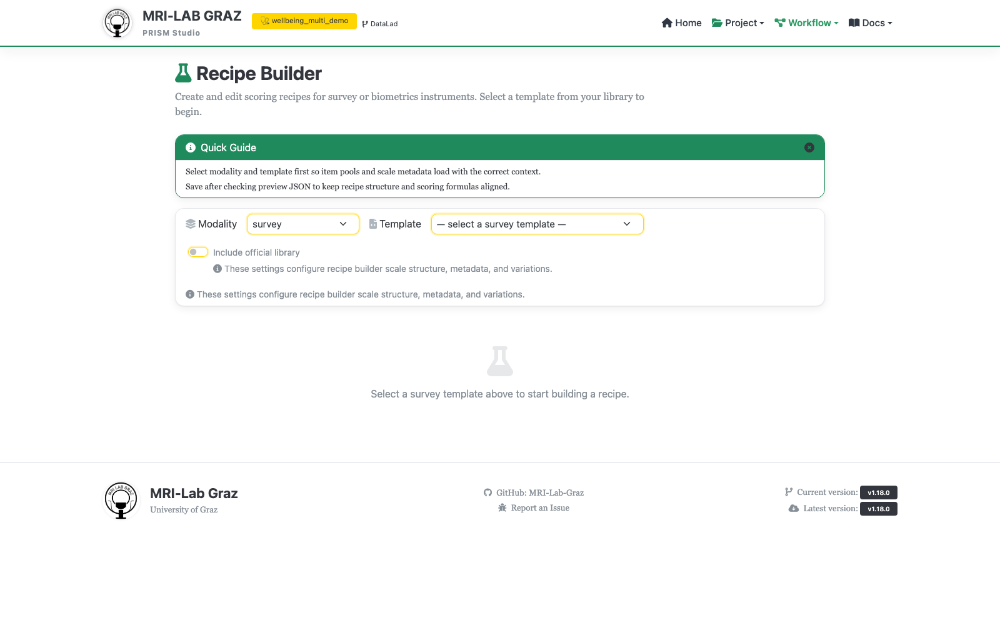

# Chapter 4: Prepare a Recipe

Chapter 4 of [Getting Started — Your First PRISM Project](TUTORIAL_BEGINNER.md).
This is about turning the five imported `WB01`-`WB05` responses into one
summary score per participant. Recipe Builder only creates and saves the
scoring definition; actually running it against your data happens on a
separate page, covered in step 5 below.

**Time:** ~20 minutes. **Outcome:** a saved scoring recipe for the
`wellbeing` survey, and a computed total score for every participant.

```{mermaid}
flowchart LR
    A["📊 WB01-WB05<br/>item responses<br/>(kept as-is, untouched)"] --> B["🔧 Recipe Builder<br/>a saved scoring rule"]
    B --> C["📈 Computed total score<br/>per participant<br/>re-runnable, never overwrites raw data"]
```

<div class="prism-persona-note" data-persona-note>
<p class="prism-persona-note-empty" data-persona-empty>Picked a persona on the <a href="TUTORIAL_BEGINNER.html#pick-a-reason-to-be-here">intro page</a>? This note speaks to it.</p>

<div class="prism-persona-note-content" data-persona="student" hidden>
<span class="prism-persona-note-badge">👩🏽‍🎓 The enthusiastic student <a class="prism-persona-note-change" href="TUTORIAL_BEGINNER.html#pick-a-reason-to-be-here">change</a></span>

*You've got real, templated responses from Chapter 3. Now they need to
become the one number your advisor actually wants to see.* A saved recipe
means that scoring logic is no longer a mental note or a one-off script —
anyone, including future you, can re-run it and get the exact same result.

</div>

<div class="prism-persona-note-content" data-persona="pi" hidden>
<span class="prism-persona-note-badge">👨🏿‍🔬 The skeptical PI <a class="prism-persona-note-change" href="TUTORIAL_BEGINNER.html#pick-a-reason-to-be-here">change</a></span>

*"We computed the composite score in Excel" is a sentence you've had to
write in a methods section before, and you hated it.* A saved recipe is the
artifact that replaces that sentence with something an actual reviewer can
check.

</div>

<div class="prism-persona-note-content" data-persona="future" hidden>
<span class="prism-persona-note-badge">🧑🏻 Future-you <a class="prism-persona-note-change" href="TUTORIAL_BEGINNER.html#pick-a-reason-to-be-here">change</a></span>

*Right now the scoring formula feels obvious. It will not feel obvious in
eighteen months.* You will not remember it — but this recipe file will.

</div>
</div>

```{tip}
**Why not just score surveys in the original spreadsheet?** Adapted from the
*PRISM without Panic* guide (ANC Salzburg). In a spreadsheet, raw answers
and score formulas often live in the same file — easy to overwrite a
formula, change a value by accident, or lose track of how a score was
calculated. In PRISM, the raw questionnaire data stays completely separate
from the scoring instructions, which are saved as a recipe: a file that can
be checked, edited, reused, and re-run without touching the original survey
data. If a scoring rule needs correcting later, you fix the recipe and
recompute — the raw responses are never at risk.
```

## 1. Open Recipe Builder



## 2. Pick modality and template

Set **Modality** to `survey`, then pick **Template**: `wellbeing` — the one
you saved into the project in [Chapter 3](TUTORIAL_BEGINNER_3_SURVEY_IMPORT.md).
Check **Include official library** if you don't see it — this widens the
dropdown to templates you haven't used in this project yet, not just ones
already imported.

## 3. Skip reverse coding

The **Inversion** panel lets you reverse-code items against their scale
range. None of `WB01`-`WB05` need this — the WHO-5-style scale used here
already runs in the same direction for every item (higher = better
wellbeing) — so leave this panel empty.

## 4. Build the score

- In the **Item Pool**, select all five items: `WB01`-`WB05`.
- In the **Scale Canvas**, click **Add Scale** to create a new `Scores[]`
  entry:
  - **Name**: `Total`
  - **Method**: `sum`
  - **Items**: `WB01`, `WB02`, `WB03`, `WB04`, `WB05`
  - **Range**: each item runs 0-5 (six response levels), so five summed
    items give a range of **min 0, max 25** — fill in the range as
    item-scale × item-count, not by guessing.

You don't need `Transforms.Derived` here — a single summed total doesn't
need an intermediate helper computation.

```{note}
**What's "Min valid"?** Adapted from *PRISM without Panic* (ANC Salzburg).
It controls how PRISM handles missing data when computing a score. Say a
scale has 9 items: with Min valid off, the score is computed no matter how
many items are missing. Set to 9, PRISM only computes it when all 9 have
valid answers. Set to 7, it still computes with at least 7 of 9 answered.
Leave it off for this tutorial's 5-item scale (no missing data in the
example file) — for your own instruments, check the questionnaire's manual
before deciding on a value.
```

You can click **Preview JSON** at any point to see the recipe's current
`Scores[]` block as it will be saved, without a server round-trip — useful
for a quick sanity check before you actually click Save.

## 5. Skip variations

**Variations** is for instruments with named scoring variants (e.g. a short
vs. long form). This tutorial's instrument has only one form, so leave this
step empty.

## 6. Fill in metadata and save

Under Recipe Metadata, give it a **Name** (e.g. "Wellbeing Total") and a
short **Description**. Click **Save**. This writes:

```text
code/recipes/survey/recipe-wellbeing.json
```

For comparison, a working version of this exact recipe already ships in the
repo at `examples/workshop/exercise_3_using_recipes/recipe-wellbeing.json` —
worth a look if your saved file's `Scores` block doesn't match what you
expected.

## 7. Run the recipe

Recipe Builder doesn't run recipes itself. Go to **Export / Analysis
Output**, pick modality `survey`, the session(s) to include (`baseline`),
and filter to your new recipe if more than one exists. Choose an output
format (`sav`/`csv`/`xlsx`) and click **Create Output**. Results land at:

```text
derivatives/survey/<recipe_id>/sub-*/ses-*/survey/*_desc-scores_beh.tsv   (per-subject)
derivatives/survey/survey_scores.tsv                                     (flat/wide, if chosen)
```

Equivalent from the terminal:

```bash
python prism_tools.py recipes surveys --prism /path/to/wellbeing_study --format prism
```

<div class="prism-persona-note" data-persona-note>
<p class="prism-persona-note-empty" data-persona-empty>Picked a persona on the <a href="TUTORIAL_BEGINNER.html#pick-a-reason-to-be-here">intro page</a>? This note speaks to it.</p>

<div class="prism-persona-note-content" data-persona="student" hidden>
<span class="prism-persona-note-badge">👩🏽‍🎓 The enthusiastic student <a class="prism-persona-note-change" href="TUTORIAL_BEGINNER.html#pick-a-reason-to-be-here">change</a></span>

A real total score, per participant, computed the same reproducible way
every time. Chapter 5 is where you find out if any of the last three
chapters actually hold together end to end.

</div>

<div class="prism-persona-note-content" data-persona="pi" hidden>
<span class="prism-persona-note-badge">👨🏿‍🔬 The skeptical PI <a class="prism-persona-note-change" href="TUTORIAL_BEGINNER.html#pick-a-reason-to-be-here">change</a></span>

A defensible, reproducible scoring pipeline, in a file, not in someone's
head. Chapter 5 is the audit — where you'd normally find out too late.

</div>

<div class="prism-persona-note-content" data-persona="future" hidden>
<span class="prism-persona-note-badge">🧑🏻 Future-you <a class="prism-persona-note-change" href="TUTORIAL_BEGINNER.html#pick-a-reason-to-be-here">change</a></span>

The formula is safely written down now. Chapter 5 checks whether everything
*else* you did along the way was written down correctly too.

</div>
</div>

## Common mistakes

```{warning}
**Item name mismatches.** The item names in the recipe must exactly match
the template's `ItemID`s (`WB01`-`WB05`); a typo produces a save-time
item-reference error, not a silent skip.
```

```{warning}
**Forgetting Range.** The schema requires a `Range` on every `Scores`
entry; derive it from the item scale rather than leaving it blank or
copying an unrelated instrument's numbers.
```

```{warning}
**Running the recipe before survey data exists.** Analysis Output has
nothing to compute against if you skipped Chapter 3; import the survey
data first.
```

```{note}
**Expecting Recipe Builder itself to produce output.** Saving a recipe and
running it are two different pages; Save only writes the definition —
Preview JSON lets you sanity-check that definition before you save, but
neither one runs the recipe against your data.
```

## What's next

- [Chapter 5 — Use the validator](TUTORIAL_BEGINNER_5_VALIDATOR.md)
- [Recipe Builder](studio/recipe_builder.md) — full reference for this screen
- [Recipes](RECIPES.md) — the full `Transforms`/`Scores` specification
