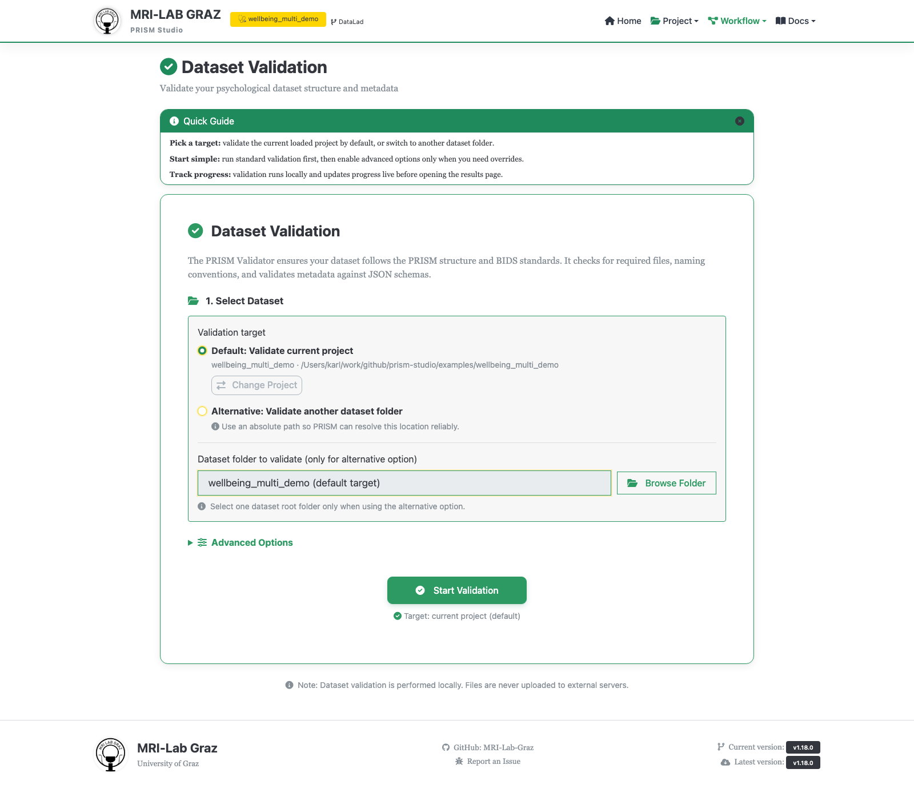
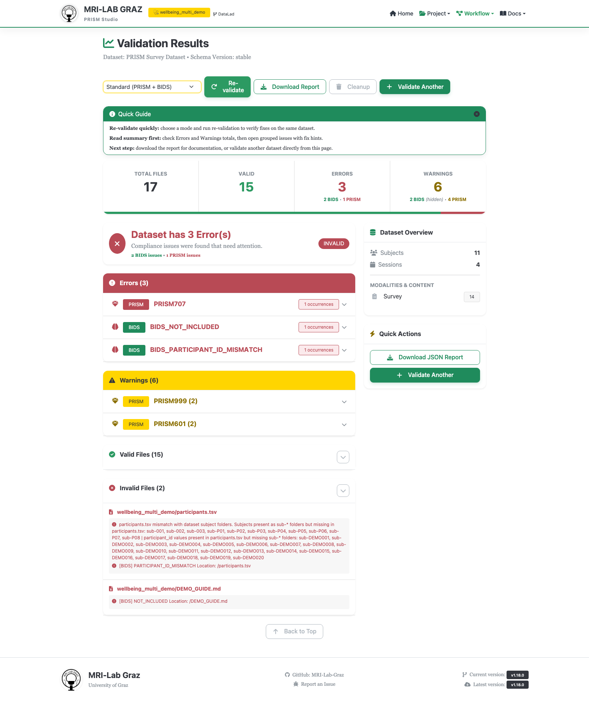

# Beginner Tutorial 5 — Use the Validator

Chapter 5 of [Getting Started — Your First PRISM Project](TUTORIAL_BEGINNER.md).
This is about running PRISM's built-in checks against `wellbeing_study` and
learning to read what they report — not about fixing every possible finding,
which will vary by project.

**Time:** ~15 minutes. **Outcome:** a validation run against
`wellbeing_study`, and enough understanding of the results to know what to
do next.

## 1. Open the Validator



**Validate current project** should already be pre-selected, showing
`wellbeing_study`'s name and path.

## 2. Leave Advanced Options at their defaults (for now)

Advanced Options is collapsed by default. Leaving it collapsed runs **Full
Validation (PRISM + BIDS)** — you don't need to opt in to get BIDS checks,
this is already the default. The one thing worth knowing about now:
**Show BIDS Warnings** is off by default, so a first run's warning count
undercounts BIDS-side warnings specifically; PRISM warnings are unaffected.

## 3. Start Validation

Click **Start Validation**. A progress panel appears, then you land on the
results page automatically.

## 4. Read the results



Start with the summary dashboard: Total Files / Valid / Errors / Warnings,
each split into BIDS vs. PRISM. Then use this table to decide what to act on
first:

| Level | Meaning | What to do |
|---|---|---|
| Error | Blocking problem | Fix before treating the dataset as valid |
| Warning | Important issue | Fix soon, especially before sharing the dataset |
| Suggestion | Improvement | Use when polishing, not urgent |

**Errors** and **Warnings** are grouped into collapsible sections by error
code, each showing a description, an optional fix-hint, affected
subjects/sessions, and sample file paths. A first run reporting several
findings is normal, not a failure — that's the checklist telling you what to
clean up next, not a sign something went wrong in the earlier chapters.

Codes you're likely to see on a first pass through this tutorial's data,
worth knowing by name:

- `PRISM201` — missing JSON sidecar
- `PRISM101` — invalid filename pattern
- `PRISM402` — a value not in the allowed `Levels` for its column

The full catalog, with fix hints for every code, is in
[Error Codes](ERROR_CODES.md) — every finding in the results also links
straight to its entry there.

## 5. Fix and re-validate

Use the **Re-validate** button in the action bar to rerun without starting
over from the Projects page. Repeat until the findings that matter to you
are gone — clearing every single suggestion isn't the bar; clearing errors,
and warnings you'd be embarrassed to ship, is.

## Equivalent from the terminal

```bash
prism-validator /path/to/wellbeing_study
```

Auto-fix for supported issues is CLI-only (no per-issue fix button exists in
the web results page yet):

```bash
prism-validator /path/to/wellbeing_study --fix --dry-run
prism-validator /path/to/wellbeing_study --fix
```

## Common mistakes

- **Narrowing to PRISM Only or BIDS Only and thinking that's the full
  picture** — Full Validation is the default and covers both; only narrow
  scope deliberately, not by accident while exploring Advanced Options.
  Something like a survey conversion issue only shows up as a valid file
  under BIDS-Only mode.
- **Treating a first run's error count as a failure** — it's expected the
  first time through; re-validate after each fix rather than expecting zero
  findings on the first attempt.
- **Missing BIDS warnings because "Show BIDS Warnings" is off** — turn it on
  in Advanced Options if you want the complete warning picture, not just
  PRISM-side warnings.

## Wrap-up

You now have a `wellbeing_study` project with demographic data, imported
survey responses, a working scoring recipe, and at least one validation
pass — the same shape of outcome the [Workshop](WORKSHOP.md)'s core path
aims for, but built at your own pace with a full explanation at each step.

## What's next

- Back to [Getting Started overview](TUTORIAL_BEGINNER.md) — the
  Intermediate tutorial (DataLad, file/folder manipulation) is next in this
  series
- [Error Codes](ERROR_CODES.md) — the full code reference
- [CLI Reference](CLI_REFERENCE.md) — running any of these five chapters
  from the terminal instead
