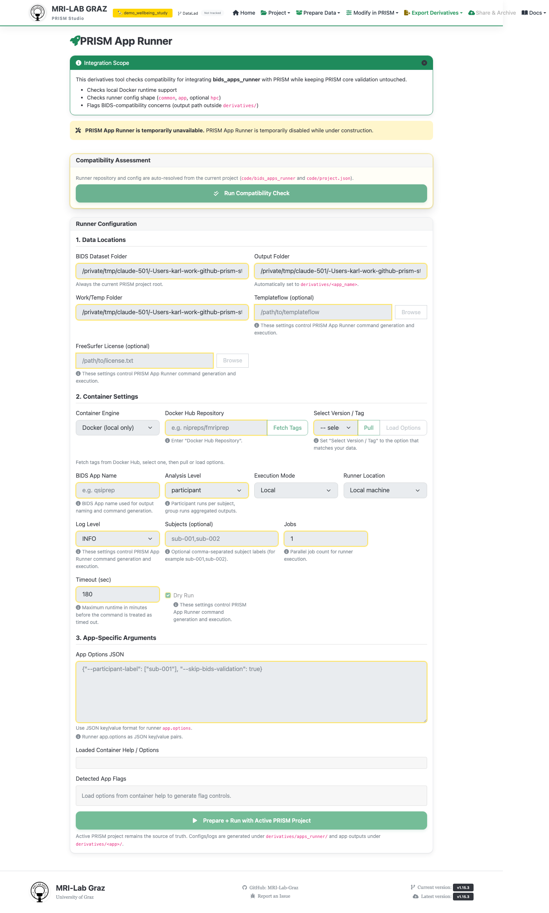

# PRISM App Runner

PRISM App Runner is meant to let you run BIDS Apps — containerized pipelines like
fMRIPrep — directly against a PRISM project, configuring data locations, container
settings, and app-specific arguments without leaving Studio. **It's currently
disabled**: a deliberate feature flag (`PRISM_APP_RUNNER_ENABLED = False` in
`tools_prism_app_runner_handlers.py`), not a bug you're running into. Every API call
this screen would make returns HTTP 503 while the flag is off, and there's no
per-user or per-project toggle — enabling it requires a code change.

## What you'll see today

The full form renders so you can see the intended layout, but everything
interactive sits inside a disabled block with a banner explaining it's temporarily
unavailable while under construction — nothing here runs yet.

## What it's designed to do once enabled

An **Integration Scope** check for Docker runtime availability and runner config
shape, then three configuration sections: **Data Locations** (BIDS dataset folder,
output folder, work/temp folder, Templateflow, FreeSurfer license), **Container
Settings** (Docker repo/tag with fetch/pull, BIDS App name, analysis level, log
level, subjects, jobs, timeout, dry run), and **App-Specific Arguments** (JSON
options, container help output, detected flags) — plus hidden panels for HPC/
DataLad/remote SSH execution, ending in **Prepare + Run with Active PRISM Project**.

## What's next

- [Recipe Builder](recipe_builder.md) and [Export](export.md) for derivatives that
  don't require this screen
