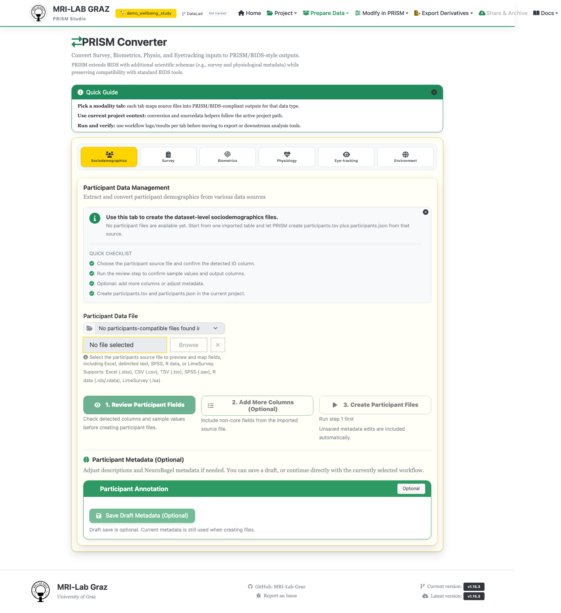

# Converter

The Converter is where external data enters a PRISM project — spreadsheets,
LimeSurvey exports, biometric measurements, physio recordings, eyetracking files,
and environment/timestamp tables all get mapped into BIDS-compatible outputs here.
One page, six tabs, one per data type; each is covered in detail on its own page:

1. [Participants / Sociodemographics](converter_participants.md) — the natural first
   step for a new project.
2. [Survey Import](converter_survey.md)
3. [Biometrics](converter_biometrics.md)
4. [Physio](converter_physio.md)
5. [Eyetracking](converter_eyetracking.md)
6. [Environment](converter_environment.md)

## What's next

Pick the tab matching the data you're importing, or start with
[Participants](converter_participants.md) if this is a new project.
