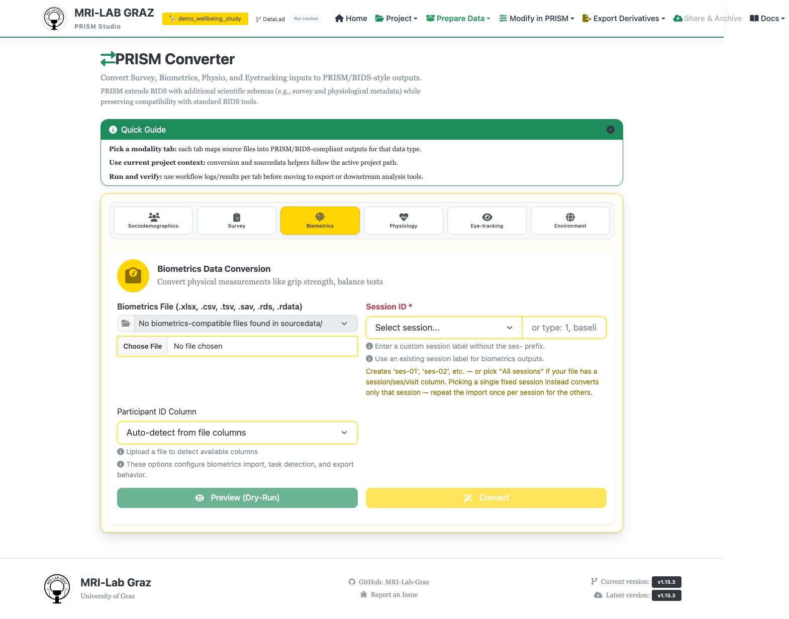

# Converter — Biometrics

Imports biometric measurement data (grip strength, balance tests, physiological
performance measures, etc.) into a PRISM project.

## Step 1 — Select file and session

- **Biometrics File** — accepts `.xlsx`, `.csv`, `.tsv`, `.sav`, `.rds`, `.rdata`, or
  pick one already in your project's `sourcedata/` via the server browse option.
- **Session ID \*** (required) — pick from a dropdown or type freely (e.g. `1`,
  `baseline`). A session/ses/visit column in your file lets you pick "All sessions"
  to convert them together in one pass; picking a single fixed session instead
  converts only that session — repeat the import once per session for the others.
- **Participant ID Column** — defaults to "Auto-detect from file columns"; the
  dropdown populates once a file is chosen.

## Step 2 — Preview and detect

Click **Preview (Dry-Run)** to run the same conversion logic without writing
anything. This reveals a **Detected Biometrics** panel listing every task/measure
detected in your file, each with its own checkbox and a Select All option — you
choose which detected tasks to actually export.

## Step 3 — Confirm and convert

Click **Confirm & Convert** (or **Convert** directly, if you're confident and skip the
detection review). Output files match `*_biometrics.tsv` under the appropriate
subject/session folder, plus a **Conversion Log** and **Validation Results** panel
once done.

## Not part of this screen

The CLI's `biometrics import-excel` command has `--equipment`/`--supervisor` flags —
those belong to a separate, unrelated tool for building a biometrics **template
library** from an Excel data dictionary. They have nothing to do with this converter
tab, which only imports subject measurement data against templates that already
exist.

## What's next

- [Converter — Participants](converter_participants.md) if you haven't imported
  sociodemographics yet
- [Recipe Builder](recipe_builder.md) to score imported biometrics
