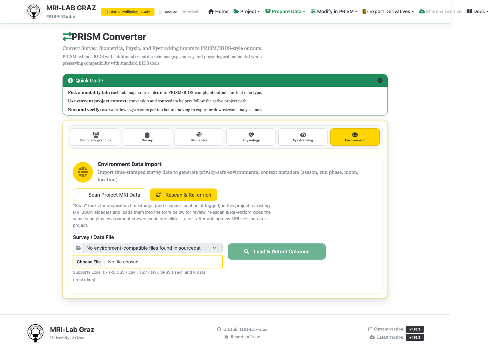

# Converter — Environment

Imports timestamped data (a survey export, a scan log, anything with a timestamp
column) and enriches it into privacy-safe environment metadata: season, sun phase,
moon phase, and location — without exporting raw addresses or coordinates.



## Optional: pull timestamps from MRI data

If your project has MRI JSON sidecars, **Scan Project MRI Data** reads acquisition
timestamps and scanner location straight from them into the form. **Rescan &
Re-enrich** does a scan-and-convert pass in one click.

## Step 1 — Select file

**Survey / Data File** accepts `.xlsx`, `.csv`, `.tsv`, `.sav`, `.rds`, `.rdata`,
`.rda`. A separator selector appears for delimited files. Click **Load & Detect
Columns** to reveal the mapping section below.

## Step 2 — Required mapping

- **Timestamp Column \***
- **Participant ID Column \***
- **Session Column \*** — a dropdown, plus a free-text override for a fixed session
  ID. A session column processes all sessions in one run; a fixed ID applies to every
  row, so you repeat the import once per session for multi-session files.

## Step 3 — Optional location fields

- **Location Label Column** — resolves coordinates only; the label itself is not
  exported.
- **Coordinates Columns** (lat/lon) — per-row override of the global fallback below.
- **Location Picker** — search a place name, pick from results, auto-fills lat/lon.
- **Manual Location Label** / **Latitude** / **Longitude** — global fallback used
  when a row has no per-row location.

A preview table shows the first 5 rows once columns are mapped.

## Step 4 — Convert

Optionally check **Convert in background (nohup-style)** for long-running jobs, then
either **Pilot Run (1 random subject)** to sanity-check the mapping quickly, or
**Convert** for the full run. A progress bar, collapsible Conversion Log, and a
**Converted Output Preview** (first 4 subjects/rows) appear as it runs.

## Output

```text
sub-<label>/ses-<label>/environment/sub-<label>_ses-<label>_recording-weather_environment.tsv
```

## What's next

- [Converter — Participants](converter_participants.md)
- [Validator](validator.md)
