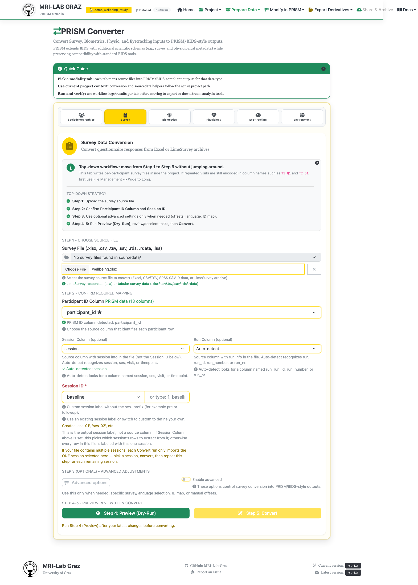

# Converter — Survey Import

Imports survey/questionnaire data (LimeSurvey exports, plain spreadsheets, SPSS/R
files) into a PRISM project as BIDS-style survey files. This page covers the generic,
non-LimeSurvey-specific workflow; see [LimeSurvey Integration](../LIMESURVEY_INTEGRATION.md)
for LimeSurvey-specific export steps upstream of this screen.



## Step 1 — Choose source file

- **Survey File (.xlsx, .csv, .tsv, .sav, .rds, .rdata, .lsa)** — the file to import,
  or pick one already sitting in your project's `sourcedata/` via the server browse
  dropdown.
- **Separator (CSV/TSV)** — appears only for delimited files (auto/comma/semicolon/
  tab/pipe).

## Step 2 — Confirm required mapping

- **Participant ID Column** — defaults to "Auto-detect (PRISM surveys only)".
- **Session Column (optional)** / **Run Column (optional)** — pick *source* columns
  that carry session/run info, if your file has them.
- **Session ID \*** (required) — the *output* session label for this run, picked from
  a list or typed freely (e.g. `1`, `baseline`). Only one session is imported per
  Convert run — a file with multiple sessions needs one Convert pass per session.

## Step 3 — Advanced options (optional, collapsible)

- **Select specific survey** — a free-text task/questionnaire key (e.g. `phq9`) to
  target a specific instrument in a multi-survey file.
- **Language** — defaults to "Auto (template default)".
- **ID Mapping File (optional)** — a two-column TSV/CSV mapping source IDs to
  `participant_id`, for when your raw file's ID column doesn't match your project's
  participant IDs.
- **Task Value Offsets** — a manual-only row editor (Add offset / Apply offsets),
  populated after running Preview.

If the chosen template defines multiple variants (a **Questionnaire Version
Selection** card appears), pick which versions to include — this controls the `acq-`
entity in the output filename.

## Step 4 — Preview (Dry-Run)

Runs the same conversion logic against a temporary location, without touching your
project. Shows: participants found, tasks included, missing items, detected sessions,
and per-task run counts. Use this to catch column-mapping problems before anything is
written.

## Step 5 — Convert

Writes the real output into your project, e.g.:

```text
sub-001/ses-01/survey/sub-001_ses-01_task-phq9_survey.tsv
sub-001/ses-01/survey/sub-001_ses-01_task-phq9_survey.json
```

If the survey template came from the official/global library, Convert also copies it
into your project at `code/library/survey/survey-<task>.json` so it can be edited
project-locally afterward (see [Template Editor](template_editor.md)).

If any copied templates are missing project-level metadata, a banner appears:
*"Some copied survey templates still need project-level metadata. Open Template
Editor to complete them."*

If an imported participant ID isn't already present in `participants.tsv`, you'll see
a registry warning — run [Participants Import](converter_participants.md) first if you
haven't yet.

## Common failures

- **Wrong participant IDs detected** — override the ID column explicitly rather than
  relying on auto-detect, or supply an ID Mapping File.
- **Missing session data** — remember only one session converts per run; repeat Step
  5 once per session present in your source file.
- **Unsupported file type** — supported inputs are `.xlsx`, `.csv`, `.tsv`, `.sav`,
  `.rds`, `.rdata`, `.lsa`.

## What's next

- [Participants Import](converter_participants.md) if you haven't imported
  sociodemographics yet
- [Template Editor](template_editor.md) to finish any copied survey templates
- [Recipe Builder](recipe_builder.md) to score the imported survey
