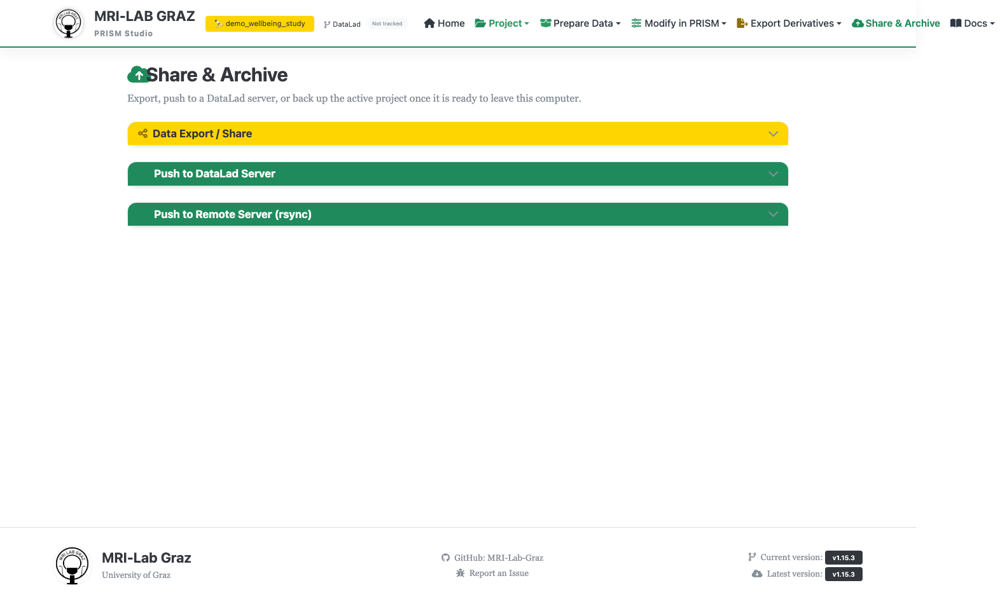

# Share / Export

Share & Archive is where a project leaves Studio — as an anonymized ZIP, a plain
folder copy, an ANC upload package, or openMINDS metadata. It's distinct from
scored derivatives, which stay inside the project (see
[Recipe Builder](recipe_builder.md)).



## Standard Export & Save

The main export path. Produces a ZIP written to a folder you choose (defaults to the
project's parent folder).

**Anonymization** (accordion, on by default where noted):
- **Randomize Participant IDs** (on by default) — e.g. `sub-001 → sub-R7X2K9`. The
  mapping is written to `code/anonymization_map.json` inside the *source* project —
  it is never included in the exported ZIP.
- **Mask Copyrighted Question Text**
- **Scrub sensitive fields from MRI JSON sidecars** — with tag-group checkboxes
  (scanner/site, timestamps, personnel, patient/subject, UIDs, protocol/comments,
  geometry, private patterns), or a single "scrub all known sensitive MRI tags"
  shortcut.
- Optional BIDS `phenotype/` bridge export (lossy compatibility export only).
- Optional anatomical MRI defacing (`pydeface`) — applied to the exported copy only,
  never to your source project.

**Export Content & Filters** — include/exclude `derivatives/`, `sourcedata/`,
`code/`, `analysis/`, plus per-subject/session/modality checklists.

**Repository mode** (for DataLad projects): `datalad_free` (default — strips
`.git`/`.datalad`), `datalad_preserving`, or `git_lfs`.

**Validation mode** — PRISM+BIDS / PRISM only / BIDS only / none. Export is blocked if
validation errors are found under the selected mode.

## Upload-Ready ZIP

Same export pipeline, with a preset that strips `code/`, `derivatives/`, `analysis/`,
and DataLad traces — for sending a dataset to a collaborator or reviewer who only
needs the raw project.

## Folder Export

Writes a plain, DataLad-free folder copy instead of a ZIP. For DataLad projects, annex
content is materialized into a temporary clone first so the copy contains real files,
not symlinks.

## Template Export

Writes `<project>_template_export.zip` — keeps project metadata/structure but drops
all participant-specific content. Use this to turn a project into a reusable starting
template for a new study.

## ANC (Austrian NeuroCloud) Export

Accordion section, badge "New". **Export for ANC** writes to a sibling folder
`<project_path>_anc_export/`, including a generated `README.md`,
`.bids-validator-config.json`, and `CITATION.cff`. An optional flag converts the
export to Git LFS. The page links out to the ANC upload portal
(`upload.anc.plus.ac.at`) for the actual upload step — Studio only prepares the
package.

## openMINDS Metadata Export

Accordion section, badge "Optional". Requires `bids2openminds`
(`pip install bids2openminds`) to be available server-side. Enable via checkbox,
choose single `.jsonld` vs. multiple-files-per-node output, optionally include empty
properties, optionally add an Ethics Assessment Category and per-task Behavioral
Protocol Descriptions (saved to `openminds_supplements.json`). **Export to
openMINDS** writes `<project>_openminds.jsonld` (or a `<project>_openminds/`
directory in multiple-file mode) next to the project.

## CLI equivalents

```bash
python prism_tools.py anonymize --dataset /path/to/project --output /path/to/out --random --mask-questions
python prism_tools.py template-export --project /path/to/project --output /path/to/out.zip
python prism_tools.py recipes surveys --prism /path/to/project --format flat
```

There is currently no CLI equivalent for ANC export or openMINDS export — both are
Studio/web-only workflows.

## Common failures

- **Export blocked by validation errors** — fix them or relax the validation mode,
  understanding that relaxing it may ship a non-compliant dataset.
- **openMINDS export unavailable** — install `bids2openminds` on the server.
- **Anonymization map missing after export** — check `code/anonymization_map.json`
  in the *source* project, not inside the exported ZIP; it's deliberately excluded
  from the export itself.

## What's next

- [Recipe Builder](recipe_builder.md) for scored derivatives that live inside the
  project rather than being exported
- [Projects](projects.md)
