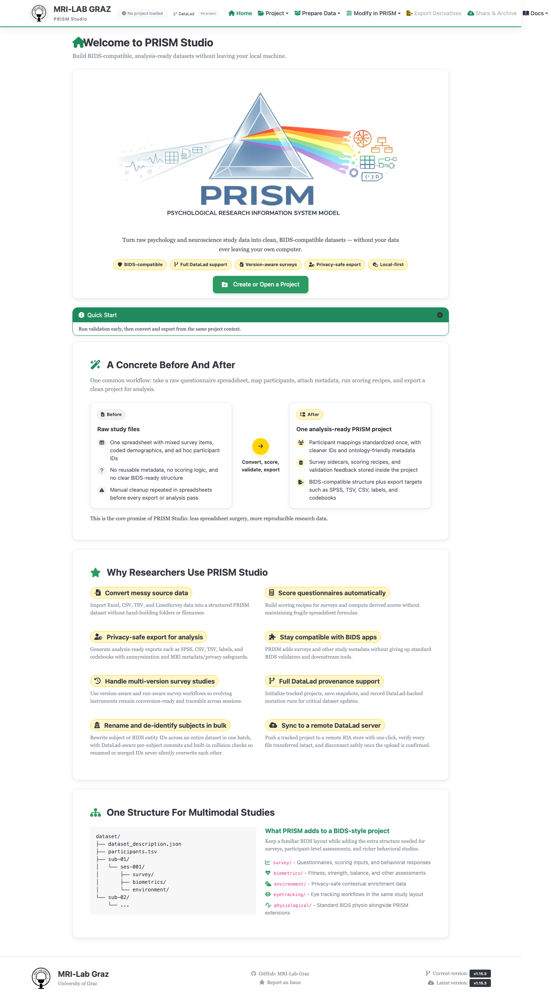

# Home

PRISM Studio turns raw psychology and neuroscience study data into clean,
BIDS-compatible datasets — without your data ever leaving your own computer. The
Home screen is where every session starts: it makes the case for the tool in one
glance and gets you to your project in one click.

## Create or open a project

Everything in Studio flows from an active project. **Create or Open a Project**
takes you straight to [Projects](projects.md), whether you're starting a new study
or picking up one you already have on disk. You don't need a project loaded to
browse Home itself — but every other screen either needs one or works better with
one.

## What PRISM Studio is for

Home makes the pitch concretely, with a before/after: a raw questionnaire
spreadsheet — mixed survey items, coded demographics, ad hoc participant IDs, no
reusable metadata, no scoring logic — becomes one analysis-ready PRISM project:
standardized participant mappings, survey sidecars and scoring recipes stored with
the data, a BIDS-compatible structure, and export targets like SPSS, TSV, CSV,
labels, and codebooks. Convert, score, validate, export — less spreadsheet surgery,
more reproducible research data.

That promise breaks down into what researchers actually use day to day: converting
messy source data (Excel, CSV, TSV, LimeSurvey) into a structured dataset without
hand-building folders or filenames; scoring questionnaires with recipes instead of
fragile spreadsheet formulas; privacy-safe export with anonymization and MRI
metadata safeguards; staying compatible with standard BIDS validators and
downstream tools; handling multi-version survey studies with version- and
run-aware conversion; full DataLad provenance — tracked projects, snapshots,
mutation runs; bulk subject renaming/de-identification with collision checks; and
syncing a tracked project to a remote DataLad server in one click.

## Where to go from here

The top navigation is where you spend most of your time: **Project** (open/switch,
recent projects), **Prepare Data** (Converter, Template Editor, Recipe Builder),
**Modify in PRISM** (Validator, File Management, JSON Editor), **Export
Derivatives** (Survey Export, Analysis Outputs, PRISM App Runner — enabled once a
project has a path and at least one derivative tool is available), **Share &
Archive** (once the project has data), and **Docs** (this site, plus the in-app
[Specifications](specifications.md) screen).

A beginner-help toggle (on by default) shows contextual guidance and highlights
required fields throughout Studio — turn it off once you know your way around.

## What's next

- [Projects](projects.md) to create or open your first project
