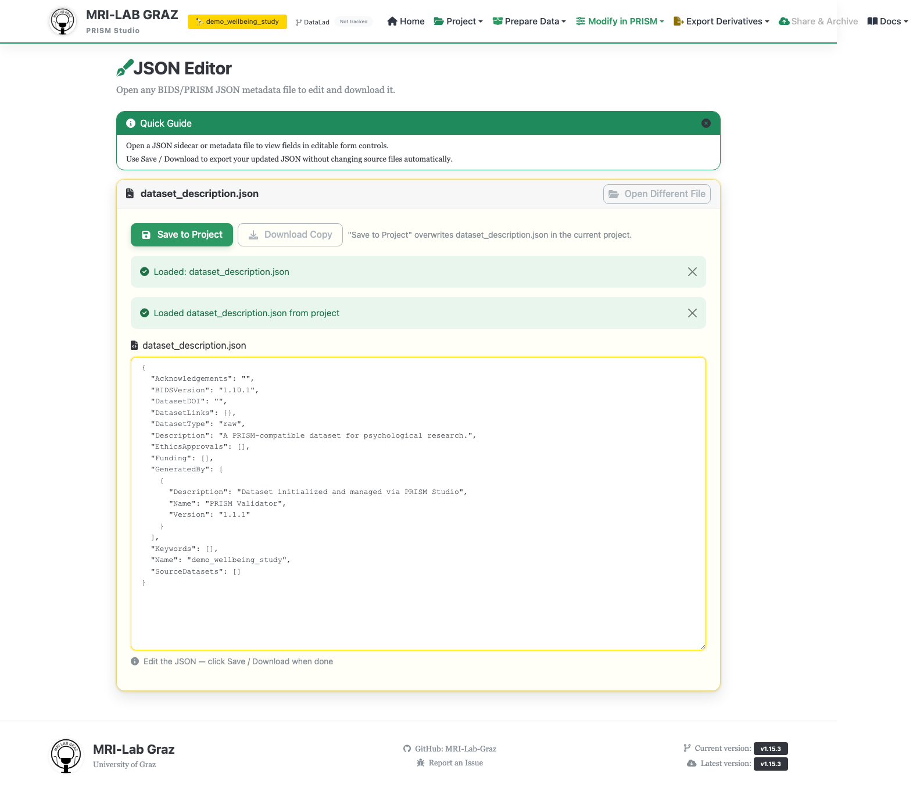

# JSON Editor

Edit a small set of known project-level JSON files directly — `dataset_description.json`,
`participants.json`, `samples.json`, or a `task-*.json` sidecar. You open a file
manually, or arrive here via a link from another Studio page that already knows
which file to load.

## Opening a file

- **Manually**: click **Browse JSON File** or drag a `.json` file onto the upload
  area. This reads the file entirely in your browser — nothing is sent to the server
  until you save.
- **From a project link**: pages elsewhere in Studio can link here with
  `?autoload=<type>&from=project`, which fetches that file directly from your current
  project.

Recognized project file types: `dataset_description`, `participants`, `samples`, and
any `task-*.json` file. There is no support for editing `project.json` here, and no
in-app file browser — you need to already know the filename or arrive via a link.

## Editing

- `participants.json` gets a custom nested, collapsible key/value form.
- Every other file — including `dataset_description.json` — opens as one large raw
  JSON textarea. A schema-aware structured form exists in the codebase but is not
  currently wired into this page, so don't expect field-level validation or
  autocomplete while typing; JSON validity is only checked when you open or save a
  file.

## Saving

Two distinct buttons, and the difference matters:

- **Save to Project** — writes your edits back to the matching file in your current
  project (`POST /editor/api/file/<type>`). A hint below the buttons tells you exactly
  which file this will overwrite, or explains why it's unavailable (only
  `dataset_description.json`, `participants.json`, `samples.json`, and `task-*.json`
  are project-writable).
- **Download Copy** — exports your edits as a local file download only. This never
  touches your project on disk — use it if you just want a copy, or if the file you
  opened isn't a recognized project type.

If a save fails (no project loaded, unrecognized file type, invalid JSON), you'll see
a clear error message rather than a silent failure.

## Common failures

- **Invalid JSON on open** — "Invalid JSON file: ..." for manually opened files.
- **File not found on autoload** — "File \<type\>.json not found in current project."
- **"No BIDS folder set"** when saving — no project is currently loaded; load one
  first.
- **"Unknown JSON type"** when saving — the opened file's name doesn't match a
  recognized project file type; use Download Copy instead.

## What's next

- [Projects](projects.md)
- [Validator](validator.md) — re-run validation after editing metadata
