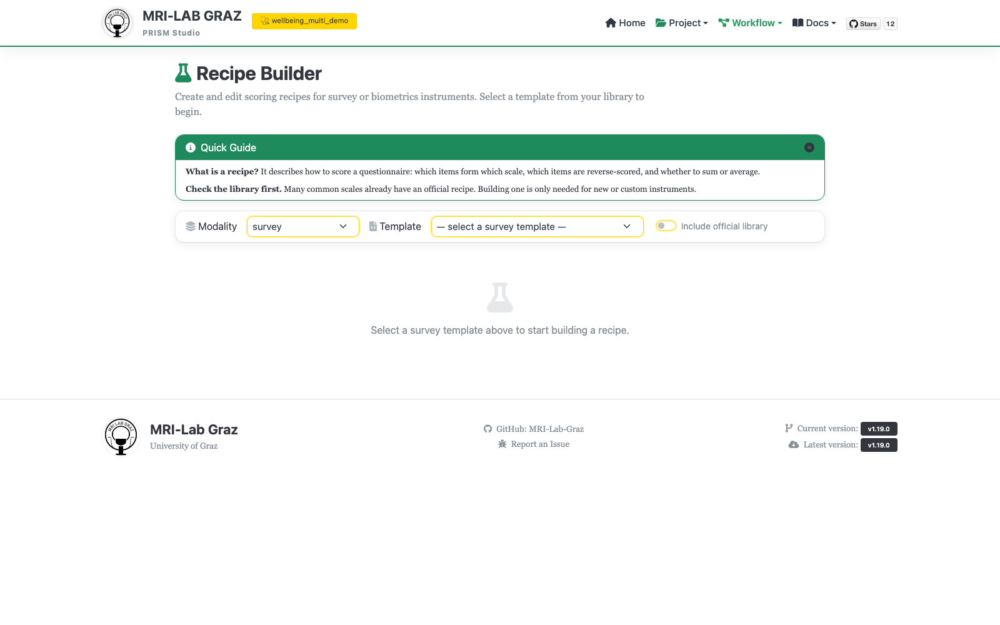
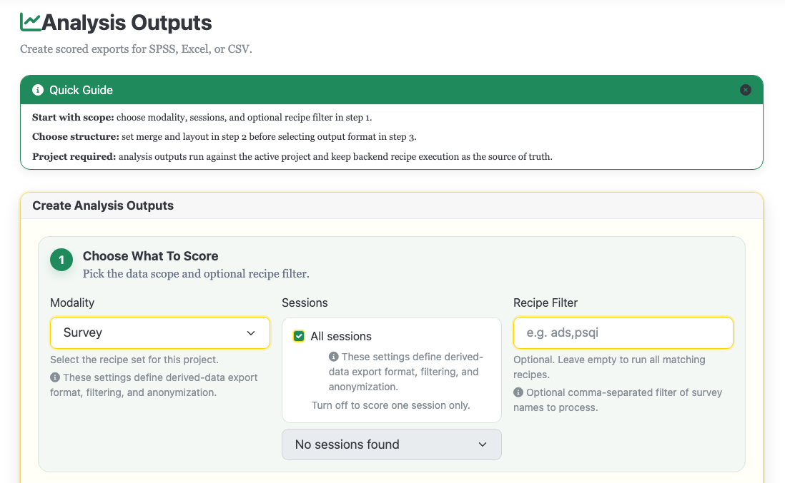

# Recipe Builder

Build scoring recipes (reverse-coding, subscales, composite scores) against a survey
or biometrics template. Recipe Builder only *creates and saves* recipes — running them
against your data happens on the separate [Export / Analysis Output](export.md) page.



## Step 1 — Pick modality and template

Choose **Modality** (`survey`/`biometrics`), then a **Template** from the dropdown,
populated from your project's `code/library/<modality>/` (and legacy fallback
locations). Check **Include official library** to also offer templates from the
bundled official library — if a project template and an official template share a
task name, the project one wins.

## Step 2 — Reverse coding (optional)

Once a template is selected, an **Inversion** panel lets you multi-select items to
reverse-code against an auto-detected scale range, with per-variant overrides where
the template defines multiple versions. This maps to a `Transforms.Invert` block in
the saved recipe.

## Step 3 — Build scores

- **Item Pool** (left) — searchable list of template items, with select-all.
- **Scale Canvas** (centre) — **Add Scale** creates a `Scores[]` entry: a name, a
  method (`sum`, `mean`, `formula`, `map`), and the items it draws from.
- Intermediate helper computations that shouldn't be a final output column go under
  `Transforms.Derived` instead of `Scores` (methods: `max`, `min`, `mean`, `avg`,
  `sum`, `map`, `formula`) — a later `Scores` entry can reference a `Derived` value,
  but not the other way around. A `Derived` name and a `Scores` name can't collide.

## Step 4 — Variations (optional)

For instruments with named scoring variants, **Add/remove variation** builds entries
under `VersionedScores.<variation name>`, each holding its own independent `Scores`
list.

## Missing answers (per scale)

Each scale has **If answers are missing**, one plain choice that stands for the recipe
fields `Missing` and `MinValid`:

- **Use the answered items** (default) — a sum or mean uses whatever was answered.
  Someone who answered 3 of 5 items gets the sum (or mean) of those 3; a sum is then
  lower than a complete response.
- **Require at least N** — the score is computed only when at least N items are
  answered, otherwise it is left empty (`n/a`).
- **Require all items** — any missing item leaves the score empty.

An answer counts as missing when the cell is empty, `n/a` or not a number. `formula`
scores are always left empty when any item they use is missing. The **What happens when
this recipe runs** box on the right restates all of this for your current scales, plus
which items are reverse-coded, and reminds you that raw data is never changed.

## Step 5 — Metadata and save

**Recipe Metadata** describes the recipe as a whole (not single items or scales) and
feeds the output metadata and the generated Methods text. For a *new* recipe it is
pre-filled from the template's own `Study` block (name and citation; for biometrics also
the description) and marked "Pre-filled from the template" — edit as needed. An existing
recipe keeps its own values.

Fill in or adjust Recipe Metadata (Name, Description, Citation), then **Save**. The server
re-validates the task/biometric name, confirms the referenced template still exists,
and checks item references before writing. Recipes save to:

```text
code/recipes/survey/recipe-<task>.json
code/recipes/biometrics/recipe-<name>.json
```

**Preview JSON** opens a read-only view of the recipe as it will be saved, with no
server round-trip.

## Running a saved recipe



Go to the **Analysis Output** page, pick modality, sessions, and optionally filter to
one recipe, choose merge/layout and output format (`sav`/`csv`/`xlsx`), and click
**Create Output**. Computed results land under:

```text
derivatives/survey/long_en/<recipe_id>/sub-*/ses-*/survey/*_desc-scores_survey.tsv   (per-subject / "prism" layout)
derivatives/survey/prism_survey_dataset_survey_scores.tsv                              (flat layout)
derivatives/survey/long_en/prism_survey_dataset_<recipe_id>.csv                        (csv/xlsx/sav exports)
derivatives/survey/long_en/dataset_description.json
```

## Common failures

- **Save fails with an item-reference error** — an item name in a `Scores`/`Derived`
  entry doesn't exist in the selected template; check the Item Pool for the exact name.
- **Name collision** — a `Derived` entry and a `Scores` entry can't share a name.
- **Nothing to run on Analysis Output** — make sure the recipe's task/biometric name
  matches data you've actually imported for that modality.

## What's next

- [Template Editor](template_editor.md) — the source templates recipes are built from
- [Export / Analysis Output](export.md) — running recipes and exporting results
- `RECIPES.md` for the full `Transforms`/`Scores`/missing-data specification
