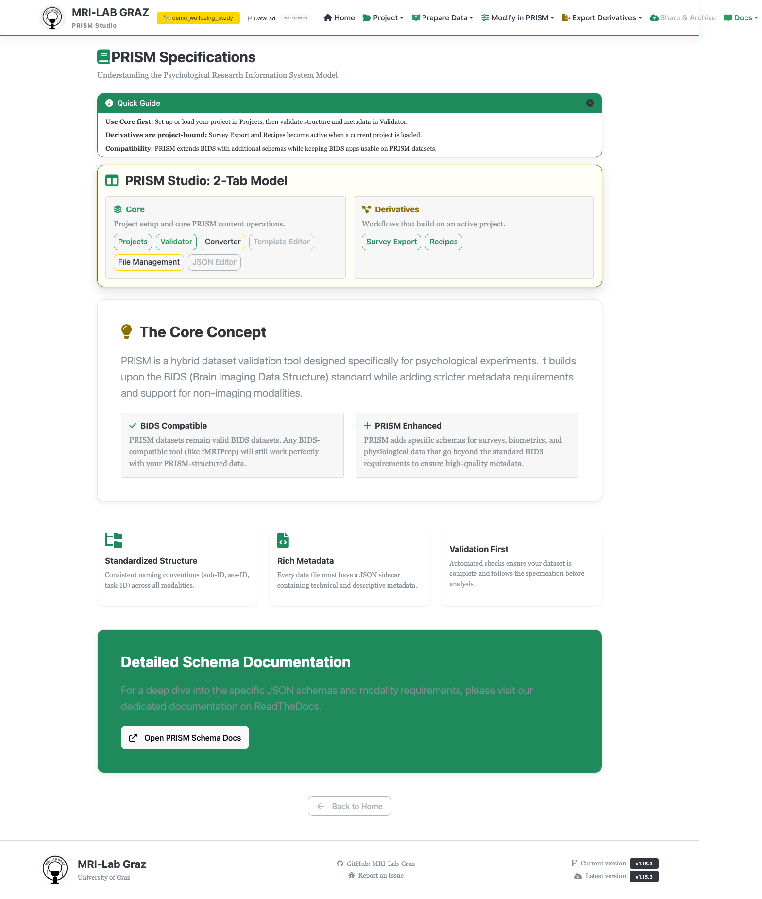

# Specifications

PRISM Studio organizes a project around two tiers: **Core** — the validated PRISM/
BIDS dataset itself (Projects, Validator, Converter, Template Editor, File
Management, JSON Editor) — and **Derivatives** — outputs computed from that dataset
(Survey Export, Recipes), which only become available once a project with data is
loaded. The Specifications screen is where Studio explains that split and points you
at both the tools and the underlying schema.

## Core vs. Derivatives

Every workflow in Studio belongs to one tier or the other. Core tools work with your
project's actual BIDS-compatible data and are always reachable. Derivatives tools —
Survey Export and Recipes — compute new outputs *from* that data, so they need a
project with real content loaded first; until then they show disabled with a
tooltip explaining why.

Underneath that split is PRISM's core relationship to BIDS: your dataset stays
BIDS-compatible at its core, with PRISM's schema-driven additions layered on top for
survey, biometrics, and other psychology-specific modalities — standardized
structure, rich metadata, and validation are the three principles that hold the
whole model together.

## Finding the schema itself

This screen doesn't define the schema — it links out to it. For the actual field-
by-field reference (required fields, filename patterns, schema versions), go to
[specs/survey](../specs/survey.md), [specs/biometrics](../specs/biometrics.md),
[specs/events](../specs/events.md), and [specs/environment](../specs/environment.md),
or start from [Specifications and Schemas](../SPECIFICATIONS.md) for the conceptual
overview.

## What's next

- [Projects](projects.md) · [Validator](validator.md) · [Template Editor](template_editor.md)
- [Recipe Builder](recipe_builder.md) · [Survey Export](survey_generator.md)
