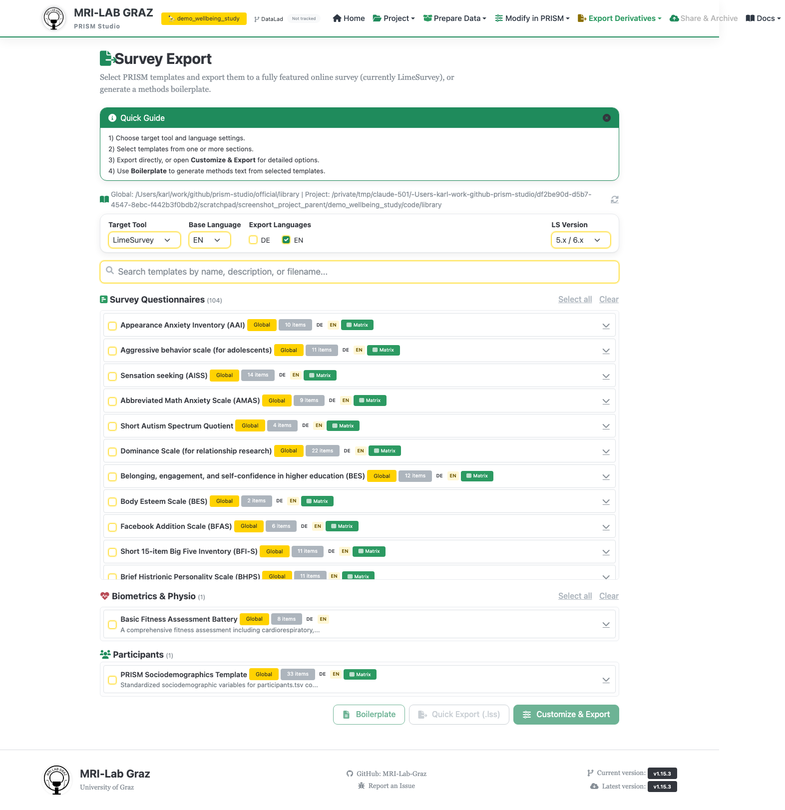

# Survey Export

Select templates from your PRISM library and export them as a ready-to-run
LimeSurvey questionnaire, or generate manuscript-ready Methods text from their
metadata. This page doesn't create or edit templates — for that, use the
[Template Editor](template_editor.md). (In the app's URL this page is still called
`/survey-generator`, a naming holdover; the screen itself is labeled "Survey
Export.")

## Step 1 — Toolbar

- **Target Tool** — only `LimeSurvey` is currently available.
- **Base Language**, **Export Languages** (checkboxes), **LS Version** (5.x/6.x
  default, or 3.x/4.x).

## Step 2 — Select templates

A search box, then four sections pulled from your PRISM library, each with
Select all/Clear:

- **Survey Questionnaires**
- **Biometrics & Physio**
- **Participants**
- **Other Templates**

## Step 3 — Choose an action

Three buttons, enabled once at least one template is checked:

- **Boilerplate** — generates manuscript-ready Methods paragraph text (Markdown +
  HTML), not a survey file at all. Summarizes library metadata: DOIs, licenses, age
  ranges, administration/scoring times, item counts, access levels, with citations.
  CLI equivalent: `prism_tools.py library generate-methods-text`.
- **Quick Export (.lss)** — exports the selected templates directly to a LimeSurvey
  `.lss` file with no customization step. Downloads
  `<title_or_survey_export>_<date>.lss`.
- **Customize & Export** — hands your selection off to
  [Survey Customizer](survey_customizer.md) for grouping, ordering, and
  LimeSurvey-specific presentation/consent settings before export.

## What's next

- [Survey Customizer](survey_customizer.md) for the full export workflow
- [Template Editor](template_editor.md) to create or edit templates first
