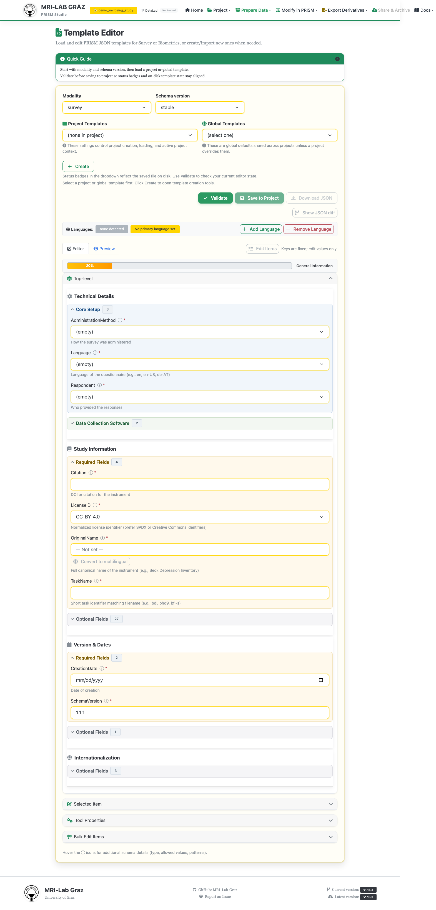

# Template Editor

Create, edit, validate, and export the JSON templates that describe survey and
biometrics instruments.

## Choosing a template

Pick a **Modality** (`survey` or `biometrics`) and **Schema version**, then choose a
template from one of two dropdowns:

- **Project Templates** — templates saved inside your current project
  (`code/library/<modality>/`).
- **Global Templates** — the official/bundled library plus any external library your
  project points at (`project.template_library_path`). These are loaded **read-only**.

You can also **Create** a blank template from the schema, or **Import** from
LimeSurvey XML (`.lsq`/`.lsg`/`.lsa`) or a tabular codebook (`.xlsx`/`.csv`/`.tsv`,
with a group picker for multi-instrument Excel files).

## Editing

The generated form has: a Top-level panel (`Study`/`Technical` metadata), a Selected
Item panel, a Tool Properties panel, a Bulk Edit Items panel, an Items panel (add/
delete items, copy style from another item), a language bar, and — for multi-version
instruments — a variant selector.

`Study` (instrument identity: `TaskName`, `OriginalName`, `ShortName`, `Authors`,
`LicenseID`, `ItemCount`, `Versions`/variant definitions) and `Technical`
(administration: `SoftwarePlatform`, `AdministrationMethod`, `Language`, ...) are the
two top-level blocks — keep them separate rather than mixing identity and
administration fields.

## Saving — what actually happens with global templates

Editing is allowed even when a template was loaded from the read-only Global list.
Saving always writes to your project's local library
(`code/library/<modality>/<filename>.json`) — it never writes back to the official or
external library. If you save a template that was loaded read-only, the editor forks
it into a new project-local copy and shows: *"↗ Saved as a project copy — the global
template was not changed."* Save requires an active project.

The **Delete** button only appears for project-local templates — it's hidden entirely
for anything loaded read-only, and the delete endpoint refuses to touch anything
outside the project's library path.

## Validation

Project-local templates are validated against the full schema. Global/library
templates are validated with a few fields intentionally relaxed (not required):
`Study.TaskName`, `Study.LicenseID`, `Study.Citation`, `Technical.SoftwarePlatform`,
`Technical.AdministrationMethod` — because official library entries are meant to be
generic and don't carry project- or administration-specific detail yet. Don't be
surprised if a global template shows fewer validation errors than your project copy
of the same instrument; that's expected.

## Questionnaire export (.docx)

The **Preview** tab includes a Word export: **Export Word** opens a modal with layout
options (participant ID/date/study-info header fields, item codes, randomize order,
header repeat interval, item column width, font size); **Download .docx** produces a
paper-and-pencil version of the questionnaire. This requires `python-docx` to be
installed server-side. A print/PDF option using the browser's print dialog is also
available.

## Common failures

- **Trying to delete a global template** — not possible by design; fork it with Save
  first, then delete the project copy if needed.
- **"Save requires an active project"** — open or create a project before editing.
- **Word export returns an error** — the server is missing the `python-docx`
  dependency.

## What's next

- [Survey Import](converter_survey.md) — templates copied during import land here
- [Recipe Builder](recipe_builder.md) — scoring recipes reference template items
- [Survey Versioning](../SURVEY_VERSION_PLAN.md) for how `Study.Versions` drives
  multi-variant templates
