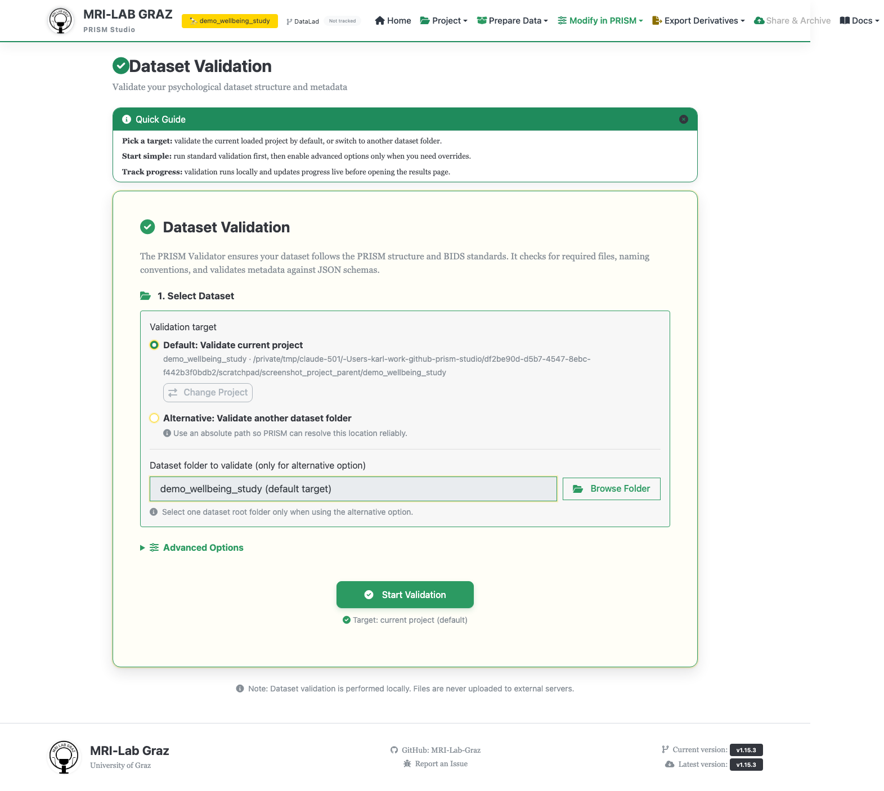
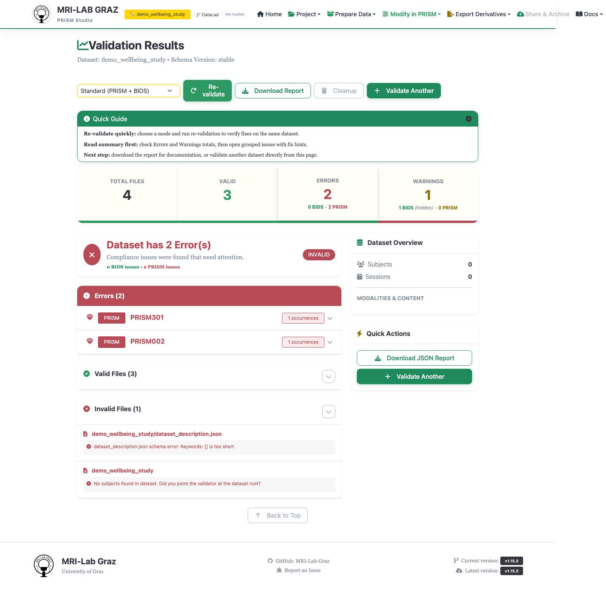

# Validator

The web equivalent of `prism-validator` on the CLI — checks a project or dataset
against PRISM and/or BIDS rules and shows the results grouped by severity.



## Step 1 — Select a dataset

- **Default: Validate current project** — pre-selected if you have a project loaded,
  showing its name and path with a "Change Project" button.
- **Alternative: Validate another dataset folder** — pick any other folder via Browse
  (local) or Browse Server Folder. This becomes the only option, auto-selected, if you
  have no project currently loaded.

## Step 2 — Advanced Options (optional)

Collapsed by default; a master "Enable advanced options" switch unlocks:

- **Validation Mode Override** — Full Validation (PRISM + BIDS) (default), PRISM Only,
  or BIDS Only. Full validation, including BIDS, runs by default — you don't need to
  opt in to get BIDS checks; use this to narrow scope instead.
- **Show BIDS Warnings** — off by default (BIDS warnings are hidden unless you turn
  this on).
- **Schema Version** — defaults to `stable`.
- **Template Library Root (Optional)** — by default validation auto-detects the
  target dataset's library and otherwise falls back to the configured global library.

## Step 3 — Start Validation

Click **Start Validation**. A progress panel (with Pause/Resume/Cancel) appears, then
you're taken to the results page automatically.

## Reading the results



- A summary dashboard: Total Files / Valid / Errors (split BIDS vs. PRISM) / Warnings
  (split BIDS vs. PRISM, noting when BIDS warnings are hidden).
- **Errors** and **Warnings** cards, grouped by error code into collapsible sections —
  each tagged BIDS or PRISM, showing description, an optional fix-hint callout,
  affected subjects/sessions, sample file paths, and a documentation link for that
  code. See [Error Codes](../ERROR_CODES.md) for the full catalog.
- **Valid Files** / **Invalid Files** collapsible lists.
- A **Dataset Overview** card (subjects/sessions/modalities/tasks) and a **Quick
  Actions** card.

Action bar at the top: a **Re-validation mode** selector + **Re-validate** button (rerun
without starting over), **Download Report** (JSON), **Cleanup** (deletes the temporary
result), and **Validate Another**.

## Auto-fix

Auto-fix (`--fix`) is currently **CLI-only** — there is no per-issue "Fix" button in
the web results page, even though the backend has a fix-tool mapping for some codes
(e.g. pointing `PRISM007` at the Template Editor). If you want mechanical fixes for
supported issues, use the CLI:

```bash
prism-validator /path/to/project --fix --dry-run
prism-validator /path/to/project --fix
```

## What's next

- [Error Codes](../ERROR_CODES.md) for the full code reference
- [Projects](projects.md)
