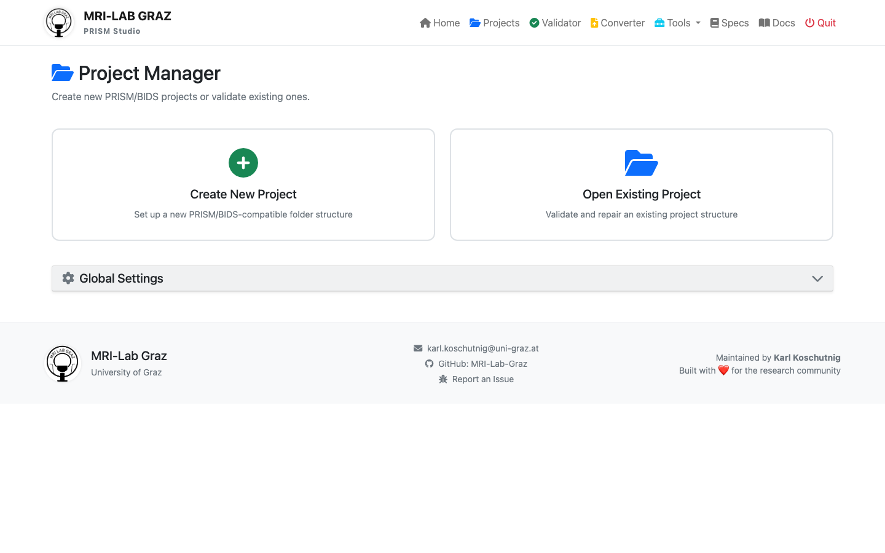
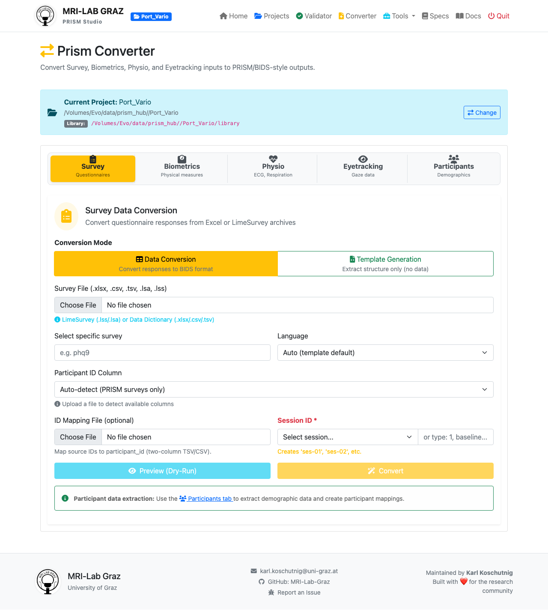
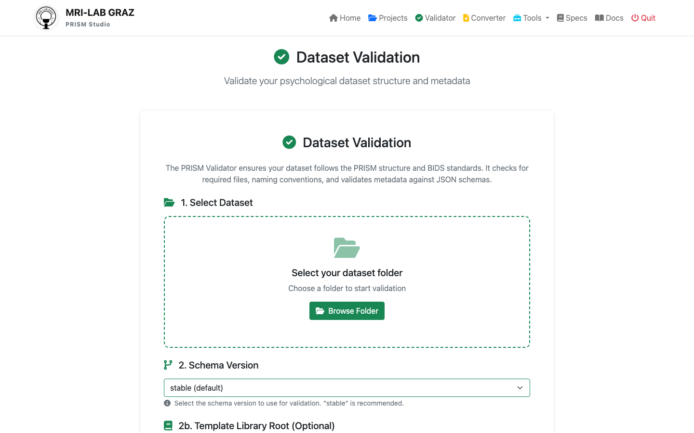
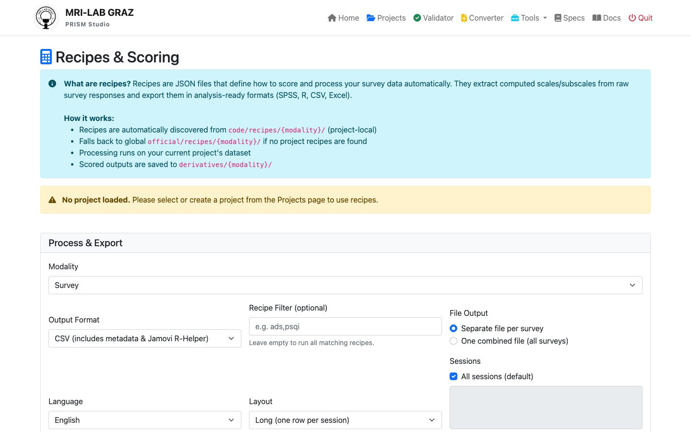

# PRISM Workshop: Structured Exercises

Welcome to the PRISM workshop! This folder includes a **core 4-step basics track** plus optional extension exercises.

## 📚 Workshop Structure

Use these **4 core folders** for the basics workshop:

```
workshop/
├── exercise_0_project_setup/      ← Start here!
├── exercise_1_raw_data/
├── exercise_2_hunting_errors/
├── exercise_3_using_recipes/
└── exercise_4_templates/          ← Optional extension
```

Additional optional branch:

```
workshop/
└── exercise_5_participant_mapping/  ← Advanced/extended session
```

---

## 🎯 Learning Path (Basics)

### Exercise 0: Project Setup
**⏱️ Time:** 10 minutes  
**📁 Location:** `exercise_0_project_setup/`
- Launching Prism.exe
- Creating your first project

### Exercise 1: Handling Raw Data
**⏱️ Time:** 30 minutes  
**📁 Location:** `exercise_1_raw_data/`
- BIDS folder hierarchy
- File naming conventions
- Using the GUI converter

### Exercise 2: Hunting for Errors
**⏱️ Time:** 25 minutes  
**📁 Location:** `exercise_2_hunting_errors/`
- Guided "Bug Hunt"
- Troubleshooting common issues

### Exercise 3: Using Recipes
**⏱️ Time:** 20 minutes  
**📁 Location:** `exercise_3_using_recipes/`
- Automated scoring
- Exporting to SPSS format

### Optional Extension: Templates
**⏱️ Time:** 20 minutes  
**📁 Location:** `exercise_4_templates/`
- Custom metadata definitions
- JSON Template Editor

### Optional Extension: Participant Mapping
**⏱️ Time:** 30-45 minutes  
**📁 Location:** `exercise_5_participant_mapping/`
- Demographic code transformations (e.g., 1→M, 2→F)
- Auto-generating standardized participants metadata

---

## 🔍 Folder ↔ App Route Check

These workshop folders match currently available PRISM Studio routes:

| Workshop Folder | Main UI Route | Purpose |
|---|---|---|
| `exercise_0_project_setup` | `/projects` | Create and activate project (YODA structure) |
| `exercise_1_raw_data` | `/converter` | Convert Excel/TSV into PRISM/BIDS-like structure |
| `exercise_2_hunting_errors` | `/validate` | Validate dataset and fix metadata issues |
| `exercise_3_using_recipes` | `/recipes` | Run scoring recipes and export outputs |
| `exercise_4_templates` (optional) | `/template-editor` | Build/edit reusable metadata templates |
| `exercise_5_participant_mapping` (optional) | `/converter` + `/validate` | Apply `participants_mapping.json` and verify outputs |

---

## 🖼️ Workshop Hero Shot

Use this screenshot at the start of the workshop to orient users:



## 🖼️ Exercise Screenshots

Use these screenshots for each exercise step:

- Exercise 0 (Project Setup)  
	
- Exercise 1 (Data Conversion)  
	
- Exercise 2 (Validation)  
	
- Exercise 3 (Recipes)  
	
- Exercise 4 (Templates)  
	
- Optional Exercise 5 (Participant Mapping)  
	

---

## 🚀 Getting Started

### 1. Windows Users
Locate and run **`Prism.exe`** in your workshop folder.

### 2. Manual Launch
If you are running from source:
```bash
source .venv/bin/activate
python prism-studio.py
```

Open browser to: **http://localhost:5001**

### 3. Start Exercise 0
Navigate to `exercise_0_project_setup/INSTRUCTIONS.md` (or `.pdf`) and follow along!
