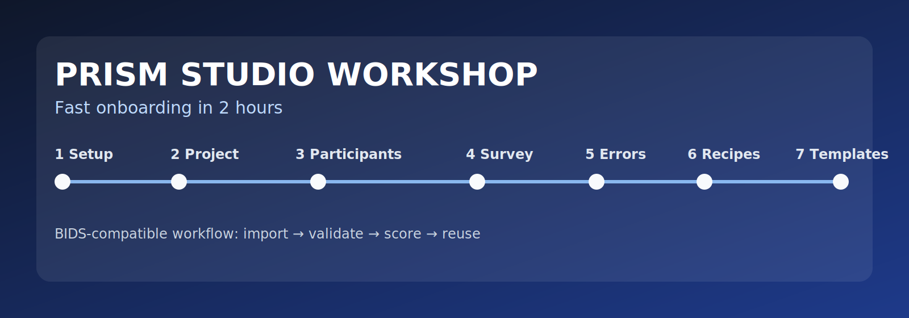
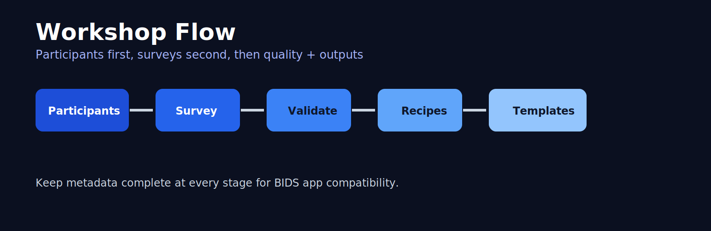
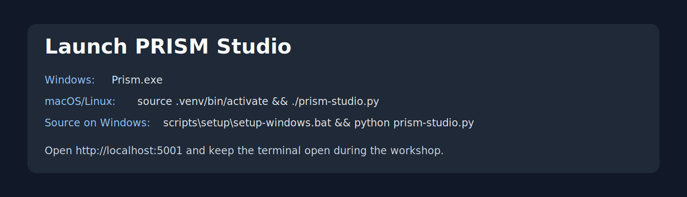

# PRISM Workshop (2h) — Quick Instructor Flow

This workshop is optimized for fast onboarding. Participants should mostly follow the linked instruction files and keep moving.



## 7-Step Agenda (120 minutes)

1. **Download + setup (Windows)** — 15 min  
	File: `exercise_0_project_setup/INSTRUCTIONS.md`
2. **Project setup** — 10 min  
	File: `exercise_0_project_setup/INSTRUCTIONS.md`
3. **Import participant data** — 20 min  
	File: `exercise_5_participant_mapping/INSTRUCTIONS.md`
4. **Import survey data** — 20 min  
	File: `exercise_1_raw_data/INSTRUCTIONS.md`
5. **Error hunting** — 20 min  
	File: `exercise_2_hunting_errors/INSTRUCTIONS.md`
6. **Recipes** — 20 min  
	File: `exercise_3_using_recipes/INSTRUCTIONS.md`
7. **Templates** — 15 min  
	File: `exercise_4_templates/INSTRUCTIONS.md`



## Start Here (what users do first)

### Windows (preferred for workshop)
1. Download/extract workshop package.
2. Double-click `Prism.exe`.
3. Keep the terminal window open.
4. Confirm browser opens `http://localhost:5001`.

### If running from source

macOS/Linux:
```bash
source .venv/bin/activate
./prism-studio.py
```

Windows PowerShell:
```powershell
scripts\setup\setup-windows.bat
.\.venv\Scripts\Activate.ps1
python prism-studio.py
```

## One-Line Goal per Step

- **Setup:** PRISM running locally.
- **Project:** create + activate `Wellbeing_Study_Workshop`.
- **Participants:** generate clean `participants.tsv` with mapped values.
- **Survey:** convert `wellbeing.tsv` into PRISM/BIDS-like structure.
- **Errors:** find and fix validation issues.
- **Recipes:** score and export (`.save` or `.xlsx`).
- **Templates:** build one reusable survey template.



## App Routes (quick reference)

- `/projects` → project creation
- `/converter` → participant/survey import
- `/validate` → validation
- `/recipes` → scoring + export
- `/template-editor` → templates

## Screenshot Pack (optional)

If your UI layout changed, regenerate screenshots with:
`../../docs/workshop/SCREENSHOTS_QUICK_START.md`
