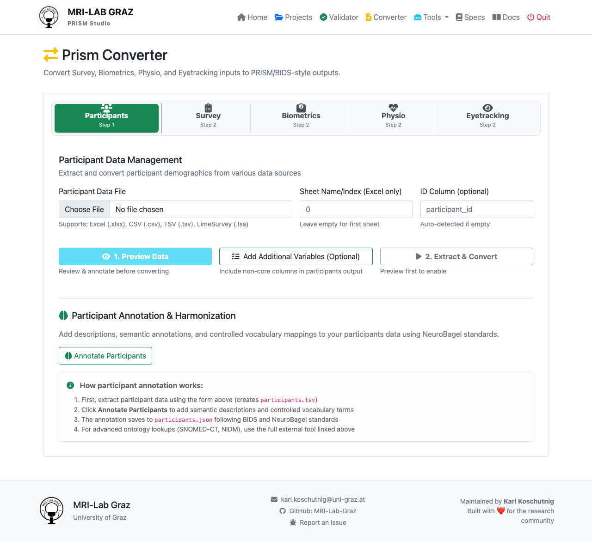

# Exercise 1: Import Raw Data & Create BIDS/PRISM Structure

**⏱ Time:** 30 minutes  
**🎯 Goal:** Convert raw survey data into a properly structured BIDS/PRISM dataset

**📚 Concepts:** BIDS file naming, folder hierarchy, data format conversion, metadata sidecars

---

## What You'll Learn

By the end of this exercise, you will:
- ✅ Understand BIDS folder structure (Dataset → Subject → Session → Modality)
- ✅ Know BIDS file naming conventions with entities (sub, ses, task)
- ✅ Use PRISM Studio's Data Converter to format survey data
- ✅ Recognize why sidecar JSON files are important
- ✅ Set up proper directory structure for data organization

---

## The Data You'll Be Working With

In the `raw_data/` folder, you'll find:

| File | Type | Content |
|------|------|---------|
| `wellbeing.tsv` | Tab-separated | WHO-5 survey responses (5 items) + demographics |
| `wellbeing.xlsx` | Excel format | Same data in Excel (alternative format) |
| `fitness_data.tsv` | Tab-separated | Optional bonus data (heart rate, strength measurements) |

These are **"raw" data**: exactly as they came from your data collection tool. Your job is to transform them into a standard format that:
- ✅ Follows international BIDS standards
- ✅ Has consistent naming conventions
- ✅ Includes proper metadata (who, when, how)
- ✅ Can be processed by automated analysis tools

---

## The WHO-5 Well-Being Index

Let me quickly explain what we're importing:

**Structure of wellbeing.tsv:**
```
participant_id    session    age    sex    education    handedness    WB01    WB02    WB03    WB04    WB05    completion_date
DEMO001          baseline   28     2      4            1            4       4       2       3       4       2025-01-15
DEMO002          baseline   34     1      5            1            3       3       3       3       3       2025-01-16
...
```

**What each column represents:**
- `participant_id`: Unique participant identifier
- `session`: Visit/timepoint label
- Demographics: `age`, `sex`, `education`, `handedness`
- **Survey items**: `WB01` through `WB05` (scores 0-5, higher = better well-being)
- `completion_date`: When the survey was filled out

---

## Step-by-Step: Convert the Data

### **Step 1: Make Sure PRISM Studio is Running**

Check that you can access: **http://localhost:5001**

If needed, activate your environment and start PRISM:
```bash
source .venv/bin/activate  # macOS/Linux
python prism-studio.py
```

### **Step 2: Navigate to the Converter**

In PRISM Studio:
1. Look for the navigation menu (usually on the left)
2. Click **"Converter"** or **"Data Converter"**
3. Select: **"Survey Data Converter"** or similar

Your screen should look similar to:



Alternatively, go directly to: **http://localhost:5001/converter**

### **Step 3: Load the Wellbeing Survey Data**

In the converter interface:

1. **Click "Browse" or "Choose File"**
2. **Navigate to:** `examples/workshop/exercise_1_raw_data/raw_data/wellbeing.tsv`
3. **Click "Load" or "Upload"**
4. **Preview:** You should see a table with:
   - Headers: participant_id, session, age, sex, ..., WB01, WB02, WB03, WB04, WB05
   - Multiple rows of data (participants DEMO001-DEMO009)

**If you see an error:**
- Check that the file is actually `wellbeing.tsv` (tab-separated, not comma-separated)
- Verify the file exists at that location
- Contact your instructor if issues persist

### **Step 4: Configure the Column Mapping**

Now tell PRISM what each column represents.

| Setting | Value | Notes |
|---------|-------|-------|
| **Participant ID Column** | `participant_id` | Dropdown: which column has the participant IDs? |
| **Session Column** | `session` | Which column has the session/visit label? |
| **Task/Survey Name** | `wellbeing` | This appears in filenames as `task-wellbeing` |
| **Modality** | `survey` | Data type: survey (vs. biometrics, imaging, etc.) |
| **Include Demographics** | ☑ Yes | Convert age, sex, education, handedness to participants.tsv |

### **Step 5: Set Output Location**

PRISM will create your new dataset structure here.

1. **Click "Set Output Folder"** or **"Output Directory"**
2. **Navigate to:** `examples/workshop/exercise_1_raw_data/`
3. **Create a new folder called:** `my_dataset`
4. **Select this folder as output**

**What PRISM will create:**
- `my_dataset/dataset_description.json` - Dataset-level metadata
- `my_dataset/participants.tsv` - All participant demographics
- `my_dataset/sub-DEMO001/` - Folders for each participant
- `my_dataset/sub-DEMO001/ses-baseline/survey/` - Survey data for that participant

### **Step 6: Enable Optional Features**

Make sure these boxes are checked:

- ☑ **Generate JSON sidecars** - Creates `.json` metadata files
- ☑ **Create participants.tsv** - Consolidates all demographic info
- ☑ **Create dataset_description.json** - Dataset-level metadata
- ☑ **Validate after conversion** - (optional) Checks for errors

### **Step 7: Review the Preview**

PRISM should show you a preview of how the output filenames will look:

**Expected filename pattern:**
```
sub-{PARTICIPANT_ID}_ses-{SESSION}_task-wellbeing_survey.tsv
sub-DEMO001_ses-baseline_task-wellbeing_survey.tsv
sub-DEMO002_ses-baseline_task-wellbeing_survey.tsv
...
```

**Check:**
- ✅ Hyphens after `sub-`, `ses-`, `task-`
- ✅ Underscores between entities
- ✅ Lowercase (except participant IDs)

If something looks wrong, you can usually edit the mapping before proceeding.

### **Step 8: Click "Convert"**

1. **Click "Convert to BIDS"** or **"Start Conversion"**
2. Watch the progress bar
3. **Success message** should appear: "X files converted successfully" or similar

---

## Step 9: Explore Your New Dataset

After conversion, navigate to `my_dataset/` on your computer and look around:

```
my_dataset/
├── dataset_description.json          (← dataset-level metadata)
├── participants.tsv                  (← all participant demographics)
│
├── sub-DEMO001/
│   └── ses-baseline/
│       └── survey/
│           ├── sub-DEMO001_ses-baseline_task-wellbeing_survey.tsv
│           └── sub-DEMO001_ses-baseline_task-wellbeing_survey.json
│
├── sub-DEMO002/
│   └── ses-baseline/
│       └── survey/
│           ├── sub-DEMO002_ses-baseline_task-wellbeing_survey.tsv
│           └── sub-DEMO002_ses-baseline_task-wellbeing_survey.json
│
... (more participants)
```

### **Open and Examine Some Files:**

**1. `dataset_description.json`**
```bash
cat my_dataset/dataset_description.json
```

You'll see metadata like dataset name, authors, BIDS version.

**2. `participants.tsv`**
```bash
head my_dataset/participants.tsv
```

Shows:
```
participant_id    age    sex    education    handedness
DEMO001          28     2      4            1
DEMO002          34     1      5            1
...
```

**3. A survey data file:**
```bash
cat my_dataset/sub-DEMO001/ses-baseline/survey/sub-DEMO001_ses-baseline_task-wellbeing_survey.tsv
```

Shows:
```
participant_id    session    WB01    WB02    WB03    WB04    WB05    completion_date
DEMO001          baseline   4       4       2       3       4       2025-01-15
```

**4. A JSON sidecar:**
```bash
cat my_dataset/sub-DEMO001/ses-baseline/survey/sub-DEMO001_ses-baseline_task-wellbeing_survey.json
```

Shows basic metadata (we'll improve this in Exercise 5).

---

## Understanding BIDS Structure

### **The Hierarchy**

```
DATASET (study level)
└── sub-PARTICIPANT (who?)
    └── ses-SESSION (when?)
        └── MODALITY (what data type?)
            └── FILES (the actual data)
```

### **File Naming Rules**

BIDS is very strict about naming. All files follow this pattern:

```
sub-<label>_[ses-<label>_]task-<label>_<suffix>.<extension>
```

**Breaking it down:**

- `sub-` = Required entity meaning "subject/participant"
- `DEMO001` = The actual participant ID (replace with any ID)
- `_` = Entity separator
- `ses-baseline` = Optional session entity
- `task-wellbeing` = The task/survey name
- `survey` = The suffix/modality
- `.tsv` = The file extension

**Examples:**
- `sub-DEMO001_ses-baseline_task-wellbeing_survey.tsv` ✅ CORRECT
- `subDEMO001_ses-baseline_task-wellbeing_survey.tsv` ❌ Missing hyphen after sub
- `sub-DEMO001_ses-baseline_task-wellbeing_survey.csv` ❌ Wrong extension (should be .tsv)
- `sub-DEMO001_task-wellbeing_survey.tsv` ✅ OK (session is optional)

### **Why This Matters**

BIDS naming is:
- **Machine readable** - Tools can parse filenames automatically
- **Unambiguous** - No confusion about what's in a file
- **Standardized** - Same across all BIDS datasets worldwide
- **Sortable** - Files organize naturally by alphabetical order

---

## Validation: Is Your Dataset Correct?

Let's check if your conversion worked properly.

### **Option 1: Use PRISM Validator**

1. In PRISM Studio, go to **"Validator"** or **"Home"**
2. Click **"Select Dataset"**
3. Navigate to and select: `examples/workshop/exercise_1_raw_data/my_dataset/`
4. Click **"Validate Dataset"**

**What you should see:**
- ✅ **All files detected** - Shows count of subjects, sessions, etc.
- ⚠️ **Warnings** - About missing metadata (this is OK! We'll fix it in Exercise 5)
- ✅ **No ERRORS** about file structure or naming

### **Option 2: Manual Check**

Confirm these things exist:
- [ ] `my_dataset/dataset_description.json` exists
- [ ] `my_dataset/participants.tsv` exists with demographic data
- [ ] Folders named `sub-DEMO001/`, `sub-DEMO002/`, etc. exist
- [ ] Each has `ses-baseline/survey/` subfolder
- [ ] Inside are `.tsv` and `.json` files with correct naming

---

## Bonus: Convert Fitness Data (Optional)

If you want extra practice:

1. **Repeat Steps 3-8** but this time:
   - Load: `examples/workshop/exercise_1_raw_data/raw_data/fitness_data.tsv`
   - Set **Modality** to: `biometrics` (not `survey`)
   - Set **Task Name** to: `fitness`
   - **Output to the same** `my_dataset/` folder

2. **Result:** You'll have both:
   ```
   sub-DEMO001/ses-baseline/survey/sub-DEMO001_ses-baseline_task-wellbeing_survey.tsv
   sub-DEMO001/ses-baseline/biometrics/sub-DEMO001_ses-baseline_task-fitness_biometrics.tsv
   ```

---

## Checklist: Ready for Next Exercise?

Before moving on, confirm:

- [ ] PRISM Studio can access `http://localhost:5001`
- [ ] Data converted successfully with no ERRORS
- [ ] `my_dataset/` folder exists with proper structure
- [ ] Filenames follow BIDS pattern (sub-, ses-, task-, survey)
- [ ] Both `.tsv` data and `.json` sidecar files exist
- [ ] `dataset_description.json` and `participants.tsv` at root

---

## Key Takeaways

🎯 **What you just did:**

1. ✅ Took unstructured survey data
2. ✅ Converted it to BIDS/PRISM standard format
3. ✅ Created proper folder hierarchy (subject → session → modality)
4. ✅ Generated metadata files
5. ✅ Made your data machine-readable and shareable

**Why this matters:**
- Other researchers can understand your data structure instantly
- Automated analysis pipelines (fMRIPrep, etc.) can process your data
- Your data is ready for archiving and sharing
- Version control and reproducibility are enabled

---

## Troubleshooting Common Issues

| Problem | Solution |
|---------|----------|
| "File format not recognized" | Make sure it's `.tsv` (tabs), not `.csv` (commas) |
| "No data rows found" | Check that the file has actual data, not just headers |
| "Invalid participant ID" | Don't use spaces or special characters in IDs |
| "Column mapping failed" | Make sure column names exactly match (case-sensitive) |
| "Output folder not writable" | Check file permissions on the output directory |

---

## Next Steps

🎉 **Excellent!** Your dataset is now structured properly.

**But notice:** The JSON sidecar files are mostly empty! They have the filenames and basic structure, but not much metadata.

**In Exercise 2: Error Hunting** you'll:
- Learn to identify common data quality issues
- See what the Validator reports
- Understand error types and how to fix them

**Ready?** → Go to `../exercise_2_hunting_errors/INSTRUCTIONS.md`

---

## Advanced: Understanding File Conversions

**What happened during conversion:**

```
Step 1: wellbeing.tsv (9 participants × 1 session)
        ↓
Step 2: Split by participant
        ↓
        sub-DEMO001_ses-baseline_task-wellbeing_survey.tsv
        sub-DEMO002_ses-baseline_task-wellbeing_survey.tsv
        ... (one file per participant)
        ↓
Step 3: Extract demographics → participants.tsv
        ↓
Step 4: Generate metadata → JSON sidecars
        ↓
Step 5: Organize → BIDS folder structure
        ↓
        Result: A valid BIDS/PRISM dataset!
```

This is why the conversion tool is powerful - it handles all these transformations automatically instead of you doing it manually!
