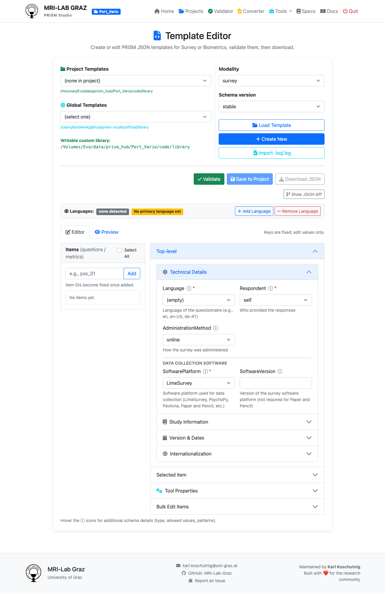

# Exercise 4: Making & Editing Templates

**Time:** 20 minutes  
**Goal:** Create a custom survey metadata template from scratch using the Template Editor.

---

## What You'll Learn

By the end of this exercise, you will:
- ✓ Use the **JSON Template Editor** to create metadata definitions
- ✓ Understand how schemas define your data (Question text, Scale ranges)
- ✓ Save and reuse templates for future datasets

---

## Why Templates Matter?

In Exercise 1, PRISM created basic "sidecar" JSON files for you. But usually, you want to include more detail:
- What exactly was asked in item `WB01`?
- What do the values `1` through `5` mean?
- What are the technical parameters of your recording?

The Template Editor lets you define these once and reuse them forever.

---

## Your Task: Create a "Daily Stress" Template

### Step 1: Open the Template Editor
1. In PRISM Studio, go to **Tools** → **JSON Template Editor**.
2. Alternatively, go to: **http://localhost:5001/template-editor**

### Step 2: Set Up the Metadata
1. **Modality:** Select `Survey`.
2. **Template Name:** Enter `daily_stress`.
3. Click **"Start New Template"**.

### Step 3: Define Your Questions
1. Look for the **"Questions"** or **"Terms"** section.
2. Add a new item:
   - **Key:** `stress01`
   - **Question Text:** "How stressed did you feel today?"
   - **Scale:** `1-7`
3. Add another item:
   - **Key:** `stress02`
   - **Question Text:** "Did you have enough time for yourself?"
   - **Levels:** `1=Not at all, 2=Somewhat, 3=Completely`

### Step 4: Validate & Save
1. Click **"Validate Against Schema"**. PRISM will check if your template matches the BIDS/PRISM standard.
2. If it's valid, click **"Save Template"**.
3. Your template is now saved in your `library/` and can be used in the Converter to automatically fill in metadata for matching columns!

---

## End of Workshop!

🎉 **Congratulations!** You have completed the full PRISM Workshop.

You now know how to:
1. **Initialize** a project workspace.
2. **Convert** messy raw data to structured BIDS/PRISM data.
3. **Hunt** for errors and troubleshoot issues.
4. **Process** data automatically using recipes.
5. **Create** custom metadata templates for your own research.

For more information, visit the [PRISM Documentation](https://prism-validator.readthedocs.io).
