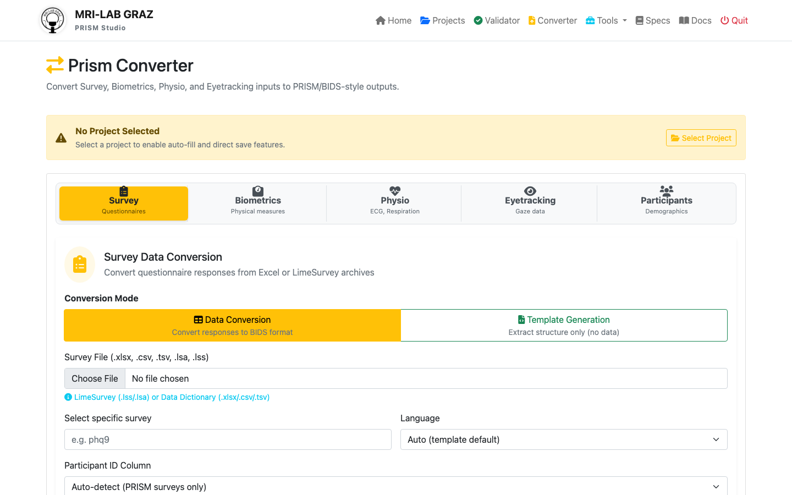

# Exercise 5: Participant Demographic Mapping

**Time:** 45 minutes  
**Goal:** Create a participant mapping specification to convert raw demographic data with custom encodings into standardized PRISM format



---

## What You'll Learn

By the end of this exercise, you will:
- ✓ Understand how to document custom demographic variable encodings
- ✓ Create a `participants_mapping.json` specification file
- ✓ Map raw data columns to PRISM standard variables
- ✓ Define value transformations (numeric codes → standard codes)
- ✓ Use the mapping to auto-generate standardized participant data

---

## Background

In Exercise 1, we created a PRISM dataset with participant data from `wellbeing.tsv`. However, that raw data uses **numeric codes** that don't match the PRISM standard:

| Raw Data | Standard PRISM |
|----------|----------------|
| sex: 1, 2, 4 | sex: M, F, O |
| education: 1-6 | education_level: 1-6 |
| handedness: 1, 2 | handedness: R, L |

The `participants_mapping.json` file tells PRISM how to transform these custom encodings into standardized format **automatically**.

---

## Starting Materials

Look in the `raw_data/` folder:
- **`wellbeing.tsv`** - Contains demographic data with numeric codes
- **`fitness_data.tsv`** - Contains biometric data

---

## Your Task

Create a participant mapping specification that documents how to transform the wellbeing survey data into standardized PRISM format.

---

## Step-by-Step Instructions

### Step 1: Examine the Raw Data

1. Open `raw_data/wellbeing.tsv` in a text editor or spreadsheet
2. Examine the header row and first few data rows
3. Note the columns and their values:
   - `participant_id` - Participant identifiers (DEMO001, DEMO002, ...)
   - `session` - Session labels (baseline, followup, etc.)
   - `age` - Age in years (numeric)
   - `sex` - Coded as: 1=Male, 2=Female, 4=Other
   - `education` - Coded as: 1-6 (education level)
   - `handedness` - Coded as: 1=Right, 2=Left
   - `WB01-WB05` - Survey items (not participant variables)

### Step 2: Understand the Mapping File Format

A `participants_mapping.json` file has this structure:

```json
{
  "version": "1.0",
  "description": "What this mapping does",
  "mappings": {
    "variable_name": {
      "source_column": "raw_column_name",
      "standard_variable": "prism_standard_name",
      "type": "string|integer|float",
      "value_mapping": {
        "raw_value": "standard_value"
      }
    }
  }
}
```

**Key concepts:**
- **source_column**: The exact column name in `wellbeing.tsv`
- **standard_variable**: The PRISM standard variable name
- **type**: The data type (string, integer, float)
- **value_mapping**: Optional - maps raw values to standard values

### Step 3: Create the Mapping File

1. Create a new file called `participants_mapping.json`
2. Place it in: **`code/library/`** (create the folders if needed)
3. Start with this template:

```json
{
  "version": "1.0",
  "description": "Mapping for wellbeing survey raw data to PRISM standard participant variables",
  "mappings": {
    "participant_id": {
      "source_column": "participant_id",
      "standard_variable": "participant_id",
      "type": "string"
    },
    "sex": {
      "source_column": "sex",
      "standard_variable": "sex",
      "type": "string",
      "value_mapping": {
        "1": "M",
        "2": "F",
        "4": "O"
      }
    }
  }
}
```

### Step 4: Extend the Mapping

Add mappings for the remaining participant variables:

**What to add:**
- `session` → `session` (pass-through, no recoding needed)
- `age` → `age` (type: integer)
- `education` → `education_level` (map 1→1, 2→2, etc.)
- `handedness` → `handedness` (map 1→R, 2→L)

**Hint:** For education, since the raw values (1-6) match the standard values, you can omit the `value_mapping` or set it to empty.

**Reference:** Open `docs/PARTICIPANTS_MAPPING.md` for examples.

### Step 5: Validate Your Mapping

Check your JSON syntax:
1. Open an online JSON validator: https://jsonlint.com/
2. Paste your file content
3. Verify it says "Valid JSON"

**Common errors:**
- Missing commas between properties
- Extra commas
- Unmatched quotes or braces

### Step 6: Test the Mapping (Web Interface)

1. Open PRISM Studio: http://localhost:5001
2. Go to **Converter** tool
3. You should see information about `participants_mapping.json`
4. The system will auto-detect and use your mapping during conversion

### Step 7: Verify the Output

After running a conversion:
1. Check the generated `participants.tsv` in your dataset's `rawdata/` folder
2. Verify the transformations:
   - Sex codes: 1→M, 2→F, 4→O ✓
   - Handedness codes: 1→R, 2→L ✓
   - Education numbers stay the same ✓

---

## Understanding the Output

When PRISM processes your dataset, it will:

1. **Auto-detect** `participants_mapping.json` in `code/library/`
2. **Load and validate** the specification
3. **Find the source data** (`wellbeing.tsv`)
4. **Transform values** according to your mappings
5. **Generate** `rawdata/participants.tsv` with standardized data

**Example transformation:**

**Input** (raw_data/wellbeing.tsv):
```
participant_id   sex   education   handedness
DEMO001          2     4           1
DEMO002          1     5           1
```

**Output** (rawdata/participants.tsv):
```
participant_id   sex   education_level   handedness
DEMO001          F     4                 R
DEMO002          M     5                 R
```

---

## Reference: Standard PRISM Variables

These are the standardized variable names PRISM recognizes:

### Core Demographics
- `participant_id` - Unique identifier
- `age` - Age in years
- `sex` - Biological sex (M, F, O, n/a)
- `gender` - Gender identity

### Education
- `education_level` - ISCED level (0-8, n/a)
- `education_years` - Years of formal education

### Physical
- `handedness` - Hand dominance (R, L, A, n/a)
- `height` - Height in cm
- `weight` - Weight in kg
- `bmi` - Body Mass Index

### Health
- `smoking_status` - Smoking history
- `alcohol_consumption` - Alcohol use frequency
- `physical_activity` - Exercise frequency

For complete list, see: **`official/participants.json`**

---

## Common Value Mappings

### Sex / Gender
```json
"value_mapping": {
  "1": "M",
  "2": "F",
  "4": "O"
}
```

### Handedness
```json
"value_mapping": {
  "1": "R",
  "2": "L",
  "3": "A"
}
```

### Yes/No Fields
```json
"value_mapping": {
  "1": "yes",
  "0": "no"
}
```

---

## Bonus: Creating a Template Automatically

If you have many columns, PRISM can auto-generate a template:

1. Open the **Converter** tool
2. Select your raw data file
3. Look for "Generate Mapping Template" option
4. This creates a suggested mapping based on your data

Then you just need to:
- Fill in the `value_mapping` for coded variables
- Remove columns that aren't participant demographics
- Review and validate

---

## Troubleshooting

### "Mapping not found"
- Check file is in `code/library/` (not `rawdata/`)
- Check filename: `participants_mapping.json` (exact name)
- Ensure it's valid JSON

### "Source column 'X' not found"
- Verify the column name in raw data matches exactly
- Column names are case-sensitive!
- Check for typos or extra spaces

### "Values don't match"
- Make sure all possible values are in the `value_mapping`
- Check if values are strings ("1") vs numbers (1)
- Add default mappings for unexpected values

### "No source data found"
- Place raw data in `raw_data/` folder
- Or specify the source file path in the mapping

---

## What You've Accomplished

✓ Documented custom demographic encodings  
✓ Created standardized mapping specification  
✓ Transformed numeric codes to standard values  
✓ Made participant data PRISM-compliant  
✓ Enabled reproducible data conversion  

The mapping file serves as **documentation** of your data encoding choices and enables **automatic transformation** during import.

---

## Next Steps

1. **Exercise 3**: Use mapping in automated batch conversion
2. **Workshop**: Apply to your own study data
3. **Documentation**: Commit mapping to version control with your dataset

---

## For More Information

- **User Guide**: `docs/PARTICIPANTS_MAPPING.md`
- **Implementation Details**: `docs/PARTICIPANTS_MAPPING_IMPLEMENTATION.md`
- **Code**: `src/participants_converter.py`
- **Example**: `examples/workshop/exercise_1_raw_data/code/library/participants_mapping.json`

