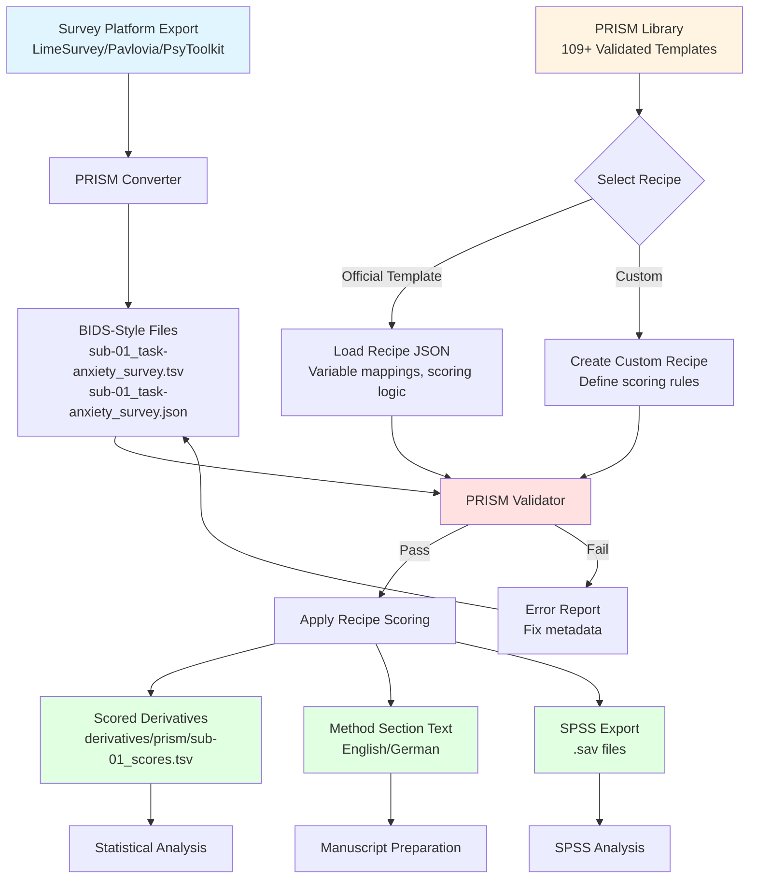

# Summary

Psychological and behavioral experiments frequently generate heterogeneous data (for example, surveys, behavioral task logs, and physical performance measures) that are challenging to standardize for sharing and reanalysis.
The Brain Imaging Data Structure (BIDS) has become a widely used standard for organizing neuroimaging datasets and associated behavioral and physiological recordings [@gorgolewski2016bids].
However, many psychology-specific data types and rich variable-level metadata requirements are not covered uniformly across studies.

PRISM is an open-source, independent toolkit that validates datasets and applies additional, versioned JSON Schemas for psychology-oriented modalities, with an emphasis on survey instruments and biometrics. PRISM is released under the GNU Affero General Public License v3.0 (AGPL-3.0).
PRISM is designed to be additive and BIDS-compatible: it does not replace BIDS, and it aims to keep standard BIDS tools and apps usable on PRISM datasets by avoiding destructive changes to core BIDS files and by supporting ignore rules where appropriate.

# Statement of need

Reproducible psychological research requires machine-readable descriptions of variables (units, response scales, levels), consistent naming conventions, and automated validation.
In practice, questionnaire exports and measurement codebooks are often stored as ad hoc spreadsheets, and metadata are distributed across lab-specific documentation.
This makes it difficult to compare studies, reuse analysis pipelines, or combine datasets.

For example, combining survey data from multiple studies requires knowing not only variable names but also their exact measurement scales, response options, and scoring procedures.
Similarly, physiological measurements (heart rate, skin conductance, grip strength) often lack standardized metadata describing units, calibration, and acquisition parameters.
Without structured metadata, researchers must manually reconcile these differences, a process that is both time-consuming and error-prone.

PRISM addresses this need by providing:

- A dataset validator that checks filename conventions and required metadata sidecars.
- A schema manager for versioned JSON Schemas that extend BIDS-style metadata for psychology-focused modalities.
- CLI and web-based workflows for converting survey and biometrics codebooks into reusable library templates.
- Optional multi-language (i18n) metadata support for variable descriptions and instrument documentation.

PRISM is intended for researchers and tool developers who want stronger, schema-based metadata guarantees for psychology datasets, while maintaining compatibility with established BIDS ecosystem tools.

## Example use case

Consider a multi-site study collecting fMRI data, self-report questionnaires (e.g., anxiety scales, personality inventories), and physiological measurements (heart rate, grip strength). While BIDS provides excellent standards for the fMRI data organization, the questionnaire and physiological data require additional metadata:

- **Survey data**: Each variable needs its label, response scale (e.g., 1-5 Likert), coding (reverse-scored items), and any scoring algorithms.
- **Biometrics**: Measurements need units, equipment specifications, calibration notes, and normative ranges.

PRISM enables researchers to embed this metadata directly alongside the data files using JSON sidecars, validated against versioned schemas. The dataset remains BIDS-compatible for neuroimaging pipelines (fMRIPrep, MRIQC) while providing rich, machine-readable documentation for behavioral analyses. When preparing manuscripts, PRISM can generate standardized method sections describing the instruments used, reducing documentation burden and improving reproducibility.

# State of the field

Several tools exist for validating and managing neuroimaging and behavioral datasets:

The official **BIDS Validator** provides comprehensive validation for core BIDS modalities (MRI, EEG, MEG) but does not enforce rich metadata requirements for psychology-specific data types like surveys and behavioral assessments. While it validates filename patterns and required files, it does not provide schema-based validation for variable-level metadata or support for scoring algorithms.

**DataLad** [@datalad2021] offers excellent version control and data distribution capabilities but focuses on data management rather than metadata validation and does not enforce structured documentation requirements.

Lab-specific validation tools exist but are typically tailored to individual workflows and lack the generalizability and community-maintained schema libraries needed for broader adoption.

PRISM was built rather than contributing to existing projects for several reasons. First, PRISM extends BIDS validation with modality-specific schemas (surveys, biometrics) that require different metadata structures than neuroimaging data—these extensions would fundamentally change the scope of the BIDS Validator. Second, PRISM integrates validation with active data management workflows (conversion from common export formats, automated scoring, manuscript boilerplate generation) that go beyond pure validation. Third, PRISM's library system with 109+ validated survey templates requires infrastructure for versioning, internationalization, and recipe-based scoring that would not fit within existing validation-only tools. The design philosophy prioritizes researcher workflows—from raw data export through validation to manuscript preparation—rather than validation as an isolated step.

# Implementation

PRISM's architecture is built on three core principles: (1) BIDS compatibility through non-destructive extensions, (2) versioned JSON Schema validation for psychology-specific modalities, and (3) integrated workflows from raw data import to manuscript preparation.

The core validation engine (`validator.py`) checks filename patterns against BIDS conventions and validates JSON sidecar content against modality-specific schemas managed by `schema_manager.py`. Schemas are versioned (e.g., `stable/`, `v0.1/`) to support evolving metadata requirements while maintaining backward compatibility. The validator integrates with `.bidsignore` files to ensure PRISM extensions do not interfere with standard BIDS tools like fMRIPrep.

PRISM Studio, the web interface built with Flask, provides drag-and-drop validation, project management, and interactive metadata editing. It implements "DataLad-style" upload filtering: for large datasets (5000+ files), only metadata files (`.json`, `.tsv`) are uploaded while data files (`.nii`, `.mp4`) are replaced with placeholders, enabling structure validation without transfer overhead.

The converter system (`src/converters/`) handles exports from common survey platforms (LimeSurvey, Pavlovia, PsyToolkit) and measurement devices, automatically generating BIDS-style filenames and JSON sidecars. The recipe system (`recipes_surveys.py`) defines scoring algorithms in machine-readable JSON format, enabling automated score calculation and generating manuscript method sections in multiple languages.

Cross-platform support is achieved through consistent path handling utilities and automated testing on Windows, macOS, and Linux environments.

Cross-platform support is achieved through consistent path handling utilities and automated testing on Windows, macOS, and Linux environments.

# Community adoption and impact

PRISM has been adopted by research groups at the University of Graz and serves as the data management infrastructure for the Austrian Neurophysiology Consortium. The official library contains 109+ validated survey instrument templates spanning clinical psychology, personality assessment, and cognitive testing domains.

The project has received contributions beyond the core developer, including survey template submissions, bug reports, and feature requests from the research community. PRISM Studio's web interface has made the toolkit accessible to researchers without command-line experience, broadening its potential user base.

While PRISM is relatively new compared to established tools in the BIDS ecosystem, its focus on psychology-specific workflows and rich metadata requirements addresses a gap that standard BIDS validation does not cover. The integration with NeuroBagel for participant-level annotations positions PRISM datasets for cross-study harmonization efforts. As the psychology and neuroscience communities increasingly recognize the need for structured behavioral metadata, PRISM provides ready-to-use infrastructure that complements rather than competes with existing BIDS tools.

# Installation and usage

PRISM can be installed from the GitHub repository:

```bash
git clone https://github.com/MRI-Lab-Graz/prism-studio.git
cd prism-studio
bash setup.sh  # macOS/Linux
# OR
.\setup.ps1   # Windows
```

The web interface can be launched with:

```bash
./prism-studio.py
```

The command-line validator can be used as:

```bash
python prism.py /path/to/dataset
```

PRISM provides over 109 validated survey templates in the official library and supports custom schemas for project-specific needs.

Full documentation is available at https://prism-studio.readthedocs.io/en/latest/, including comprehensive user guides, API reference, and example workflows.

# Figures





# Availability and reproducibility

The PRISM source code is available at https://github.com/MRI-Lab-Graz/prism-studio and is released under the GNU Affero General Public License v3.0 (AGPL-3.0). A permanent archival snapshot will be created and archived on Zenodo with a citable DOI for this submission.

All tests and sample datasets required to reproduce validation workflows are present in the `tests/` and `examples/` directories and can be executed using `./run_tests.sh` or `python run_all_tests.py`.

Official binary distributions for Windows, macOS, and Linux are available as GitHub Release artifacts. Windows executables are code-signed via SignPath integrated into CI workflows.

# Documentation practices

User and developer documentation is hosted at Read the Docs (link above). To keep documentation screenshots and UI examples in sync with the codebase we use automated capture tools integrated into CI; tools such as Heroshot (https://heroshot.sh/) work well with Sphinx/Read the Docs and can be integrated into GitHub Actions to update screenshots automatically when the UI changes. This helps ensure that documentation reflects the current behavior of the application and reduces manual maintenance overhead.

# AI usage disclosure

Generative AI tools (GitHub Copilot, Claude) were used to assist with code development, documentation writing, and manuscript preparation. All AI-generated content was reviewed, verified, and edited by the author to ensure accuracy and appropriate scientific context.

# Acknowledgements

The author thanks the MRI-Lab Graz community for testing and feedback during PRISM's development.
We are grateful to the BIDS community for establishing a robust foundation for neuroimaging data standards.
Special thanks to contributors who provided survey templates, reported issues, and helped refine the validation schemas.
This work was conducted at the University of Graz, Austria.

# References
