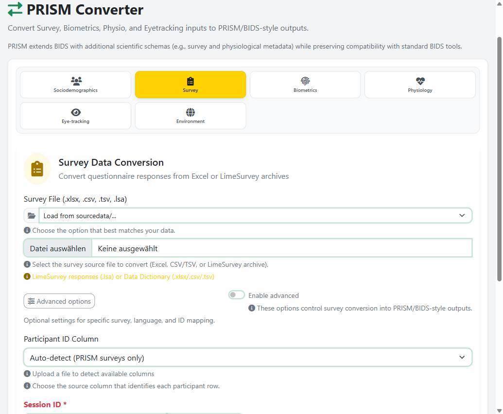

# Summary

Psychological and behavioral studies often combine neuroimaging with questionnaires, participants metadata, physiological recordings, eye tracking, and other tabular measurements. The Brain Imaging Data Structure (BIDS) provides an effective baseline for organizing neuroimaging datasets and associated behavioral files [@gorgolewski2016bids], but many psychology workflows still depend on ad hoc spreadsheets, incomplete codebooks, and lab-specific conventions for instrument metadata, response levels, and derived scores.

PRISM is a local-first, open-source toolkit for converting, validating, and documenting psychological experiment datasets while remaining compatible with BIDS. It extends BIDS with additional schema-driven metadata for surveys, biometrics, physiological recordings, eye tracking, and environment/context files, but it does so additively rather than replacing core BIDS conventions. The software combines a command-line interface with a Flask-based web application, PRISM Studio, for guided validation, template authoring, participants conversion, scoring, and export. Current workflows include survey template management, NeuroBagel-compatible participants annotations, LimeSurvey import and export, survey version handling, run-aware survey conversion, wide-to-long reshaping for repeated-measures tables, methods-text generation, and exports for SPSS, Word questionnaires, and Austrian NeuroCloud-ready packages. At the time of writing, the official bundled library contains 104 survey templates and one biometrics template.

# Statement of need

Reproducible psychology requires more than stable filenames. Researchers need machine-readable descriptions of survey items, response options, reverse coding, units, acquisition settings, participant variables, and instrument versions. In practice, these details are often scattered across spreadsheets, survey platform exports, protocol documents, and manuscript drafts. This creates ambiguity during reanalysis, cross-study comparison, and long-term reuse.

The gap becomes especially visible in mixed-modality studies. A BIDS-formatted imaging dataset may be structurally correct while still lacking the metadata needed to interpret repeated questionnaire administrations, compare two versions of the same instrument, harmonize participant variables, or regenerate derived scores. These problems are not only about validation; they are also about conversion, template reuse, and keeping metadata synchronized with the data that produced it.

PRISM addresses this need by providing a single workflow layer for psychology-oriented metadata on top of BIDS. It offers schema-based validation for additional modalities, converters from common tabular and survey exports, reusable instrument templates, recipe-based scoring, participants.tsv generation, and manuscript-facing outputs such as methods boilerplate. The intended users are researchers, data stewards, and tool developers who want richer guarantees for behavioral metadata without giving up compatibility with established BIDS tooling.

# State of the field

PRISM complements rather than replaces established tools in the BIDS ecosystem. The official BIDS Validator and the broader BIDS standard are essential for core structural compliance, especially for imaging data [@gorgolewski2016bids]. However, they do not attempt to enforce detailed psychology-specific item metadata, recipe-based scoring rules, or project-facing conversion workflows for survey and participant annotations. DataLad is highly effective for dataset versioning, provenance, distribution, and nested dataset management [@halchenko2021datalad], but it is not designed to define domain schemas for psychological instruments or to normalize questionnaire exports into BIDS-compatible tabular layouts.

Survey collection platforms such as LimeSurvey solve a different problem again: they help author and administer instruments, but they do not by themselves produce a reusable research dataset with BIDS-style naming, sidecars, schema validation, participants harmonization, and derivative generation. PRISM was therefore developed as a separate toolkit because the scholarly contribution lies in integrating these concerns: additive BIDS compatibility, psychology-oriented schemas, template libraries, conversion, scoring, and export in one reproducible workflow. Contributing isolated pieces of this functionality upstream would not by itself provide the end-to-end workflow needed by the target users.

# Software design

PRISM follows three design principles. First, it preserves BIDS compatibility by treating PRISM metadata as an additive layer. PRISM-specific files live alongside standard BIDS content, and `.bidsignore` support allows standard BIDS tools to ignore PRISM-only artifacts when necessary. This makes it possible to keep imaging pipelines such as BIDS apps usable while still attaching richer metadata for psychology-focused modalities.

Second, PRISM keeps workflow logic in a shared Python backend and exposes it through both CLI and web interfaces. The core backend modules under `src/` implement conversion, reshaping, export, recipe execution, and other data-processing helpers; the web layer in `app/` primarily acts as a thin adapter over those capabilities. This arrangement matters for reproducibility because the same backend behavior can be exercised from scripted terminal workflows and from PRISM Studio's interactive pages.

Third, PRISM treats metadata authoring as part of routine data handling rather than as a separate curation step. Survey and biometrics templates are versioned JSON documents that can be edited interactively, validated against schema expectations, and reused across projects. Recent development extended this model with template-driven survey versioning via `Study.Version`, `Study.Versions`, and `acq-<version>` filename entities; run-aware survey conversion for repeated administrations; and version-aware recipe selection. The same instrument descriptions can be exported to LimeSurvey 3.x, 5.x, and 6.x, re-imported from survey archives, or rendered as paper-pencil `.docx` questionnaires.

PRISM also includes workflow features that are difficult to express with static schemas alone. Participants conversion tools can detect identifier columns, preview candidate mappings, write `participants.tsv`, and merge NeuroBagel-compatible annotations into `participants.json`. A wide-to-long utility normalizes repeated-measures survey tables before validation or scoring. Large-dataset uploads in PRISM Studio can run in a structure-only mode that transfers metadata files while substituting placeholders for large binaries, enabling local validation of filenames and sidecars without moving the full payload. Export tools generate score derivatives, methods boilerplate in English and German, SPSS-compatible outputs, and AND-ready package structures for repository submission.

# Research impact statement

PRISM demonstrates credible research significance through a combination of domain focus, open development history, and researcher-facing workflows. The public repository shows iterative development from September 2025 onward, tagged releases through version 1.15.0, automated continuous integration, and cross-platform release artifacts for macOS, Windows, and Linux. The repository also includes workshop materials, example datasets, and end-to-end documentation so that researchers can test the workflows locally rather than treating the software as an opaque web service.

The scientific value of PRISM is its attempt to make structured behavioral metadata operational in day-to-day research practice. The bundled template library, participants and NeuroBagel workflows, survey version handling, wide-to-long reshaping, LimeSurvey integration, and repository-facing exports reduce the amount of manual metadata reconciliation required to move from raw collection outputs to reusable datasets. This is particularly relevant for labs that already use BIDS for imaging data but still manage questionnaires and participant metadata in less standardized ways.

# Availability and reproducibility

PRISM is released under the GNU Affero General Public License v3.0 (AGPL-3.0) and developed at https://github.com/MRI-Lab-Graz/prism-studio. The release described here is version 1.15.0. Source installation is documented for macOS, Windows, and Linux through `setup.sh` and `setup.ps1`, and the main user entry points are `python prism-studio.py` for the web application and `python prism.py` for CLI workflows. The repository contains example datasets and workshop material under `examples/`, while automated checks are run in CI through `python tests/verify_repo.py` and pytest-based verification.

The final JOSS submission should cite the archival DOI for the exact release under review once the corresponding Zenodo snapshot has been created.

# AI usage disclosure

Generative AI tools, including GitHub Copilot and Claude, were used for code drafting and refactoring, documentation editing, and manuscript drafting. All AI-assisted outputs were reviewed, edited, and validated by the author, and all substantive software-design and scientific framing decisions remained under human control.

# Acknowledgements

The author thanks the MRI-Lab Graz community for testing, issue reports, and feedback during PRISM's development. We are grateful to the BIDS community for the standards ecosystem on which PRISM builds, and to contributors who provided templates, bug reports, and workflow feedback. This work was conducted at the University of Graz, Austria.

# References
